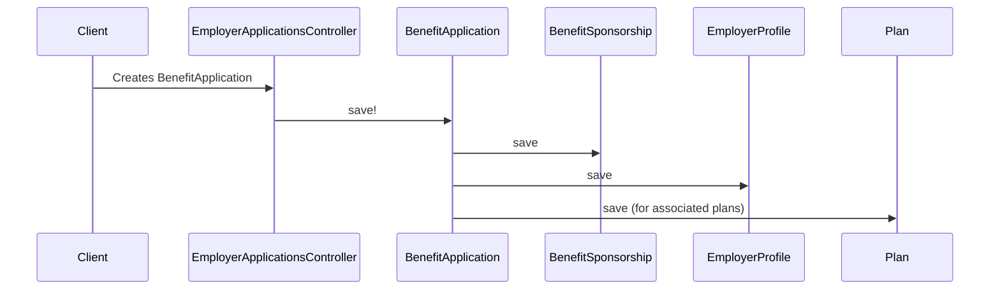

# Chapter 3: EmployerProfile/BenefitSponsorship/BenefitApplication

In the previous chapter, [Plan](02_plan_.md), we learned how health insurance plans are represented in our system.  Now, let's explore how employers offer these plans to their employees through `EmployerProfile`, `BenefitSponsorship`, and `BenefitApplication`.

## Why do we need these concepts?

Imagine a company, Acme Corp, wants to offer health benefits to its employees.  They need a way to manage their benefit offerings, choose plans, and track employee enrollment.  This is where `EmployerProfile`, `BenefitSponsorship`, and `BenefitApplication` come in.

## Key Concepts

* **EmployerProfile:** This is like Acme Corp's benefits profile. It stores basic information about the company relevant to benefits, like their company size and contact information.

* **BenefitSponsorship:** This manages Acme Corp's benefit offerings over time.  It's like a container for all their benefit applications.

* **BenefitApplication:** This is a specific set of benefit offerings for a given plan year.  For example, Acme Corp might have a `BenefitApplication` for 2024 that includes a choice of three health plans and a dental plan.

## Solving the Use Case: Acme Corp Offering Benefits

1. **Create EmployerProfile:** First, we create an `EmployerProfile` for Acme Corp.

2. **Create BenefitSponsorship:** Next, we create a `BenefitSponsorship` to manage Acme Corp's benefit offerings.

3. **Create BenefitApplication:**  For each plan year, we create a `BenefitApplication`.  Let's create one for 2024.  We'll select the plans Acme Corp wants to offer from the available [Plan](02_plan_.md)s.

```ruby
# Simplified example (actual implementation is more complex)

acme_profile = EmployerProfile.new(legal_name: "Acme Corp")
acme_sponsorship = BenefitSponsorship.new(employer_profile: acme_profile)

benefit_application_2024 = BenefitApplication.new(
  benefit_sponsorship: acme_sponsorship,
  start_on: Date.new(2024, 1, 1),
  end_on: Date.new(2024, 12, 31)
)

# Select plans (simplified - actual process involves BenefitGroups)
plan1 = Plan.find_by(name: "Plan A")
plan2 = Plan.find_by(name: "Plan B")

benefit_application_2024.plans << plan1
benefit_application_2024.plans << plan2

benefit_application_2024.save!
```

This code creates an `EmployerProfile`, a `BenefitSponsorship`, and a `BenefitApplication` for 2024, including two selected plans.  Now, Acme Corp's benefit offerings are represented in our system. Employees can then enroll in these plans (we'll cover enrollment in the [HbxEnrollment](04_hbxenrollment_.md) chapter).

## Internal Implementation

When we call `benefit_application_2024.save!`, several things happen behind the scenes:



1. The `employer_applications_controller.rb` (or a similar controller) receives the request to create a `BenefitApplication`.

2. The `BenefitApplication` model's `save!` method is called.

3. The `save!` method triggers saving of the associated `BenefitSponsorship`, `EmployerProfile`, and selected `Plan` objects. This ensures data consistency.

The relevant code for saving a `BenefitApplication` can be found in `employer_applications_controller.rb` and the `BenefitApplication` model.  The code for saving `BenefitSponsorship` and `EmployerProfile` is in their respective models.

```ruby
# employer_applications_controller.rb (simplified)
def create
  @benefit_application = BenefitApplication.new(benefit_application_params)
  @benefit_application.save! # This triggers saving of associated objects
end
```

## Conclusion

This chapter introduced `EmployerProfile`, `BenefitSponsorship`, and `BenefitApplication`, explaining how they represent employers offering health benefits. We used the example of Acme Corp to illustrate how these concepts work together.  We also looked at the internal implementation to understand what happens behind the scenes.

Next, we'll explore how employees enroll in these benefit offerings with [HbxEnrollment](04_hbxenrollment_.md).


---

Generated by [AI Codebase Knowledge Builder](https://github.com/The-Pocket/Tutorial-Codebase-Knowledge)