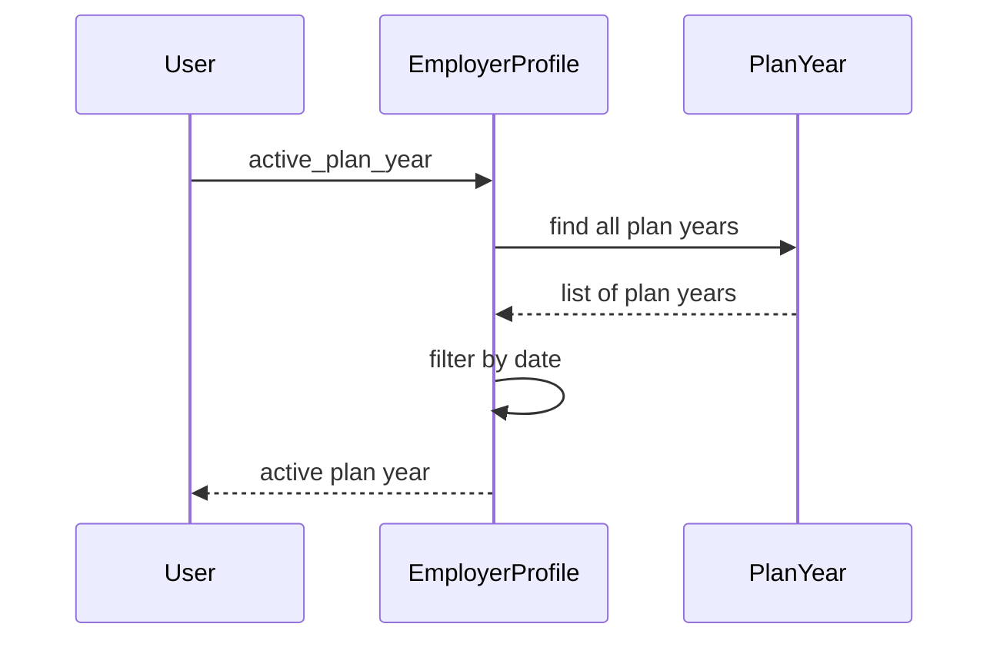

# Chapter 3: EmployerProfile

In the previous chapter, [Family](02_family.md), we learned how families are represented in our system. This chapter introduces the `EmployerProfile` concept, which represents an employer and their role in providing health benefits.

## What problem does `EmployerProfile` solve?

Imagine a company, "Acme Corp," wants to offer health insurance to its employees.  How do we store information about Acme Corp, like their company details, the health plans they offer, and which employees are enrolled? The `EmployerProfile` model solves this. It's like a company profile specifically designed for managing health benefits.

## Key Concepts:

1. **Organization:**  An `EmployerProfile` is embedded within an [Organization](XX_organization.md). The `Organization` holds basic company information like the legal name, address, and tax ID (FEIN).  Think of the `Organization` as the general company record, while the `EmployerProfile` focuses on benefits.

2. **Plan Years:** An `EmployerProfile` has multiple [PlanYear](04_planyear.md) objects. A `PlanYear` represents the benefits offered by the employer during a specific time period (e.g., 2024).  Each `PlanYear` contains details about the available health plans, open enrollment periods, and employee enrollments.

3. **Benefit Plans:**  Within each `PlanYear`, there are [BenefitGroup](05_benefitgroup.md) objects.  These represent the specific health plans offered (e.g., "Acme Corp Gold Plan").

4. **Employees:** The `EmployerProfile` is linked to its employees through their [EmployeeRole](XX_employeerole.md) embedded in a [Person](01_person.md) object.  This connection allows us to track which employees are eligible for benefits and which plans they've enrolled in.

## Using the `EmployerProfile` model

Let's say we want to find the active plan year for Acme Corp:

```ruby
# ... other code ...

acme_corp = Organization.find_by(legal_name: "Acme Corp").employer_profile
active_plan_year = acme_corp.active_plan_year

# ... use active_plan_year ...
```

This code first finds the `EmployerProfile` for Acme Corp by looking up the organization. Then, it retrieves the active `PlanYear`.

## Under the Hood

When you call `acme_corp.active_plan_year`, the following happens:

1. **Retrieve Plan Years:** The `EmployerProfile` retrieves all its associated `PlanYear` objects.

2. **Filter by Date:** It filters the `PlanYear` objects to find the one that is currently active based on the current date.



The code for this is in `employer_profile.rb`:

```ruby
# employer_profile.rb
class EmployerProfile
  # ... other code ...

  def active_plan_year
    # ... other code (simplified for brevity) ...
    plan_years.published_plan_years_by_date(today).first
  end

  # ... other code ...
end
```

This simplified code snippet shows how the `active_plan_year` method filters the `plan_years` collection by the current date (`today`).

## Conclusion

This chapter introduced the `EmployerProfile` model, which represents an employer and their benefits offerings. We learned about its key concepts and how to use it. In the next chapter, we'll explore [PlanYear](04_planyear.md) in more detail.


---

Generated by [AI Codebase Knowledge Builder](https://github.com/The-Pocket/Tutorial-Codebase-Knowledge)