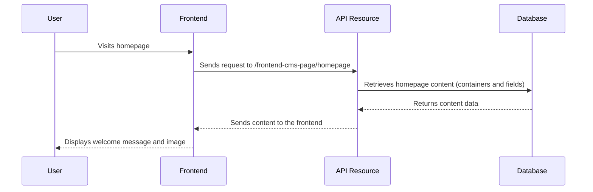

# Chapter 3: Frontend CMS

In the previous chapter, [API Resources](02_api_resources_.md), we learned how the frontend communicates with the backend. Now, let's explore how to actually *build* that frontend using a Frontend CMS.  This is like having a website builder right inside your application!

## The Use Case: Displaying a Welcome Message

Imagine you want to greet your users with a personalized welcome message on your homepage.  The Frontend CMS lets you easily create and manage this message without writing any code.

## Key Concepts

1. **Containers:** Think of containers as building blocks for your website.  They hold different types of content, like text, images, or videos.  For example, a "Hero Section" container might hold a large image and a welcome message.

2. **Fields:** Fields are the specific pieces of content within a container.  For example, the "Hero Section" container might have a "Headline" field for the welcome message and an "Image" field for the background image.

## Displaying a Welcome Message: Step-by-Step

Here's how the Frontend CMS helps you display a welcome message:

1. An administrator logs into the Frontend CMS.
2. They choose the "Homepage" page to edit.
3. They add a "Hero Section" container to the page.
4. They fill in the "Headline" field with the welcome message (e.g., "Welcome to Healthy Living!").
5. They upload an image to the "Image" field.
6. They save the changes.
7. Now, when users visit the homepage, they see the welcome message and image.

## Under the Hood: Code Implementation

Here's a simplified look at how the frontend retrieves the welcome message:



The `routes/tenant.php` file defines the API Resource for frontend CMS pages:

```php
// File: routes/tenant.php

// ... other code ...

Route::apiResources(['ws-frontend-cms-page' => FrontendCMSController::class]);

// ... other code ...
```

This creates a route `GET /ws-frontend-cms-page/homepage` that retrieves the homepage content.

The `FrontendCMSController` handles this request:

```php
// File: app/Http/Controllers/Tenant/FrontendCMS/FrontendCMSController.php (simplified)

// ... other code ...

public function show($page)
{
    // Retrieve containers and fields for the given page from the database
    // ... database query logic ...

    return $pageData; // Returns the page content
}

// ... other code ...
```

The frontend then uses this data to display the welcome message and image.  The specific implementation details of how the frontend renders the containers and fields will vary depending on the frontend framework used.  However, the core concept remains the same: the Frontend CMS provides the content, and the frontend displays it.


## Conclusion

In this chapter, we explored the Frontend CMS and how it allows administrators to manage website content without writing code. We saw how containers and fields are used to structure the content and how the frontend retrieves and displays this content. Next, we'll delve into [Authentication (Auth)](04_authentication__auth__.md) to understand how users log in and access protected areas of your application.


---

Generated by [AI Codebase Knowledge Builder](https://github.com/The-Pocket/Tutorial-Codebase-Knowledge)