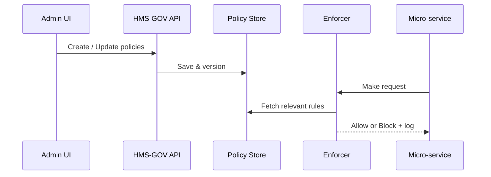

# Chapter 3: Governance Layer (HMS-GOV)

*(You just learned how users express “what they want” in [Intent-Driven Navigation](02_intent_driven_navigation_.md). Now we’ll see how the platform decides **whether** and **how** those wants are allowed.)*

---

## 1. Why Do We Need a “Cabinet Office” in Software?

Imagine **Carlos**, an EBSA analyst, building a self-service “Find My Retirement Plan” tool.  
Before going live, he must guarantee:

1. No personal data leaves U.S. soil.  
2. AI suggestions are logged for audit.  
3. Service usage stays under the pilot budget cap of **$500 / month**.

He could hard-code checks in every micro-service—but that repeats work and invites accidents.

**HMS-GOV** solves this once and for all.  
Think of it as OMB’s circulars baked directly into code: one place to set rules that every lower layer (MFEs, APIs, AI agents, etc.) automatically inherits.

---

## 2. Key Concepts (Plain-English)

| Term | Beginner Explanation |
|------|----------------------|
| **Policy** | A written rule (“AI outputs must be stored for 3 yrs”). |
| **Scope** | Where the policy applies (all services, one agency, a single endpoint). |
| **Inheritance** | Children (e.g., the EBSA tool) automatically obey parent rules, unless the parent says they can opt-out. |
| **Enforcer** | Tiny middleware that checks a request against active policies. |
| **Audit Trail** | An automatic diary of “who did what, when, and which rule allowed/blocked it.” |

---

## 3. A 3-Step Use Case: Carlos Launches His Tool

### 3.1 Carlos Writes Policies (👩‍💼 Admin View)

`ebsa_policies.yaml`

```yaml
# 1) Keep data in US
data:
  residency: "US_ONLY"

# 2) Turn on AI logging
ai:
  output_storage_days: 1095   # 3 years

# 3) Monthly spend limit
budget:
  usd_cap: 500
```

*Explanation*: One human-readable file; no code changes to micro-services.

### 3.2 HMS-GOV Activates Them

```bash
hms gov apply --file ebsa_policies.yaml
```

Output (terminal):

```
✔ Uploaded 3 policies
✔ Linked scope: /agencies/EBSA/*
✔ Version: 2024-04-12T10:33Z
```

### 3.3 Service Calls Auto-Enforce

When the EBSA micro-service later tries to call an EU-based storage API:

```
▶ 403 FORBIDDEN — Violates policy: data.residency=US_ONLY
```

Carlos gets an alert; no citizen data crossed borders. Zero extra code in the service.

---

## 4. How Does HMS-GOV Work Under the Hood?



Five players, that’s it!

---

## 5. Peeking at the Enforcer Code (15 Lines)

`middleware/policy-enforcer.js`

```js
import { getRules } from '@hms/gov-sdk';

export async function enforce(req, res, next) {
  // 1. Find rules for this service & endpoint
  const rules = await getRules({
    service: process.env.SVC_NAME,
    path: req.path,
    method: req.method
  });

  // 2. Run simple checks (demo)
  if (rules.data?.residency === 'US_ONLY'
      && req.headers['x-destination']?.includes('.eu')) {
    return res.status(403).json({ error: 'Data residency rule' });
  }

  // 3. Record the pass in audit log
  console.info('✓ GOV policy pass', { path: req.path });

  next(); // allow normal handling
}
```

Explanation:  
• `getRules` pulls the latest compiled policies.  
• One `if` statement shows the pattern; real code uses reusable validators.  
• Regardless of pass/fail, the call is logged for auditors.

Attach it in `server.js`:

```js
import express from 'express';
import { enforce } from './middleware/policy-enforcer.js';
const app = express();

app.use(enforce);          // ← one line to adopt HMS-GOV
// ...route handlers...
```

---

## 6. Quick Start Checklist for New Projects

1. Create a policy file (YAML or JSON).  
2. Run `hms gov apply`.  
3. Add `@hms/gov-sdk` to your service and register the `enforce` middleware.  
4. Verify in the Governance dashboard that rules and audit logs appear.  
5. Sleep better—oversight is now automatic!

---

## 7. FAQ for Beginners

**Q: Can a project override a policy?**  
A: Only if the parent scope marks it `override: true`. Otherwise inheritance is strict.

**Q: Does this slow down requests?**  
A: Policy lookups are cached in-memory; typical overhead is <2 ms.

**Q: Where are audit logs stored?**  
A: In the [Observability & Metrics Pipeline](13_observability___metrics_pipeline_.md) under the `gov.audit` stream.

---

## 8. Where HMS-GOV Touches Other Layers

• MFEs and APIs call the Enforcer before executing, so UI & backend stay in sync.  
• The next layer, the **[Policy & Process Engine](04_policy___process_engine_.md)**, uses HMS-GOV rules to orchestrate multi-step workflows.  
• Role checks from [RBAC](08_role_based_access_control__rbac__.md) are referenced as policies inside HMS-GOV, giving you one rulebook.

---

## 9. Summary & What’s Next

In this chapter you learned:

• HMS-GOV centralizes rules, budgets, and privacy constraints.  
• Policies are plain YAML, scoped, versioned, and inherited.  
• A tiny “Enforcer” middleware brings these rules into every micro-service.  
• Audit trails are automatic, satisfying oversight with minimal code.

Ready to see how complex processes (e.g., approvals, escalations) are modeled on top of these rules? Continue to [Policy & Process Engine](04_policy___process_engine_.md).

---

Generated by [AI Codebase Knowledge Builder](https://github.com/The-Pocket/Tutorial-Codebase-Knowledge)