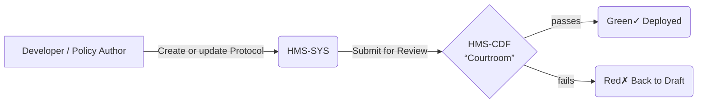
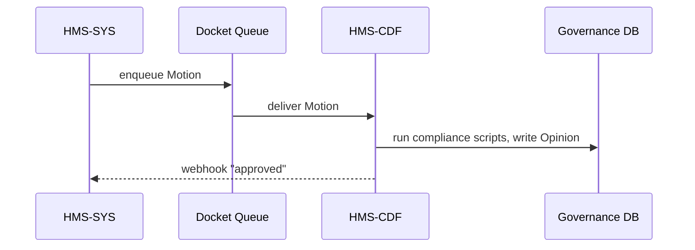

# Chapter 3: Governance Layer (HMS-SYS → HMS-CDF)

*(Jumped in from [Protocol Model (Execution Playbook)](02_protocol_model__execution_playbook__.md))*  

---

## 1 — Why Does “Governance” Exist?

You just wrote a shiny **Lead-Paint Inspection** protocol in Chapter 2.  
Great—but are you *allowed* to run it?

* HUD lawyers must check that privacy wording is correct.  
* EPA wants to confirm environmental forms are referenced.  
* The public needs an audit trail that “someone in charge” signed off.

In human government this is called “**parliamentary procedure**.”  
In HMS it lives inside the **Governance Layer**—a pair of services that act like a **constitutional court in software**:

```
HMS-SYS   (submits change)  ➜  HMS-CDF   (approves or rejects)
```

Think of it as the last red-green traffic light before any code or rule hits production.

---

## 2 — High-Level Picture



* **HMS-SYS** = The **submitter** (e.g., your Laravel API).  
* **HMS-CDF** = The **decision engine** written in Rust.  
* **Green** path publishes the change; **Red** path sends it back with reasons.

---

## 3 — Key Concepts in Plain English

| Term | What it really means |
|------|----------------------|
| Motion | “Please accept my change.” A JSON envelope around your Program/Protocol edit. |
| Docket | Inbox queue where all motions wait for ruling. |
| Opinion | Decision record (approve, reject, amend) plus human-readable notes. |
| Compliance Rules | Tiny scripts—“laws”—run by HMS-CDF (privacy, ethics, budget caps). |
| Signature | Digital proof that the correct official (or AI agent) rendered the opinion. |

Keep these five words in mind; they repeat everywhere.

---

## 4 — Beginner Walk-Through: Approving a New Protocol

Scenario: You added “Fiber Rollout Checklist” to *Municipal Broadband 2026* and need approval.

### 4.1 Submit the Motion

```php
// routes/web.php   (<= 15 lines)
Route::post('/governance/motions', function () {
    $motion = \App\Models\Gov\Motion::create([
        'title'       => 'Add Fiber Rollout Checklist',
        'object_type' => 'Protocol',
        'object_id'   => 12,             // your new protocol ID
        'proposed_by' => auth()->user()->id,
    ]);

    return $motion;   // JSON with docket number
});
```

Explanation:  
• A row is placed in the **docket** saying, “Please review Protocol #12.”  
• You get back a **motion_id** (like docket № 54).

### 4.2 HMS-CDF Runs the Gauntlet

No code needed on your side; a background worker pushes docket № 54 to HMS-CDF, which:

1. Loads the protocol JSON.  
2. Executes each **Compliance Rule** (privacy, ethics, budget).  
3. Records an **Opinion**.

### 4.3 Fetch the Opinion

```php
Route::get('/governance/motions/{id}/opinion', function ($id) {
    return \App\Models\Gov\Motion::with('opinion')->findOrFail($id);
});
```

Possible response:

```json
{
  "motion_id": 54,
  "status": "approved",
  "opinion": {
    "signed_by": "EPA_Chief_Counsel",
    "notes": "Environmental language OK.",
    "timestamp": "2024-04-22T15:31:00Z"
  }
}
```

If status = `rejected`, the **notes** field tells you what to fix.

---

## 5 — What Happens Under the Hood?



Step-by-step:

1. **SYS** enqueues the motion.  
2. A lightweight queue (**QUE**) transports it.  
3. **CDF** loads rule files, runs them in a sandbox, writes outcome.  
4. **SYS** receives a webhook; if approved, it flips the Protocol from *draft* to *active*.

---

## 6 — Peeking at the Compliance Rule Code

*(Rust in HMS-CDF, trimmed to 15 lines)*

```rust
// src/rules/privacy.rs
pub fn privacy_check(protocol: &Protocol) -> RuleResult {
    if protocol.steps.iter().any(|s| s.contains("SSN")) {
        // SSN detected! Needs encryption clause.
        return RuleResult::Reject("PII field 'SSN' found without redaction");
    }
    RuleResult::Approve
}
```

Explanation:

1. Each file is a **single rule**.  
2. `privacy_check` inspects `steps`.  
3. It returns **Reject** or **Approve**, plus a short message.  
4. Multiple rules are composed; *all* must approve.

---

## 7 — Where Do These Rules Live?

```text
hms-cdf/
 └─ rules/
    ├─ privacy.rs
    ├─ ethics.rs
    ├─ budget.rs
    └─ security.rs
```

Policy teams can add a new `.rs` file, commit it, and HMS-CDF hot-loads the change.  
This allows **AI-speed policy cycles** without touching the rest of HMS-API.

---

## 8 — Government Analogy Cheat-Sheet

Software Term   | Government Equivalent
----------------|-----------------------
Motion          | Bill introduced on the House floor
Docket          | Congressional calendar
Compliance Rule | Clause in the Federal Statute
Opinion         | Final vote & committee report
Signature       | President’s signature (or veto)

---

## 9 — Common Beginner Gotchas

1. Forgetting to **submit a motion**—a protocol in *draft* never runs.  
2. Hard-coding `object_id`—always fetch it programmatically after creation.  
3. Misreading rejection notes—look at **first** failing rule; others may cascade.  
4. Skipping digital **signatures** in test environments—use `"TEST_KEY"` but keep the field!

---

## 10 — Mini-Exercise

1. Create a protocol named “Zero-Trust Checklist”.  
2. Submit a governance motion for it.  
3. Intentionally include the word “SSN” in one step to trigger a privacy rejection.  
4. Fetch the opinion; note the rejection reason.  
5. Remove “SSN”, resubmit, and watch it get approved.

---

## 11 — Recap & What’s Next

You learned how the **Governance Layer**:

* Collects change requests as **Motions**.  
* Runs them through automated **Compliance Rules**.  
* Issues legally traceable **Opinions** before anything goes live.

With approvals in hand, the system must now expose safe, versioned endpoints to other services and the public.  
Let’s open the doors in [Backend API Gateway (HMS-API / HMS-SVC)](04_backend_api_gateway__hms_api___hms_svc__.md).

---

Generated by [AI Codebase Knowledge Builder](https://github.com/The-Pocket/Tutorial-Codebase-Knowledge)