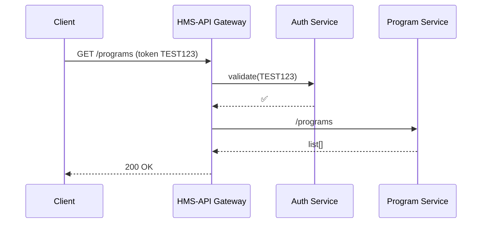

# Chapter 3: HMS-API Gateway  

*(A friendly doorway into every other HMS service)*  

---

[← Back to “Protocol Blueprint”](02_protocol_blueprint__protocol_model__.md)

## 1. Why a Gateway Exists – A 2-Minute Story

The **Department of Housing** has just published “Form-EZ” for a *First-Time Home-Buyer Grant*.  
Three totally different callers now want data:

1. The public web form saving a new application.  
2. An internal finance bot pulling approved grants for payment.  
3. A watchdog agency pinging for nightly statistics.

Without rules, any caller could:

* Skip authentication  
* Hammer the server with 10 000 requests  
* Accidentally reach the wrong micro-service

HMS-API Gateway is the **receptionist at the federal building**:

| Caller shows up | Gateway does… | Analogy |
|-----------------|---------------|---------|
| Presents token  | Checks ID     | “Show your badge.” |
| Says purpose    | Sends to room | “You need Room 204, Records.” |
| Too noisy       | Slows them    | “Please wait in line.” |

Once the request is safely inside, it can reach the **Program Registry**, **Protocol Blueprint**, or any future service.

---

## 2. Key Concepts (Plain English)

1. **Authentication** – Is the badge real?  
2. **Authorization** – Does this badge allow *this* action?  
3. **Routing** – Which internal micro-service should handle the call?  
4. **Rate Limiting** – How many times per minute may this badge knock?  
5. **Observability** – Log every visitor: who, when, success/fail.

Keep these in mind; the rest of the chapter shows how each piece works.

---

## 3. A 60-Second Curl Test

First, confirm your Gateway is running (default: `http://localhost:8000`).

```bash
# Minimal, unauthenticated call (should FAIL)
curl -i http://localhost:8000/api/v1/programs
```

Expected output (simplified):

```
HTTP/1.1 401 Unauthorized
{
  "message": "Missing or invalid token."
}
```

Now supply a fake bearer token:

```bash
curl -i \
  -H "Authorization: Bearer TEST123" \
  http://localhost:8000/api/v1/programs
```

If `TEST123` is whitelisted for demo, you’ll see JSON like:

```json
[
  { "id": 1, "title": "COVID-19 Response" },
  { "id": 2, "title": "Home Solar Rebate" }
]
```

Congratulations—you just walked through the *front door*!

---

## 4. Under the Hood – The 5-Step Check-In



1. **GW** asks **AU** if the token is valid.  
2. **GW** finds the right downstream URL (`Program Service`).  
3. Response returns through the same path, giving the client one stable endpoint.

---

## 5. A Tiny Route Definition

In HMS projects we keep Gateway routes separate from business routes:

_File: `routes/gateway.php`_

```php
use Illuminate\Support\Facades\Route;

/* Proxy all Program calls */
Route::prefix('api/v1/programs')
     ->middleware(['auth.token', 'throttle:60,1'])
     ->group(function () {
         Route::any('{any}', \App\Http\Controllers\Proxy\ProgramProxy::class)
              ->where('any', '.*');   // forward everything
     });
```

What’s happening?

* `auth.token`  – our badge checker (see next snippet).  
* `throttle:60,1` – max 60 requests per minute per token.  
* Any verb/path (`{any}`) is forwarded untouched to the Program micro-service.

---

### 5.1  The Simplest Token Middleware  

_File: `app/Http/Middleware/CheckToken.php`_

```php
namespace App\Http\Middleware;

class CheckToken
{
    public function handle($req, \Closure $next)
    {
        $token = $req->bearerToken();

        // 1. Quick deny if missing
        if (!$token) {
            return response('Missing token', 401);
        }

        // 2. Fake lookup – replace with real DB / JWKS
        if ($token !== 'TEST123') {
            return response('Bad token', 401);
        }

        return $next($req);   // badge accepted
    }
}
```

Only ~15 lines, yet it blocks every anonymous caller.

---

### 5.2  Forwarding the Call  

_File: `app/Http/Controllers/Proxy/ProgramProxy.php`_

```php
class ProgramProxy
{
    public function __invoke(Request $req)
    {
        /* Build downstream URL */
        $downstream = 'http://program-svc:9000/'.$req->path();

        /* Forward method, headers, body */
        $resp = Http::withHeaders($req->headers->all())
                    ->send($req->method(), $downstream, [
                        'body' => $req->getContent(),
                    ]);

        /* Mirror status & body back to caller */
        return response($resp->body(), $resp->status());
    }
}
```

Key points:

1. The caller never sees `program-svc:9000`; only the Gateway knows that address.  
2. We reuse the exact HTTP method (`GET`, `POST`, etc.).  
3. Complexity is hidden—no business logic lives here, only plumbing.

---

## 6. Rate Limiting in One Line

You already saw `throttle:60,1` in the route.  
Want *tougher* limits for anonymous tokens?

```php
->middleware(['auth.token','throttle:10,1'])
```

Meaning: *10* requests per minute—extra protection during pilot launches.

---

## 7. GraphQL? Same Idea!

Suppose your UI prefers GraphQL:

```js
fetch('/graphql', {
  method: 'POST',
  headers: { 'Authorization': 'Bearer TEST123' },
  body: JSON.stringify({ query: '{ programs { id title } }' })
});
```

The `/graphql` endpoint still passes through the *exact* middleware stack, so auth & rate-limit rules remain consistent across protocols.

---

## 8. Hands-On Exercise

1. Clone HMS-API, run `php artisan serve --port=8000`.  
2. Edit `CheckToken.php` to accept two tokens: `TEST123`, `INSPECTOR456`.  
3. Issue 70 rapid GET calls with `TEST123` and watch how call 61+ receive `429 Too Many Requests`.  
4. Repeat with `INSPECTOR456` but lower the throttle middleware to `throttle:5,1`—notice the stricter cap.

You just simulated different **policy tiers** without touching downstream services.

---

## 9. How the Gateway Talks to Other Chapters

| Need | Gateway action | Chapter |
|------|----------------|---------|
| Look up Programs | Forwards to Program micro-service | [Program Registry](01_program_registry__program_model__.md) |
| Fetch Protocol steps | Forwards to Protocol svc | [Protocol Blueprint](02_protocol_blueprint__protocol_model__.md) |
| Enforce per-agency limits | Reads policy table | [Policy Engine](09_policy_engine__hms_cdf__.md) |
| Log every request | Emits span to OPS | [Operations & Monitoring Layer](16_operations___monitoring_layer__hms_ops__.md) |

---

## 10. Government Analogy Cheat-Sheet

• Gateway = Building receptionist & metal detector.  
• Token = Your badge or visitor sticker.  
• Route table = The floor directory showing which room handles which task.  
• Rate limit = Fire-marshal max occupancy rules.  
• Logs = Visitor sign-in sheet kept for audits.

---

## 11. Summary & What’s Next

You learned how HMS-API Gateway:

* Authenticates every caller with a **token badge**.  
* Routes traffic to the correct micro-service **without exposing internals**.  
* Applies **rate limits** so one loud visitor cannot drown out everyone else.  

In the next chapter you’ll step into the **lobby kiosks**—the web UI where policy officers can tweak these rules without writing code.  

[Continue to “Governance Portal (HMS-GOV Interface)”](04_governance_portal__hms_gov_interface__.md)

---

Generated by [AI Codebase Knowledge Builder](https://github.com/The-Pocket/Tutorial-Codebase-Knowledge)