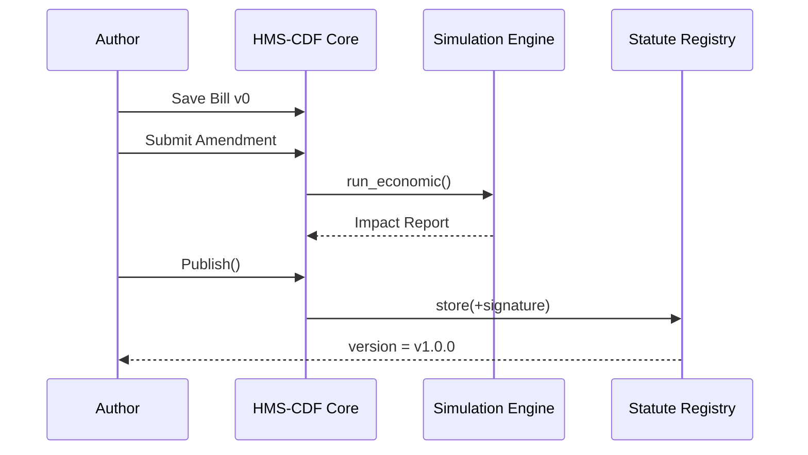

# Chapter 3: HMS-CDF (Codified Democracy Foundation Engine)
*[← Back to Chapter 2: HMS-MFE](02_hms_mfe__micro_frontend_experience__.md)*  

---

## 1. Why Do We Need HMS-CDF?

Imagine a **city council** wants a brand-new ordinance that limits where hobbyists can fly drones.  
The current process looks like this:

1. Staff lawyers write a 40-page PDF.  
2. Council members email back Word docs full of “Track Changes.”  
3. Nobody knows which edit set is “the real one.”  
4. Weeks later, the public finally sees an outdated version.

HMS-CDF fixes this in the same way **Git + compilers** fixed software chaos:

• A bill becomes **structured data** (not a blob).  
• Amendments are **diffs** (like PRs).  
• Final laws are **versioned artifacts** with timestamps, authorship, and automatic impact tests.

In short: **Legislation gets the same tooling that developers enjoy.**

---

## 2. Key Concepts (Plain English)

| Term                       | Friendly Analogy                               | What It Means in CDF                                                                          |
|----------------------------|------------------------------------------------|------------------------------------------------------------------------------------------------|
| Draft Bill (Bill v0)       | Source file (`main.rs`)                        | First formal proposal written in machine-readable YAML/JSON.                                   |
| Legislative AST            | Parse tree in a compiler                       | Hierarchical structure: Sections → Clauses → Sentences, each with an ID.                      |
| Amendment Patch            | `git diff`                                     | Insert / delete / replace ops that map to AST nodes.                                           |
| Simulation Harness         | Unit-test suite                                | Runs economic, legal, or environmental models against draft text to predict impact.            |
| Statute Registry           | Package registry (e.g., crates.io)             | Signed, versioned record of all passed laws with semantic versioning (`v2.3.1`).               |

---

## 3. The 5-Minute “Hello-Bill”

Goal: Draft a **“Drone Safety Ordinance”**, submit an amendment, run a quick impact test, and publish.

### 3.1 Create the Draft Bill

```rust
// file: hello_bill.rs
use hms_cdf::bill::*;

fn main() {
    let mut bill = Bill::new("Drone Safety Ordinance v0");
    bill.section("S1", "No-Fly Zones")
        .clause("C1", "Drones may not operate within 500 ft of schools.");
    bill.save("drone_bill_v0.cdf");             // → JSON on disk
}
```

Explanation  
1. We import the CDF bill API.  
2. We build a small hierarchy (`Bill → Section → Clause`).  
3. `save` turns it into JSON so the engine can parse it.

---

### 3.2 Propose an Amendment

```rust
// file: amend.rs
use hms_cdf::amend::*;

fn main() {
    let patch = Amendment::replace(
        "C1",
        "Drones may not operate within **300 ft** of schools."   // changed number!
    );
    patch.save("reduce_distance.patch");
}
```

Explanation  
`Amendment::replace(id, new_text)` targets the existing clause by its ID (`C1`).  
Saving it creates a **diff file**—think “pull request” for legislation.

---

### 3.3 Run an Impact Simulation

```rust
// file: simulate.rs
use hms_cdf::simulate::*;

fn main() {
    let report = Simulator::new("drone_bill_v0.cdf")
        .apply("reduce_distance.patch")
        .run_economic();     // built-in model
    println!("{}", report.summary());
}
```

What happens?  
• The simulator merges the amendment into the AST.  
• It calls an embedded model estimating **local drone industry revenue change**.  
• We print a one-line summary:  

```
Estimated economic impact: −1.2 % annual revenue
```

---

### 3.4 Publish the Statute

```rust
// file: publish.rs
use hms_cdf::registry::*;

fn main() {
    Registry::connect("city-ledger.db")
        .publish("drone_bill_v1.cdf")?;       // auto-generates version v1.0.0
}
```

Explained  
Publishing signs the bill with the clerk’s key, bumps the version, and stores it immutably.

---

## 4. How It Works Under the Hood



Step-by-step  

1. Text becomes an **AST** (parser in Rust).  
2. Amendments are validated (node IDs must exist).  
3. Simulations run in sandboxed WASM for safety.  
4. Final artifact is hashed, signed, and stored.

---

## 5. Peek at the Source

### 5.1 Mini AST Node

```rust
// file: src/ast.rs
#[derive(Serialize, Deserialize, Clone)]
pub struct Node {
    pub id: String,
    pub kind: Kind,         // Bill | Section | Clause
    pub text: String,
    pub children: Vec<Node>,
}
```

Less than 10 lines yet powerful—every legal element is just a tree node.

### 5.2 Applying a Patch (simplified)

```rust
// file: src/amend.rs
pub fn apply(root: &mut Node, patch: Patch) {
    match patch.op {
        Op::Replace { target_id, new_text } => {
            if let Some(node) = root.find_mut(&target_id) {
                node.text = new_text;
            }
        }
        // insert & delete code omitted
    }
}
```

The logic resembles a tiny **AST transformer** exactly like you’d see in a compiler.

---

## 6. Connecting to Other HMS Layers

• Front-end authors in [HMS-MFE](02_hms_mfe__micro_frontend_experience__.md) can fetch live bill versions via REST:  

`GET /api/cdf/statutes/v1.0.0`

• Service windows in [HMS-GOV](01_hms_gov__government_interface_layer__.md) expose public comment forms that feed directly into `Amendment::from_public_comment()`.

• Downstream analytics in [HMS-DTA](06_hms_dta__data_lake___governance__.md) subscribe to registry events to update dashboards.

---

## 7. FAQ & Troubleshooting

| Symptom | Likely Cause | Quick Fix |
|---------|--------------|-----------|
| “Unknown node ID” when applying patch | Typo in target ID | Run `bill.print_tree()` to list valid IDs. |
| Simulation takes too long | Complex model | Pass `Simulator::with_timeout(3000)` (ms). |
| Version conflict on publish | Parallel edits | Pull the latest registry head and re-apply your patch. |

---

## 8. What You Learned

You can now:

1. Draft legislation as structured data.  
2. Apply amendments like code diffs.  
3. Run predictive simulations in seconds.  
4. Publish immutable, versioned statutes.

The result? **Faster, safer, and more transparent law-making.**

Next we’ll explore how general-purpose APIs and business logic live in the platform’s heart: [HMS-SVC (Core Backend Services)](04_hms_svc__core_backend_services__.md).

---

Generated by [AI Codebase Knowledge Builder](https://github.com/The-Pocket/Tutorial-Codebase-Knowledge)