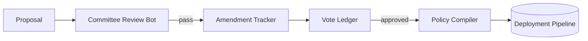
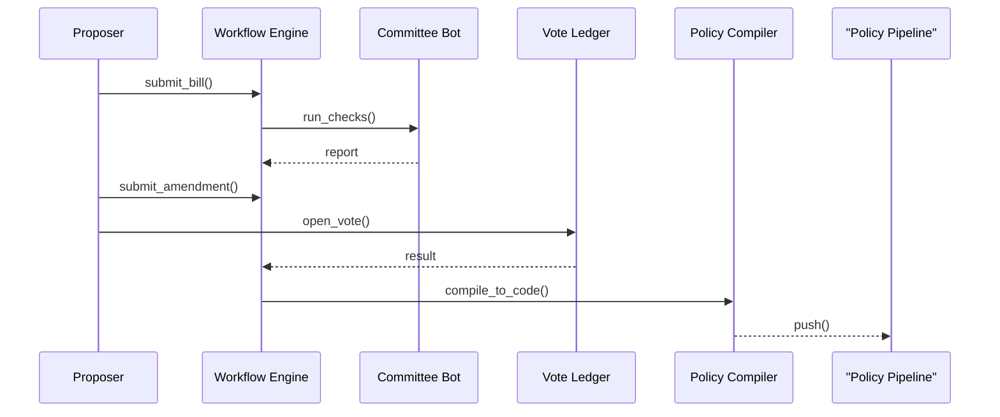

# Chapter 3: HMS-CDF Legislative Workflow Engine

*(Turning plain ideas into production-ready policy code)*  

[← Back to Chapter 2: Human-in-the-Loop (HITL) Oversight Mechanism](02_human_in_the_loop__hitl__oversight_mechanism_.md)

---

## 1. Why Do We Need a “Legislative Workflow Engine”?

Think of every **form letter, city ordinance, or agency memo** sitting in someone’s inbox.  
Right now, turning that text into real, enforceable rules can take **months** of legal review, committee debate, and IT rewrites.

HMS-CDF’s Legislative Workflow Engine (LWE) compresses that timeline into **hours**:

1. **Proposal In →** any employee or citizen group describes a policy change in English.  
2. **Automated Committees →** bots & reviewers run legality, budget, and ethics checks.  
3. **Amendments →** stakeholders suggest fixes in a GitHub-style thread.  
4. **Vote & Sign →** once approved, the engine “compiles” the final text into machine-readable code.  
5. **Out →** the new rule flows straight to deployment in [Policy Deployment Pipeline (CI/CD for Rules)](04_policy_deployment_pipeline__ci_cd_for_rules__.md).

_Imagine the Farm Service Agency publishing a new drought-relief formula by Wednesday instead of next fiscal year._

---

## 2. Story-Driven Example  
### “Rent Cap by Midnight”

A mid-sized city wants to cap rent increases at **2 %** starting tomorrow.

1. Housing Officer Dana opens the **LWE Console** and writes:  
   _“Limit annual residential rent increases to **2 %**, effective 00:00.”_
2. The engine wraps this note into a **RentCap-2024** bill.  
3. Automatic committees run: legal, budget, fairness, tech impact.  
4. An amendment bumps the cap to **2.5 %** after economic review.  
5. Council votes **12-2**.  
6. At 23:59 the code behind every city payment portal now enforces the new limit—no human deploys servers at midnight.

---

## 3. Key Concepts (Beginner Friendly)

| Engine Part | Analogy | 1-Sentence Job |
|-------------|---------|----------------|
| Bill Draft | Google Doc | Raw text of the proposal. |
| Committee Bot | Spell-checker | Runs pre-defined tests (legality, cost). |
| Amendment Tracker | Git pull request | Records each change with author & reason. |
| Vote Ledger | Poll app | Stores who voted and how. |
| Policy Compiler | PDF-to-HTML converter | Turns final text into executable Rust/JSON. |

---

### 3.1 Visual Overview



---

## 4. Hands-On: Submitting Your First Bill

Below we’ll use the **HMS-CLI** (a thin wrapper around the API).  
All commands fit in a small script—no admin rights needed.

```bash
# 1. Create a new bill draft
hms bill new "RentCap-2024" --text "Cap annual rent increases at 2%."

# 2. Run automated committee checks
hms bill committee "RentCap-2024" run --all

# 3. Propose an amendment (bump to 2.5%)
hms bill amend "RentCap-2024" --line 1 --replace "2%" "2.5%" \
  --note "Economic stability review"

# 4. Call for final vote  
hms bill vote "RentCap-2024" --open 2h
```

What happens?

1. A draft file is stored in the Engine’s DB.  
2. Committee Bot attaches results (pass/fail).  
3. Amendment shows up in the web UI thread.  
4. Vote Ledger starts a timer and collects votes.

---

### 4.1 Reading Results

```bash
hms bill status "RentCap-2024"
```

Sample output:

```
Bill: RentCap-2024
Stage: Voting (closes in 01:52:13)
Yes: 2   No: 0   Abstain: 0
Latest amendment: ID#5 (2% ➜ 2.5%)
Committee Checks: ✅ Legal  ✅ Budget  ⚠️ Fairness
```

---

## 5. Under the Hood—A 60-Second Tour



---

## 6. A Peek at the Code  
*(All snippets ≤ 20 lines)*

### 6.1 Bill Struct (Rust)

```rust
// file: engine/bill.rs
use serde::{Serialize, Deserialize};

#[derive(Serialize, Deserialize, Debug)]
pub struct Bill {
    pub id: String,
    pub text: String,
    pub stage: Stage,
    pub amendments: Vec<Amendment>,
}

#[derive(Serialize, Deserialize, Debug)]
pub enum Stage { Draft, Committee, Voting, Passed }
```

Explanation:  
• `Bill` holds everything we need—text, where it is in the process, and edits.

---

### 6.2 Committee Checker (Rust, simplified)

```rust
// file: engine/committee.rs
pub fn run_checks(text: &str) -> Vec<String> {
    let mut notes = vec![];
    if !text.contains("%") { notes.push("Missing numeric value"); }
    if text.len() > 1000  { notes.push("Text too long"); }
    notes  // empty means all good
}
```

Explanation:  
A placeholder “spell-checker” that flags obvious issues. Real modules would import legal or budget logic.

---

### 6.3 Policy Compiler (Rust → JSON)

```rust
// file: engine/compiler.rs
use serde_json::json;

pub fn compile(text: &str) -> String {
    // Super-naïve: assume "2.5%" pattern
    let percent = text.split('%').next().unwrap()
                      .rsplit_once(' ').unwrap().1;
    json!({
        "rule": "rent_cap",
        "max_increase_pct": percent.parse::<f32>().unwrap()
    }).to_string()
}
```

Explanation:  
Turns plain English into a JSON rule the downstream systems understand. You will wire this into the CI/CD pipeline in the next chapter.

---

## 7. Connecting the Dots

* **Automated rules** from [Governance Layer](01_governance_layer__ai_governance_model__.md) still guard every step.  
* **Humans** can override committee results via the red-phone you built in [HITL](02_human_in_the_loop__hitl__oversight_mechanism_.md).  
* Once compiled, the policy file travels to the [Policy Deployment Pipeline (CI/CD for Rules)](04_policy_deployment_pipeline__ci_cd_for_rules__.md) for staging and rollout.  
* Compliance dashboards later surface in [Compliance Guardrail Framework (HMS-ESQ)](05_compliance_guardrail_framework__hms_esq__.md).

---

## 8. Mini-Lab: Your First Pass/Fail

1. Clone the quick-start repo (placeholder):  
   `git clone https://github.com/example/hms-cdf-quickstart.git`
2. Paste the three Rust snippets above into `src/`.  
3. Run:

```bash
cargo run -- "Cap rent at 5%."
```

4. The CLI prints committee warnings.  
5. Tweak the text until `run_checks` returns empty, then watch `compile()` spit out JSON like:

```json
{"rule":"rent_cap","max_increase_pct":5.0}
```

Congratulations—you just legislated in under five minutes! 🚀

---

## 9. Recap & What’s Next

In this chapter you learned:

1. How the Legislative Workflow Engine converts plain language into enforceable policy.  
2. The life-cycle: Draft → Committee → Amendment → Vote → Compile.  
3. How even a tiny Rust module can power a city-wide regulation.

Next we’ll see how that JSON rule slides automatically into staging, testing, and production using DevOps-style tooling. Ready to ship?  
→ [Policy Deployment Pipeline (CI/CD for Rules)](04_policy_deployment_pipeline__ci_cd_for_rules__.md)

---

---

Generated by [AI Codebase Knowledge Builder](https://github.com/The-Pocket/Tutorial-Codebase-Knowledge)