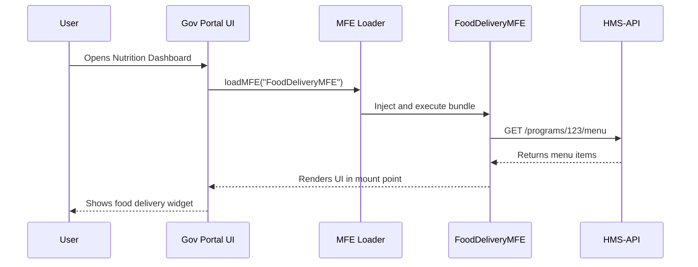

# Chapter 3: HMS-MFE (Micro-Frontend Components)

In [Chapter 2: HMS-MKT (Citizen Portal)](02_hms_mkt__citizen_portal__.md) you built a full citizen-facing flow. Now let’s break that UI into reusable, plug-and-play widgets with **HMS-MFE**—our Micro-Frontend Components.

---

## 1. Motivation & Central Use Case

**Problem:** Every portal re-implements similar UI pieces (appointment schedulers, dashboards, data tables). This leads to duplicated work and inconsistent look-and-feel.

**Use Case Example:**  
The Nutrition Assistance team wants to embed a “Food Delivery” widget on their program page. Rather than coding it from scratch, they pick the `FoodDeliveryMFE` and plug it into their portal. Behind the scenes, it automatically loads its code and data, displays menus, and processes orders—all seamlessly.

---

## 2. Key Concepts

1. **Micro-Frontend (MFE)**  
   A self-contained UI widget (e.g., `FoodDeliveryMFE`, `KanbanBoardMFE`).

2. **Manifest**  
   A registry that maps MFE names to their hosted JavaScript bundles.

3. **Loader**  
   A small script that reads the manifest, injects the MFE bundle, and returns its factory function.

4. **Props & Events**  
   Inputs you pass into an MFE (props) and custom callbacks it emits (events).

5. **Mount Point**  
   A DOM element where the MFE renders itself, like plugging in a kiosk.

---

## 3. Embedding an MFE in Your Portal

### 3.1 Declare Your Manifest

Create a simple map of MFE names to URLs:

```js
// src/mfe/manifest.js
export const MFE_MANIFEST = {
  FoodDeliveryMFE: "https://cdn.gov/mfe/food-delivery.umd.js",
  KanbanBoardMFE:   "https://cdn.gov/mfe/kanban-board.umd.js"
}
```

*This tells our loader where to fetch each widget.*

### 3.2 Write a Loader Utility

The loader injects the script and resolves a factory function:

```js
// src/mfe/loader.js
import { MFE_MANIFEST } from "./manifest"

export function loadMFE(name) {
  const url = MFE_MANIFEST[name]
  if (!url) throw new Error(`Unknown MFE: ${name}`)

  return new Promise((resolve, reject) => {
    const script = document.createElement("script")
    script.src = url
    script.onload  = () => resolve(window[name])    // MFE must attach itself to window
    script.onerror = () => reject(`Load failed: ${name}`)
    document.head.appendChild(script)
  })
}
```

*Now `loadMFE("FoodDeliveryMFE")` will fetch and return its factory.*  

### 3.3 Use an MFE in a Page

```vue
<!-- src/pages/NutritionDashboard.vue -->
<template>
  <div>
    <h1>Nutrition Program</h1>
    <div id="food-delivery-mfe"></div>
  </div>
</template>

<script>
import { loadMFE } from "../mfe/loader"

export default {
  async mounted() {
    const factory = await loadMFE("FoodDeliveryMFE")
    factory({
      mountPoint: "#food-delivery-mfe",
      props: { programId: 123 },
      onOrderSubmitted: (order) => {
        console.log("Order sent:", order)
      }
    })
  }
}
</script>
```

1. We reserve a `<div>` as the mount point.  
2. On `mounted()`, we call our loader.  
3. We pass the DOM selector, props, and an event callback.

---

## 4. What Happens Under the Hood

Here’s a simplified flow of embedding and running an MFE:



---

## 5. Inside the MFE Bundle

A minimal MFE might look like this:

```js
// (bundled as UMD to src on window.FoodDeliveryMFE)
window.FoodDeliveryMFE = function({ mountPoint, props, onOrderSubmitted }) {
  // 1. Fetch menu
  fetch(`/api/programs/${props.programId}/menu`)
    .then(r => r.json())
    .then(menu => {
      // 2. Render a simple list
      const container = document.querySelector(mountPoint)
      container.innerHTML = menu.map(i => `<button>${i.name}</button>`).join("")
      // 3. Attach click handlers
      container.querySelectorAll("button").forEach((btn, idx) => {
        btn.onclick = () => onOrderSubmitted(menu[idx])
      })
    })
}
```

1. Reads `props.programId` to fetch data.  
2. Renders buttons for each menu item.  
3. Calls `onOrderSubmitted` when the user clicks.

---

## 6. Conclusion & Next Steps

You’ve learned how HMS-MFE lets you treat UI widgets like vending-machines you plug into any portal. We covered:

- Declaring an **MFE Manifest**  
- Writing a **Loader** to fetch & mount bundles  
- Embedding an MFE with props & event callbacks  
- Peeked inside a minimal MFE implementation  

Next, we’ll dive into the data side with [Chapter 4: HMS-API (Backend API)](04_hms_api__backend_api__.md).

---

Generated by [AI Codebase Knowledge Builder](https://github.com/The-Pocket/Tutorial-Codebase-Knowledge)