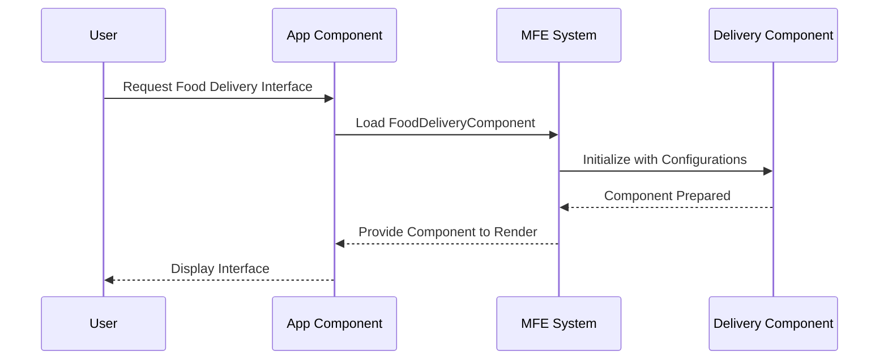

# Chapter 3: HMS-MFE

Welcome to Chapter 3 of our tutorial! In the previous chapters, we journeyed through [HMS-A2A](01_hms_a2a_.md) and [HMS-MKT](02_hms_mkt_.md), exploring how these systems assist in navigating governmental services and creating a vibrant marketplace for interactions. Now, let's delve into `HMS-MFE`, an exciting tool that helps build adaptable micro-frontends tailored to specific program needs.

## What is HMS-MFE?

### Motivation and Use Case

Imagine you're developing a web platform where users can order food and also access learning resources. Balancing the needs for both functionalities while maintaining a seamless user experience can be challenging. Here's where `HMS-MFE` comes into play. It acts like a customizable toolbox, providing specific micro-frontend components that enhance user interaction by delivering the right tools for the right context.

`HMS-MFE` is designed to:

- Deliver specialized interface components for different use cases.
- Enhance user interaction by providing tailored tools for specific contexts.
- Allow developers to quickly integrate and adapt these components into their platforms.

## Understanding Key Concepts

Let's break down the core concepts of `HMS-MFE` to see how it works behind the scenes.

### Key Concept 1: Customizable Toolbox

Think of `HMS-MFE` as a box full of flexible, pre-made parts (components) you can use. Need a food ordering interface? No problem—just grab the needed component from `HMS-MFE` and place it where it fits best.

### Key Concept 2: Specialized Components

Each component in `HMS-MFE` is crafted for a specific use. Whether you need a course dashboard or a food delivery interface, there's likely a ready-made solution you can adapt and tailor for user-friendly integration.

## How to Use HMS-MFE

Let's explore a simple example: integrating a food delivery interface into your application using `HMS-MFE`.

```python
# Using HMS-MFE to add a food delivery interface

# Import the necessary micro-frontend component
from hms_mfe import FoodDeliveryComponent

# Initialize the component with basic configuration
food_delivery = FoodDeliveryComponent(user_location="123 Main St", preferred_restaurants=["Pizza Place", "Sushi House"])

# Render the component within your app
food_delivery.render()
```

### Explanation

- **Import Component**: We start by importing the `FoodDeliveryComponent` from `HMS-MFE`.
- **Initialize**: We set up the component with user location and restaurant preferences.
- **Render**: Finally, we invoke the `render` method to display the component within the application.

## Behind the Scenes

Curious about the internal workings of `HMS-MFE` when you use a component like in our example? Here's a simple illustration:



### Step-by-Step Breakdown

1. **User Request**: The user requests a food delivery interface.
2. **Load Component**: The application component loads the `FoodDeliveryComponent`.
3. **Initialize**: The MFE system initializes the component with user-specific configurations.
4. **Render**: The component is prepared and rendered for the user.

### Internal Implementation

Wondering how the `FoodDeliveryComponent` might be implemented internally? Let's take a peek:

```plaintext
# Placeholder implementation of the FoodDeliveryComponent
class FoodDeliveryComponent:
    def __init__(self, user_location, preferred_restaurants):
        # Initialize with user data
        self.location = user_location
        self.restaurants = preferred_restaurants

    def render(self):
        # Logic to display the component in the application
        print(f"Displaying food delivery options for {self.restaurants} at {self.location}")
```

This simple code snippet highlights the key steps of component initialization with user data to render the interface effectively.

---

## Conclusion

In this chapter, you've discovered how `HMS-MFE` provides a customizable toolbox of specialized components like our food delivery interface example. These components help build adaptable micro-frontends tailored to enhance user-specific interactions. With `HMS-MFE`, developers have the flexibility to integrate and adapt these tools efficiently.

Ready to learn more? Let's proceed to the next chapter about [HMS-AGX](04_hms_agx_.md), where we'll explore new dimensions of capabilities. Keep the curiosity going!

---

Generated by [AI Codebase Knowledge Builder](https://github.com/The-Pocket/Tutorial-Codebase-Knowledge)