# Chapter 3: HMS Micro-services Backbone

← You just met the rule-making brain in [HMS-CDF  (Policy Engine / Codified Democracy Foundation)](02_hms_cdf___policy_engine___codified_democracy_foundation__.md).  
Now let’s see how those rules travel across the entire platform.

---

## 1. Why Do We Need a “Backbone”?

Imagine a citizen, **Maya**, using an online **Affordable Housing Voucher** portal.

1. She submits the form.  
2. The **Housing Eligibility Service** checks income rules written in HMS-CDF.  
3. The **Document Service** stores her pay stubs.  
4. The **Notification Service** emails a receipt.  

All three services must:

* talk to each other quickly,  
* apply the same security rules, and  
* leave a trace we can audit later.

The HMS Micro-services Backbone is the **campus road system** that makes this coordination effortless.

---

## 2. The Campus Analogy (One Slide)

```mermaid
flowchart LR
  Gate["🔐 API Gateway<br/>(security)"] --> Road1
  Road1["🛣️ Service Mesh<br/>(traffic control)"] --> Registry
  Registry["📇 Service Registry<br/>(who is where?)"] --> EventBus
  EventBus["📮 Event Bus<br/>(mail between buildings)"] --> OBS
  OBS["🔭 Observability<br/>(power meter)"]
```



• Buildings = micro-services (Housing, Documents, Notifications)  
• Roads = HTTP/gRPC calls traveling through a **service mesh**  
• Mailboxes = events on a **bus**  
• Gates = authentication / authorization  
• Power meter = log & metrics collection

---

## 3. Key Concepts in Plain English

1. Service = “Building” 
   A tiny program focused on one task (e.g., “Generate PDFs”).

2. API Gateway = “Front Gate” 
   Every outsider must show ID here once; inside, a stamped pass is trusted.

3. Service Mesh = “GPS-guided Roads” 
   Adds automatic retries, encryption, and traffic shaping **without** changing service code.

4. Event Bus = “Campus Mail Room” 
   Services drop letters (events) like “voucher-submitted” that any other service can open.

5. Observability Hooks = “Smart Power Meters” 
   Count every watt (request) for audits and performance tuning.

---

## 4. Tiny Code Tour: Building + Road + Mail

Below 20 lines each, promised!

### 4.1 A Micro-service (“Housing Eligibility”)

```python
# file: svc_housing.py
from fastapi import FastAPI
import httpx, os

app = FastAPI()

CDF_URL = os.getenv("CDF_URL", "http://cdf/rules")

@app.post("/check")
async def check(data: dict):
    # Fetch MAX_INCOME rule from HMS-CDF
    r = await httpx.get(f"{CDF_URL}/MAX_INCOME")
    max_income = r.json()["value"]
    eligible = data["income"] <= max_income
    return {"eligible": eligible}
```

What happened?  
• Service owns **one** endpoint `/check`.  
• Business logic stays tiny; rule lookup goes to HMS-CDF.

### 4.2 Publishing an Event (“voucher-submitted”)

```python
# file: emit_event.py
import json, os, pika   # RabbitMQ client
bus = pika.BlockingConnection(pika.URLParameters(os.getenv("BUS_URL")))
ch = bus.channel()
def publish(ticket_id):
    payload = {"type":"voucher-submitted", "ticket":ticket_id}
    ch.basic_publish(exchange="hms.events", routing_key="housing", 
                     body=json.dumps(payload))
```

Now any other service can subscribe to `"housing"` and react.

---

## 5. Walking Through Maya’s Request


1. UI call enters through **Gateway** (auth).  
2. **Housing Service** checks rules via **CDF**.  
3. It emits an event; **Email Service** listens and sends a receipt.  
4. All traffic is encrypted, counted, and retryable by the **mesh**.

---

## 6. What Glue Holds It Together?

### 6.1 Service Registry Example (YAML)

```yaml
# file: registry/services/housing.yml
name: housing-eligibility
url: http://housing:8000
routes:
  - /check
events:
  publishes: ["voucher-submitted"]
  subscribes: []
```

A simple manifest tells the mesh **where** and **how** to route traffic.  
The registry lives in Git; CI updates the mesh automatically.

### 6.2 Mesh Sidecar (Kubernetes Snippet)

```yaml
# pod spec excerpt (6 lines)
containers:
  - name: housing
    image: ghcr.io/hms/housing:1.2
  - name: mesh-sidecar      # auto-injected
    image: istio/proxyv2
```

No code change required—Istio encrypts (mTLS) and retries calls.

### 6.3 Central Metrics (Prometheus Rule)

```yaml
- alert: HighErrorRate
  expr: rate(hms_requests_failed[5m]) > 0.05
  for: 10m
  labels: {severity: "page"}
```

If >5 % of requests fail for 10 min, on-call engineers get paged.

---

## 7. How Do I Add a New Service?

1. Scaffold:

```bash
hms new-service payment-ledger
```

2. Fill the generated `payment-ledger.yml` manifest.  
3. Push to Git → CI builds the container and updates the registry.  
4. Deploy with one command:

```bash
hms deploy payment-ledger
```

The gateway, mesh, and observability wires come for free.

---

## 8. Relationship to Other HMS Pieces

• Reads policy from [HMS-CDF](02_hms_cdf___policy_engine___codified_democracy_foundation__.md).  
• Exposes stable endpoints that form the [Backend API Layer (HMS-SVC & HMS-API)](04_backend_api_layer__hms_svc___hms_api__.md).  
• Emits logs consumed by [Observability & Ops (HMS-OPS)](14_observability___ops__hms_ops__.md).

Keep the picture: **Backbone = highways**, other chapters describe the **vehicles**.

---

## 9. Summary

You learned:

1. The micro-services backbone is HMS’s campus road system.  
2. Core pieces: API Gateway, Service Mesh, Event Bus, Registry, Observability.  
3. How a tiny service consults rules and publishes events with <20 lines of code.  
4. How the backbone cooperates with the rest of HMS.

Ready to see how these services are published as official, versioned APIs?  
Jump to [Backend API Layer (HMS-SVC & HMS-API)](04_backend_api_layer__hms_svc___hms_api__.md).

---

Generated by [AI Codebase Knowledge Builder](https://github.com/The-Pocket/Tutorial-Codebase-Knowledge)