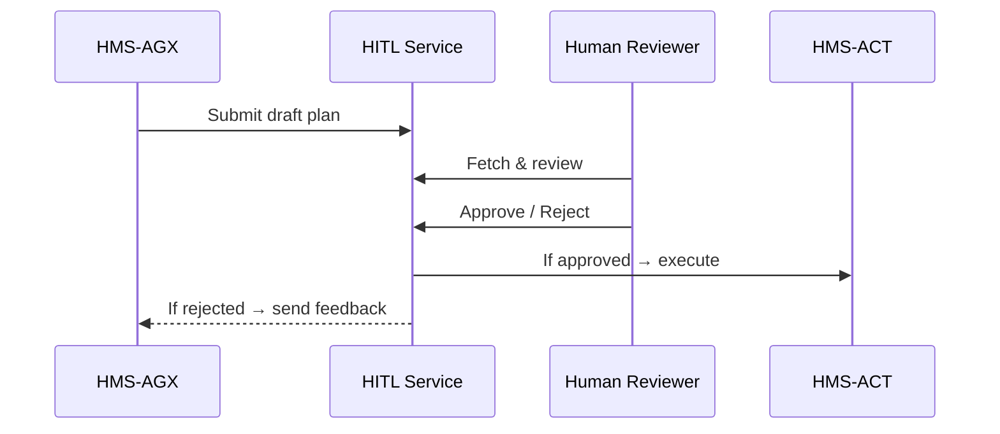

# Chapter 3: Human-in-the-Loop (HITL) Oversight

*[Jump back to Chapter&nbsp;2: AI Representative Agent (HMS-AGX)](02_ai_representative_agent__hms_agx__.md)*  

---

## 1. Why Do We Need HITL?

Picture this:  
The Transportation Security Administration (TSA) wants to roll out an **AI-generated “Express Screening Plan”** for a holiday weekend. HMS-AGX has already drafted every checkpoint change—lane re-assignments, staff rosters, even coffee-break schedules.

Before the plan goes live, one human supervisor, Carla, must answer a single question:

> “Do you approve these changes?”

That stop-sign moment is **Human-in-the-Loop (HITL) Oversight**.  
It keeps automation fast *and* accountable—Carla can tweak numbers, hit **Reject**, or simply click **Approve**. No AI “flips the big red switch” alone.

---

## 2. Key Concepts in Plain English

| Term                    | Analogy (Gov-Friendly)                                       |
|-------------------------|--------------------------------------------------------------|
| Approval Gate           | The sign-off box on a federal form. Nothing proceeds without it. |
| Reviewer / Approver     | Committee chair who initials every staff memo.              |
| Draft Artifact          | The memo produced by HMS-AGX (e.g., TSA plan).              |
| Feedback Loop           | Commenting in the margins—“Increase staff at Gate C.”       |
| Audit Stamp             | Time-stamped entry that says **who** did **what**.          |

---

## 3. Quick Hands-On Demo (≤18 Lines)

Below is a **toy API** that shows the life of a draft plan.  
Read the comments—no setup needed.

```python
# hitl_demo.py
import httpx, json

# 1. AGX submits a draft TSA plan
draft = {
  "title": "Express Screening Plan",
  "agency": "TSA",
  "actions": ["Open extra Pre✓ lane", "Add 4 officers"],
}
ticket = httpx.post("/api/hitl/drafts", json=draft).json()
print("Ticket →", ticket["id"])

# 2. Human reviewer fetches waiting items
pending = httpx.get("/api/hitl/drafts?status=PENDING").json()
print("Pending:", [d["title"] for d in pending])

# 3. Approve the first item
httpx.post(f"/api/hitl/drafts/{ticket['id']}/approve")

# 4. Verify status
state = httpx.get(f"/api/hitl/drafts/{ticket['id']}").json()
print("Status:", state["status"])          # -> APPROVED
```

What happened?

1. A draft plan entered the HITL queue.  
2. Carla saw it in her “Waiting for Review” list.  
3. She clicked **Approve**.  
4. The item’s status flipped to **APPROVED** and is now safe to execute.

---

## 4. Under the Hood—A 60-Second Tour



Step-by-step:

1. **Draft Intake** – AGX POSTs a JSON document to the HITL Service.  
2. **Queueing** – The draft waits in a “PENDING” state.  
3. **Review UI** – Via [HMS-GOV](01_governance_layer___admin_portal__hms_gov__.md) or a micro-frontend (next chapter), Carla inspects details.  
4. **Decision** – On **Approve**, HITL notifies the [Agent Orchestration Engine (HMS-ACT)](06_agent_orchestration_engine__hms_act__.md) to start execution; on **Reject**, AGX receives comments and writes a new revision.  
5. **Audit** – Every click lands in the immutable log inside the [Central Data Repository (HMS-DTA)](07_central_data_repository__hms_dta__.md).

---

## 5. Internals in Mini Code (Each <20 Lines)

### 5.1 Routes (Node + Express)

`services/hitl/routes.js`

```js
const router = require('express').Router();
const Bus = require('../lib/bus');      // wraps RabbitMQ

// POST /drafts
router.post('/drafts', async (req, res) => {
  const draft = { ...req.body, status: 'PENDING' };
  const id = await Drafts.insert(draft);      // db helper
  res.json({ id });
});

// POST /drafts/:id/approve
router.post('/drafts/:id/approve', async (req, res) => {
  const id = req.params.id, user = req.user.email;
  await Drafts.update(id, { status: 'APPROVED', approvedBy: user });
  await Bus.publish('draft.approved', { id });
  res.sendStatus(200);
});

module.exports = router;
```

Explanation:

• `Drafts.insert` stores the plan as **PENDING**.  
• On approval we update status *and* broadcast `draft.approved` so HMS-ACT can listen.  
• No business logic here—just safe transitions.

### 5.2 Listener Inside HMS-ACT

`services/hms-act/listeners/approved.js`

```python
# approved.py
from bus import subscribe, call_service

@subscribe("draft.approved")
def execute(payload):
    draft_id = payload["id"]
    # pull full plan (simplified)
    draft = db.find("drafts", draft_id)
    call_service("tsa.ops.execute_plan", draft)
```

Now every approved plan is handed to the operational layer without extra clicks.

---

## 6. How HITL Connects to Other Layers

| Layer                                  | Interaction with HITL          |
|----------------------------------------|--------------------------------|
| HMS-AGX (Chapter 2)                    | **Creates** drafts, receives feedback |
| HMS-GOV (Chapter 1)                    | Provides the **UI** for reviewers |
| HMS-ACT (Chapter 6)                    | **Executes** approved items    |
| HMS-ESQ – Legal & Compliance (Ch. 8)   | Can auto-flag drafts before human review |
| HMS-OPS – Monitoring (Ch. 12)          | Emits real-time status of the approval backlog |

---

## 7. Common Questions

**Q: Can multiple humans review the same draft?**  
Yes—HITL supports multi-step workflows: “Team Lead → Director → General Counsel.” Each step is just another **Approval Gate**.

**Q: What about emergencies?**  
A draft may carry `priority="EMERGENCY"`. Policy can mark such drafts as *pre-approved* but still post-audited within 24 hours.

**Q: Is HITL only for AGX proposals?**  
No. Any service—external vendor forms, FOIA requests, legislative memos—can enqueue a draft to HITL.

---

## 8. What You Learned

• **HITL** is the safety valve that keeps humans in charge.  
• You ran a 4-step demo turning an AGX draft into an **APPROVED** plan.  
• Under the hood, simple REST routes, a message bus, and clear states do the work.  
• HITL glues together AGX, GOV, ACT, and audit logging.

Ready to build the interface panel where Carla clicked **Approve**?  
Head to [Micro-Frontend Interface Library (HMS-MFE)](04_micro_frontend_interface_library__hms_mfe__.md).

---

Generated by [AI Codebase Knowledge Builder](https://github.com/The-Pocket/Tutorial-Codebase-Knowledge)