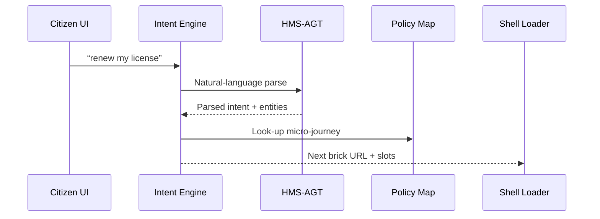

# Chapter 3: Intent-Driven Navigation Engine

*(continues from [Micro-Frontend Interface (HMS-MFE)](02_micro_frontend_interface__hms_mfe__.md))*  

---

## 1. Why Do We Need an “Intent Engine”?

### A concrete story

Maria opens the city portal and simply types:  

> “I just moved, need to update my address and renew my driver’s license.”

Behind that innocent sentence lurk **four** agencies and **eight** forms:

1. DMV – License renewal  
2. DMV – Address change  
3. Tax Office – New municipality registration  
4. Voter Commission – Voter-roll update  

Today Maria would have to **guess** each web link.  
With the **Intent-Driven Navigation Engine (IDNE)** her plain words are enough:

```
Maria types goal ─▶  IDNE  ─▶ Auto-builds a step-by-step journey
```

Think of it as **Google Maps for paperwork**.  
You say the destination; the engine finds every legal turn and hands your browser the right micro-frontends.

---

## 2. Key Concepts (in Plain Words)

| Term | What it means | Analogy |
|------|---------------|---------|
| Intent | A short natural-language goal (“renew passport”) | Destination address |
| Micro-Journey | Ordered list of screens/tasks | Driving route |
| Slot | A missing piece of info the journey needs (e.g., “current license #”) | Gas in the tank |
| Disambiguator | A tiny Q&A to clarify vague intents | “Did you mean Elm St in NY or NJ?” |
| Policy Map | Graph of which agency owns which step and in what order | City road map |

---

## 3. Quick Start — Route a Single Intent in 15 Lines

Below we run the engine in **stand-alone mode**.  
(Full integration with HMS-MFE comes later.)

```python
# demo_route.py
from hms_idne import IntentEngine

engine = IntentEngine()

goal = "renew my driver's license"
route = engine.plan(goal)

print("Journey steps:")
for step in route:
    print("•", step["title"])
```

Example output:

```
Journey steps:
• Verify identity  (DMV)
• Collect eyesight certificate  (DMV)
• Pay renewal fee  ($40)
• Receive temporary license
```

Explanation  
1-2  Import the minimal wrapper.  
4    Create the engine (bootstraps models & policy map).  
6    Pass the citizen’s text.  
7-10 Loop over the micro-journey and print human-readable titles.

That is the **entire** public API most developers need!

---

## 4. Hooking the Engine to the Frontend Shell

A micro-frontend only has to ask for **the next step**.  
Below is a simplified brick-side snippet (8 lines).

```javascript
// bricks/journeyNav.js
import {publish} from '/bus.js';      // message bus from Chapter 2

export async function start(goal){
  const res = await fetch('/idne?goal='+encodeURIComponent(goal))
                    .then(r=>r.json());
  publish('LOAD_BRICK', res.nextBrickUrl);   // shell loads it
}
```

Explanation  
• Fetches `/idne` service (the engine wrapped as HTTP).  
• Broadcasts `LOAD_BRICK` so the shell dynamically imports the right brick (§3 of last chapter).  
• Any brick can now call `start()`—no hard-coded URLs.

---

## 5. What Happens Under the Hood?



Step-by-step:

1. UI sends the raw sentence to IDNE.  
2. IDNE delegates the heavy NLP to [HMS-AGT](01_ai_representative_agent__hms_agt__.md).  
3. AGT returns structured data `{intent:"LICENSE_RENEW", age:34}`.  
4. IDNE consults its **Policy Map** graph (stored in [Central Data Repository](12_central_data_repository__hms_dta__.md)).  
5. It answers the shell with:  

```json
{
  "nextBrickUrl": "/bricks/dmv/license-renew.js",
  "slots": ["license_id", "eye_exam_form"]
}
```

---

## 6. A Peek Inside the Codebase

### 6.1 Core Planner (file `hms_idne/engine.py`, 18 lines)

```python
from .nlp import parse_intent
from .policy import GRAPH

class IntentEngine:
    def plan(self, text):
        intent, entities = parse_intent(text)     # 1
        nodes = GRAPH[intent]["steps"]            # 2
        return [{"title":n["title"],
                 "brick":n["brick"],
                 "slots":n.get("slots",[])}
                for n in nodes]                   # 3
```

Explanation  
1  `parse_intent` is a thin wrapper over HMS-AGT.  
2  Selects the right sub-graph (a dict cached in memory).  
3  Returns a trimmed list the UI can consume.

### 6.2 Tiny Policy Map Snippet (file `hms_idne/policy.py`)

```python
GRAPH = {
  "LICENSE_RENEW": {
     "steps":[
        {"title":"Verify identity",
         "brick":"/bricks/common/identity.js",
         "slots":["license_id"]},
        {"title":"Pay fee",
         "brick":"/bricks/pay/pay.js"}
     ]
  }
}
```

Change this JSON-ish dict and the engine immediately supports new journeys—**no code compile** needed.

---

## 7. Handling Ambiguous Requests

Humans are fuzzy. If the engine detects ambiguity it raises a **disambiguator** prompt:

```python
# inside IntentEngine.plan()
if intent == "AMBIGUOUS":
    return {"ask":"Did you mean driver or fishing license?"}
```

The frontend shows a quick options dialog, then re-calls `plan()` with the clarified answer.  
You get error-proof routing with **two extra lines**.

---

## 8. Frequently Asked Questions

**Q: Do I need to train my own language model?**  
A: No. IDNE piggybacks on the centrally hosted model already used by HMS-AGT.

**Q: How big can a micro-journey be?**  
A: Any size. The engine streams steps, so even a 50-step immigration path loads one screen at a time.

**Q: Where are privacy rules enforced?**  
A: Slot data never leaves the browser until the citizen consents; the [Governance Layer & AI Values Framework](05_governance_layer___ai_values_framework_.md) masks sensitive tokens in logs.

---

## 9. Wrap-Up

In this chapter you:

• Learned why natural-language routing removes guesswork for citizens.  
• Built a **15-line** script that plans a license-renewal journey.  
• Connected the engine to the micro-frontend shell with one API call.  
• Peeked at the internal planner and policy map.

Next we will see **how humans can monitor and override every AI decision** through a dashboard: [Human-In-The-Loop (HITL) Control Panel](04_human_in_the_loop__hitl__control_panel_.md)

Welcome to smoother, smarter navigation!

---

Generated by [AI Codebase Knowledge Builder](https://github.com/The-Pocket/Tutorial-Codebase-Knowledge)