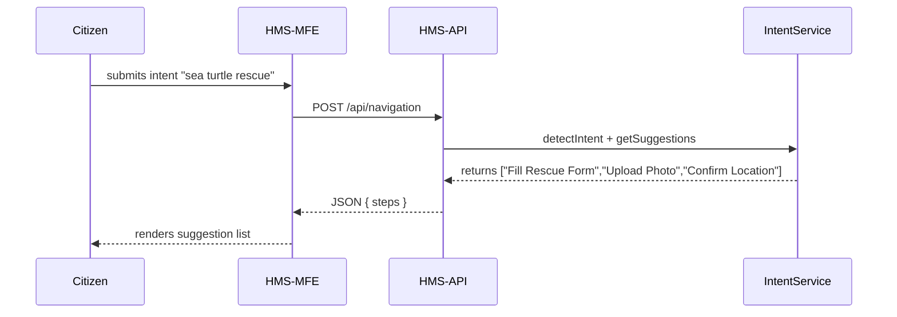

# Chapter 3: Intent-Driven Navigation

Welcome back! In [Chapter 2: Role-Based Actors](02_role_based_actors_.md) we learned how to give everyone the right “badge” so they can only do what they’re allowed. Now, let’s build an AI-powered guide that not only answers questions but predicts what forms or services you need—just like a friendly clerk at an information desk.

---

## 1. Why Intent-Driven Navigation?

Imagine a citizen visits the NOAA Fisheries portal to report a stray sea turtle strand. Instead of them hunting through menus, our system asks, “What brings you here today?” They type “sea turtle rescue” and—voilà—we suggest exactly:

1. Wildlife Rescue Form  
2. Upload photo of animal  
3. Review safety guidelines  

This guided journey saves time and reduces mistakes.

### Central Use Case

A marine volunteer wants to report a fishing net entanglement incident. They:

1. Open the citizen portal (HMS-MFE).  
2. Pick “Report Wildlife Incident.”  
3. The system shows the next 3 steps: form, upload photos, confirm location.

Behind the scenes, an AI intent detector reads their choice and returns context-aware suggestions.

---

## 2. Key Concepts

1. **Intent Detection**  
   Turn free-text or menu choices into a recognized goal (e.g., “wildlife incident”).

2. **Suggestion Engine**  
   A mapping from intent → ordered list of next steps or forms.

3. **User Journey**  
   The dynamic sequence of pages/forms presented, adapting as the user completes tasks.

---

## 3. Building an Intent-Driven Widget

Below is a tiny React component that asks for the user’s intent and shows suggestions.

```jsx
// src/IntentNavigator.jsx
import React, { useState } from 'react';

export default function IntentNavigator() {
  const [intent, setIntent] = useState('');
  const [steps, setSteps] = useState([]);

  async function handleSubmit(e) {
    e.preventDefault();
    const res = await fetch('/api/navigation', {
      method: 'POST',
      headers: {'Content-Type':'application/json'},
      body: JSON.stringify({ intent })
    });
    const data = await res.json();
    setSteps(data.steps);
  }

  return (
    <div>
      <form onSubmit={handleSubmit}>
        <label>What do you need? 
          <input onChange={e => setIntent(e.target.value)} required/>
        </label>
        <button>Go</button>
      </form>
      <ol>{steps.map((s,i)=><li key={i}>{s}</li>)}</ol>
    </div>
  );
}
```

Explanation:
- User types their intent (e.g., “report sea turtle”).  
- We call POST `/api/navigation`.  
- Render the ordered list `steps` returned by the API.

---

## 4. Under the Hood: Request Flow

Here’s the simple flow when a volunteer clicks “Go”:



1. HMS-MFE sends the free-text intent to HMS-API.  
2. HMS-API calls our IntentService.  
3. Suggestions come back and display in the UI.

---

## 5. Internal Implementation

### 5.1 API Route

```js
// src/routes/navigation.js
const express = require('express');
const { suggestSteps } = require('../services/intentService');
const router = express.Router();

router.post('/', async (req, res) => {
  const { intent } = req.body;
  const steps = await suggestSteps(intent);
  res.json({ steps });
});

module.exports = router;
```

Explanation:
- We extract `intent` from the request.  
- Call `suggestSteps(intent)` and return the list.

### 5.2 Intent Service

```js
// src/services/intentService.js
const intentMap = {
  "report wildlife": [
    "Fill Wildlife Incident Form",
    "Upload Photos",
    "Provide GPS Location"
  ],
  "apply building permit": [
    "Start Permit Application",
    "Upload Site Plan",
    "Pay Fee"
  ]
};

async function suggestSteps(text) {
  const key = Object.keys(intentMap)
    .find(k => text.toLowerCase().includes(k));
  return intentMap[key] || ["Please clarify your request"];
}

module.exports = { suggestSteps };
```

Explanation:
- We use a simple map from recognized intent keys → step arrays.  
- If none match, we ask the user to clarify.

---

## 6. Why This Matters

- **User Guidance:** Citizens never wonder “What next?”  
- **Flexibility:** Add or refine intents in one place (`intentMap`).  
- **Consistency:** All journeys follow the same pattern, reducing support calls.

---

## Conclusion

You’ve learned how to turn a user’s goal into a step-by-step guided journey with AI-style intent detection. Next, we’ll dive deeper into optimizing entire processes using AI:

[Chapter 4: AI-Facilitated Process Optimization](04_ai_facilitated_process_optimization_.md)

---

Generated by [AI Codebase Knowledge Builder](https://github.com/The-Pocket/Tutorial-Codebase-Knowledge)