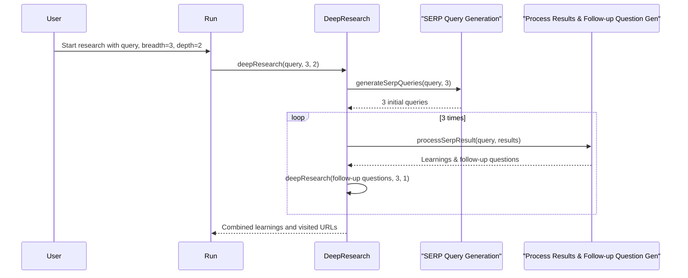

# Chapter 3: Iterative Deepening

In the previous chapter, [Research Breadth](02_research_breadth_.md), we learned how to control the "width" of our research. Now, let's explore how to control its "depth" using *Iterative Deepening*.

Imagine you're researching the history of the internet.  A broad search might cover key milestones like the invention of the World Wide Web and the rise of social media. But what if you want to go deeper and explore the specific technologies behind the web, or the societal impact of social media? This is where iterative deepening comes in.

## What is Iterative Deepening?

Iterative deepening controls how many levels "deep" the research goes.  Think of it like exploring a family tree:

- **Depth 1:** You only look at your parents.
- **Depth 2:** You look at your parents and their parents (your grandparents).
- **Depth 3:** You look at your parents, grandparents, and *their* parents (your great-grandparents).

In research, each level of depth represents a new layer of exploration.  A higher depth means exploring more related subtopics, making the research more comprehensive but also more time-consuming.

## Using Iterative Deepening

Let's return to our internet history example.  Here's how different depth values would affect the research:

- **Depth = 1:** The agent might provide a general overview of the internet's history, covering major milestones.
- **Depth = 2:** The agent might explore the key figures involved in each milestone, like Tim Berners-Lee for the World Wide Web.
- **Depth = 3:** The agent might delve into the specific technologies that enabled these milestones, like the development of HTML.

You control the depth parameter when calling the `deepResearch` function, alongside the breadth:

```typescript
// src/run.ts
const { learnings, visitedUrls } = await deepResearch({
  query: "History of the internet",
  breadth: 3, // Exploring 3 different angles at each level
  depth: 2,   // Exploring two levels deep
});

// ... (rest of the code remains the same)
```

This code snippet sets the depth to 2, instructing the agent to explore two levels deep into the history of the internet.

## Inside the Deep Research Agent with Iterative Deepening

Here's a simplified sequence diagram showing how iterative deepening works:



1. You provide the initial query, breadth, and depth (2 in this example).
2. The `deepResearch` function generates initial search queries based on the breadth.
3. It processes the search results, extracting learnings and generating follow-up questions.
4. Since the depth is 2, it then uses these follow-up questions as *new* queries and calls `deepResearch` again, but with a depth of 1.  This represents the second level of exploration.
5. This process repeats until the specified depth is reached.

Here's a simplified look at the recursive call within `deepResearch`:

```typescript
// src/deep-research.ts
// ... (other code)
if (newDepth > 0) {
  // ...
  const nextQuery = `
    Previous research goal: ${serpQuery.researchGoal}
    Follow-up research directions: ${newLearnings.followUpQuestions.join('\n')}
  `.trim();

  return deepResearch({
    query: nextQuery,
    breadth: newBreadth,
    depth: newDepth,
    // ... other parameters
  });
}
// ... (other code)
```

The function calls itself with the follow-up questions and a reduced depth, effectively diving deeper into the topic.

## Conclusion

This chapter explained how Iterative Deepening allows you to control the "depth" of your research, exploring subtopics and related concepts. In the next chapter, [SERP Query Generation](04_serp_query_generation_.md), we'll learn how the Deep Research Agent generates intelligent search queries to explore these different levels.


---

Generated by [AI Codebase Knowledge Builder](https://github.com/The-Pocket/Tutorial-Codebase-Knowledge)