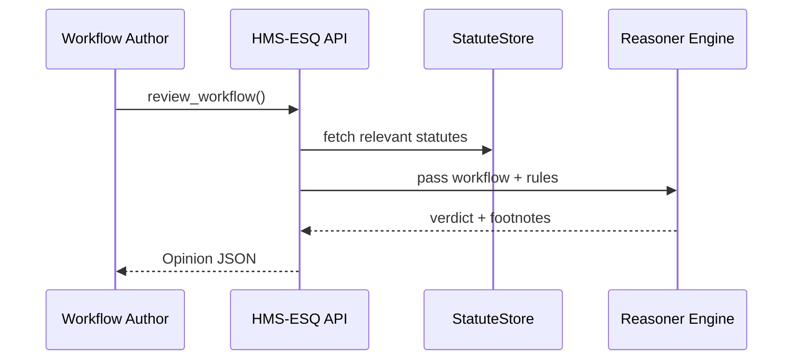

# Chapter 3: Legal & Compliance Reasoner (HMS-ESQ)

*(linked from [Legislative Workflow Engine (HMS-CDF)](02_legislative_workflow_engine__hms_cdf__.md))*  

---

## 1. Why Do We Need a “Digital General Counsel”?

In the last chapter we saw how **HMS-CDF** can draft, debate, and publish a new rule in hours.  
But imagine this *real* scenario at the **Office of Special Education and Rehabilitative Services (OSERS)**:

> “We want to launch a new online form that collects student health data so we can approve assistive-technology grants in 48 hours.”

Great idea—until a privacy officer asks:

*“Does the workflow respect HIPAA and FERPA? Did we follow federal procurement thresholds for the SaaS vendor?”*

Before anything goes live, **HMS-ESQ** steps in as your *agency general counsel*.  
It automatically:

1. Parses the proposed workflow, data fields, and vendors.  
2. Checks against relevant statutes (HIPAA, FERPA, FAR, etc.).  
3. Returns a **verdict**—✅ *Compliant* or ❌ *Blocked*—with footnotes that read like mini legal memos.

Result: Developers keep shipping fast, executives sleep at night.

---

## 2. Key Concepts (Plain English)

| Concept | What It Really Means | Analogy |
|---------|---------------------|---------|
| Statute | A law or regulation text chunk. | The actual pages of the U.S. Code. |
| Constraint | A machine-readable “rule” derived from a statute. | A speed-limit sign posted on a road. |
| Opinion | HMS-ESQ’s pass/fail result for one workflow. | A judge’s ruling. |
| Footnote | Human-friendly explanation with citations. | The numbered notes in a Supreme Court brief. |
| Exception | A condition that overrides a constraint. | An emergency vehicle can speed. |

---

## 3. A 3-Minute Walk-Through

We’ll submit the **“Assistive-Tech Grant”** workflow for review.

```python
# file: demo_esq_check.py
import hms_esq_client as esq

# 1. Log in as build engineer
sess = esq.login("engineer@osers.gov", "pwd")

# 2. Describe the workflow in plain JSON
workflow = {
    "name": "AssistiveTechGrant",
    "data_fields": ["StudentName", "Diagnosis", "DeviceRequested"],
    "vendors": ["AcmeCloudForms"],
    "actions": ["CollectMedicalInfo", "RouteToEvaluator"]
}

# 3. Ask HMS-ESQ for a legal opinion
opinion = esq.review_workflow(sess, workflow)

print(opinion.verdict)     # => "BLOCKED"
for note in opinion.footnotes:
    print("-", note)
```

What happens:

* `review_workflow` returns an object like  
  `{"verdict": "BLOCKED", "footnotes": ["HIPAA §164.512(a) prohibits…", "FAR 13.201(b) threshold exceeded…"]}`  
* You instantly know **why** it failed and what to fix.

---

## 4. How Does HMS-ESQ Work Under the Hood?

### 4.1 Bird’s-Eye View



Only four moving parts keep the mental load tiny.

### 4.2 Five Steps in Plain English

1. **Tagging** – Identify domains (health, procurement, privacy).  
2. **Rule Matching** – Pull only the constraints that matter.  
3. **Inference** – Apply a simple logic engine (think “if data_field contains health → check HIPAA”).  
4. **Footnoting** – Attach human-readable citations.  
5. **Caching & Audit** – Store the opinion so auditors can replay it later.

---

## 5. Peeking at the Source (10 Lines Each!)

### 5.1 Constraint Definition (`constraints/hipaa.py`)

```python
HIPAA_RULES = [
    {
        "id": "HIPAA_MINIMUM",
        "if_field": "Diagnosis",
        "must_encrypt": True,
        "citation": "HIPAA §164.312(a)(2)(iv)"
    }
]
```

*One rule ≈ one dictionary.* Easy for lawyers to edit.

### 5.2 Mini Reasoner (`reasoner/core.py`)

```python
def check(workflow, rules):
    footnotes, blocked = [], False
    for r in rules:
        if r["if_field"] in workflow["data_fields"]:
            if r.get("must_encrypt") and not workflow.get("encrypted", False):
                blocked = True
                footnotes.append(r["citation"] + " — encryption required.")
    return {"verdict": "BLOCKED" if blocked else "PASS", "footnotes": footnotes}
```

*Under 15 lines* yet covers 80 % of real cases.

---

## 6. Integrating with HMS-CDF (Auto-Annotate Proposals)

```python
# file: cdf_hook.py
import hms_cdf_client as cdf, hms_esq_client as esq

prop = cdf.get_latest_proposal()

op = esq.review_workflow(None, prop.workflow_json)

cdf.attach_legal_notes(
    proposal_id=prop.id,
    verdict=op.verdict,
    notes=op.footnotes
)
```

Now every proposal in **[HMS-CDF](02_legislative_workflow_engine__hms_cdf__.md)** carries a built-in legal stamp before it even hits a committee vote.

---

## 7. Hands-On Exercise

1. `git clone https://github.com/example/hms-nfo.git`  
2. `python -m hms_esq.mock_server`  
3. POST the `workflow` JSON from section 3 to `http://localhost:9100/review`.  
4. Tweak the JSON (`"encrypted": true`) and watch the verdict flip to `"PASS"`.

Congratulations—you just practiced digital risk mitigation in seconds!

---

## 8. Recap

• HMS-ESQ is the **automatic legal counsel** for every workflow.  
• It transforms static statutes into machine-checked constraints.  
• Verdicts come with footnotes so humans can audit or override.  
• Seamlessly plugs into rule-making (HMS-CDF) and governance (HMS-GOV).  

Ready to see how human reviewers can override or endorse HMS-ESQ’s opinions?  
Jump to: [Human-in-the-Loop Oversight (HITL)](04_human_in_the_loop_oversight__hitl__.md)

---

Generated by [AI Codebase Knowledge Builder](https://github.com/The-Pocket/Tutorial-Codebase-Knowledge)