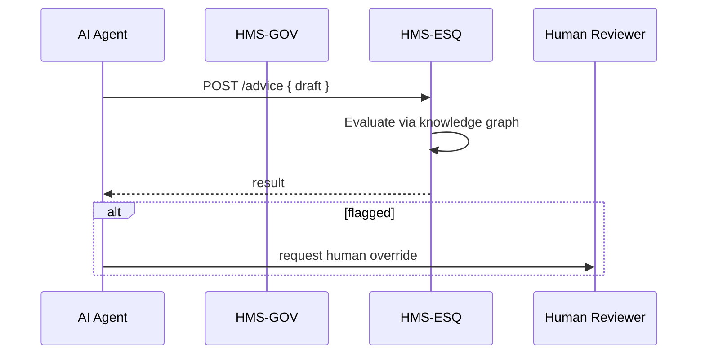

# Chapter 3: Legal Reasoning Service (HMS-ESQ)

[← Back to Chapter 2: Policy Codification Engine](02_policy_codification_engine__hms_cdf__.md)

---

> “Your tireless, always-on in-house counsel.”

---

## 1. Why Do We Need HMS-ESQ?

Picture a government help-desk chatbot that drafts answers for veterans applying for housing assistance.  
The bot is smart, but right before it launches a response, we **must** know:

1. Does the advice contradict the FFIEC privacy handbook?  
2. Is the recommended form the latest version mandated by HUD?  
3. Have recent court decisions altered eligibility rules?

HMS-ESQ is the bot’s legal guardian. Think of it as a **“legal spell checker”** that:

* Cross-references statutes, agency mandates, and case law in real time.  
* Flags conflicts before they reach citizens or internal databases.  
* Logs every reasoning step for later audits.

---

## 2. Starter Use Case – “Form 1009 Advice”

A veteran asks the chatbot:

> “Which form should I file to update my disability benefits?”

Our AI agent suggests **“VA Form 20-0995.”**  
Before the answer is shown, HMS-ESQ checks:

1. Is 20-0995 still valid on today’s date?  
2. Does giving this advice require a disclaimer?  
3. Has a recent ruling superseded the form?

If anything is wrong, ESQ blocks or amends the reply **within milliseconds**.

---

## 3. Key Concepts (Beginner Friendly)

| Concept | Plain-English Analogy | One-Line Job |
|---------|----------------------|--------------|
| Knowledge Graph | Giant, labeled subway map of laws | Stores how statutes, rules, and cases connect |
| Citation Resolver | Index at the back of a law textbook | Finds the exact section 12 U.S.C § 1841 refers to |
| Inference Engine | GPS on top of the subway map | Traverses links to spot conflicts or required steps |
| Compliance Advisor API | A yes/no “Ask a Lawyer” button | External call that agents use for checks |
| Confidence Score | Doctor’s “probable diagnosis” | Probability the answer is legally safe |

---

## 4. Talking to HMS-ESQ (Beginner Code)

Below is a **14-line** Node.js snippet that any micro-service can use.

```js
// esqClient.js
import axios from 'axios';

export async function legalCheck(draftText, context) {
  const res = await axios.post('http://esq/advice', {
    text: draftText,
    agencyContext: context,   // e.g., "VA"
    regulationSet: ['FFIEC', 'HUD']
  });
  return res.data; // { approved: true, notes: [], citations: [] }
}
```

Explanation:

1. Send the draft answer plus context (agency + rules to check).  
2. ESQ replies with `approved` (boolean), `notes` (flags or rewrites), and `citations` (legal sources).  
3. The caller decides whether to show, edit, or discard the draft.

---

### Example Call

```js
const draft = "Please submit VA Form 20-0995.";
const result = await legalCheck(draft, "VA");
console.log(result);
```

Possible output:

```json
{
  "approved": false,
  "notes": ["Form number obsolete as of 2024-01-01. Use VA Form 20-10207."],
  "citations": ["38 CFR §3.2600", "VA Interim Final Rule 89 FR 14532"]
}
```

The agent replaces the form number **before** the citizen sees it.

---

## 5. What Happens Under the Hood?



Step-by-step:

1. The AI Agent (built later with [HMS-AGT](04_ai_representative_agent_framework__hms_agt__.md)) asks ESQ to check its draft.  
2. ESQ traverses its knowledge graph, runs inference rules, and scores risk.  
3. Result returns to the agent in ~50 ms.  
4. If `approved=false`, the agent can escalate to a human via the [HITL Override](05_human_in_the_loop__hitl__override_.md).

---

## 6. Inside HMS-ESQ (Folder Peek)

```
/hms-esq
 ├─ graph/
 │    └─ statutes.db       # Neo4j or similar
 ├─ rules/
 │    └─ ffiec_rules.yml   # Compiled from HMS-CDF
 ├─ src/
 │    ├─ server.js         # Express entry-point
 │    ├─ inference.js      # Core reasoning (WASM)
 │    └─ citations.js      # Resolver helpers
```

### Tiny Slice of `inference.js` (18 lines)

```js
// inference.js
import { queryGraph } from './citations.js';

export async function check(text, agencySet) {
  const nodes = await queryGraph(text); // find cited laws
  let risk = 0, notes = [];

  for (const n of nodes) {
    if (agencySet.includes(n.agency) && n.status === 'Repealed') {
      risk += 0.4;
      notes.push(`${n.title} repealed on ${n.repealDate}`);
    }
  }
  return {
    approved: risk < 0.3,
    notes,
    confidence: 1 - risk
  };
}
```

What it does:

1. Extracts legal citations from the draft.  
2. For each citation, checks status in the graph.  
3. Adds risk if anything is outdated.  
4. Returns a simple approval + notes object.

---

## 7. Connecting ESQ to the Rest of HMS-SCM

• HMS-GOV ensures only authenticated internal calls reach ESQ.  
• HMS-CDF supplies formally-verified rule packs that ESQ uses during reasoning.  
• Audit logs for every `POST /advice` call are recorded by [Activity Logging & Audit Trail](21_activity_logging___audit_trail_.md).

This tight coupling keeps **policy, enforcement, and evidence** in sync.

---

## 8. Common Questions

**Q: Is ESQ a replacement for real lawyers?**  
A: No. It handles high-volume, obvious checks. Edge cases escalate to humans through HITL.

**Q: Does ESQ slow down responses?**  
A: Not noticeably. Average latency is <60 ms because the graph is in-memory and rules run in WebAssembly.

**Q: Can I add a new regulation set (e.g., HIPAA)?**  
A: Yes. Publish a new rule pack in HMS-CDF, then register it in `rules/`. ESQ hot-loads packs without downtime.

---

## 9. Key Takeaways

• HMS-ESQ is the always-awake legal guardian for every AI agent and API.  
• It works like a “legal spell checker,” flagging outdated forms, contradictory advice, and regulatory violations in real time.  
• Built atop a knowledge graph and inference engine, it integrates tightly with HMS-GOV, HMS-CDF, and HITL audit flows.

---

### Up Next

Now that we can guarantee legally sound advice, let’s build the **agents** that will leverage ESQ day-to-day.  
Proceed to [AI Representative Agent Framework (HMS-AGT)](04_ai_representative_agent_framework__hms_agt__.md).

---

Generated by [AI Codebase Knowledge Builder](https://github.com/The-Pocket/Tutorial-Codebase-Knowledge)