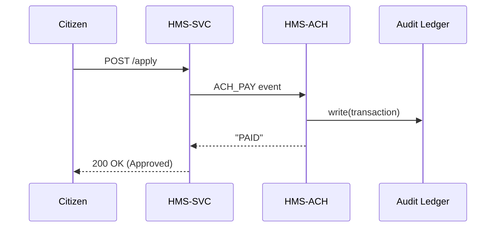

# Chapter 3: Management Layer (HMS-SVC & HMS-ACH)


*[Jump back to Chapter 2: Policy & Process Engine](02_policy___process_engine__backend_api__.md)*  

---

## 1. Why Does This Layer Exist?

Imagine the **Department of Education** launches a “Student Loan Relief” portal:  

1. Laws limit total yearly relief to **\$10 B**.  
2. A published policy (Chapter 1) translates into an API contract (Chapter 2).  
3. Citizens now submit relief requests.

Who actually approves requests, watches the budget, and wires money to bank accounts?  
➡ **The Management Layer**—our day-to-day **operations center** made of:

* **HMS-SVC** – domain micro-services that hold the business logic (e.g., `loan-relief-svc`).  
* **HMS-ACH** – the payment rail that pushes real dollars, enforces quotas, and records every cent.

Think of HMS-SVC as the staffers checking applications, and HMS-ACH as the **Treasury** printer moving funds—both under the rules already approved.

---

## 2. Key Concepts (Plain-English Cheatsheet)

| Term          | Analogy in a Federal Agency                    |
|---------------|-----------------------------------------------|
| HMS-SVC       | Individual program office desks               |
| HMS-ACH       | Bureau of the Fiscal Service payment system   |
| Task Queue    | An inbox tray where files wait for review     |
| Quota Guard   | CFO telling you “budget left this quarter: 5 %”|
| Routing Rule  | Mail-room clerk deciding which desk gets what |
| Reconciliation| Daily audit log sent to the Inspector General |

---

## 3. A 2-Minute Mental Model

```mermaid
graph TD
  Citizen[Citizen Portal] -->|reliefRequest| SVC[HMS-SVC<br>(loan-relief)]
  SVC -->|validate quota| GOV[(HMS-GOV)]
  SVC -->|send payout| ACH[HMS-ACH]
  ACH -->|record spend| Ledger[(Audit Ledger)]
```

1. Request hits HMS-SVC.  
2. Service checks rules/quota.  
3. Valid requests flow to HMS-ACH.  
4. ACH moves money & writes to the auditing ledger.

---

## 4. Walk-Through: “Student Loan Relief” in Action

We will build one tiny endpoint and watch money flow.

### 4.1 Create the Service Skeleton

```bash
hms-svc init loan-relief-svc
cd loan-relief-svc && npm install
```

`init` scaffolds a folder and **auto-registers** the service in the mesh (Chapter 4).

### 4.2 Add a Relief Endpoint (≤15 lines)

```js
// routes/relief.js
router.post("/apply", async (req, res) => {
  const { ssn, amount } = req.body;

  // 1) Quota check (calls HMS-GOV cache)
  if (!(await quota.within("relief", amount))) {
    return res.status(429).json({ error: "Budget exhausted" });
  }

  // 2) Persist application
  const appId = db.save({ ssn, amount, status: "APPROVED" });

  // 3) Schedule payout
  await ach.pay({ appId, ssn, amount });

  res.json({ appId, status: "APPROVED" });
});
```

Explanation for beginners  
1. `quota.within` asks HMS-GOV if money is left.  
2. We store the approved request.  
3. `ach.pay` fires an **asynchronous** payment job so the HTTP call stays snappy.

### 4.3 The ACH Call (8 lines)

```js
// lib/ach.js
export async function pay({ appId, ssn, amount }) {
  await mesh.emit("ACH_PAY", { appId, ssn, amount }); // non-blocking
}
```

HMS-ACH is listening on the mesh bus. Your service never deals with banking APIs directly.

### 4.4 What Happens Next?



All under 5 participants—easy to follow!

---

## 5. Hands-On Mini-Lab (5 Minutes)

1. Start both services locally:  
   ```bash
   hms-svc dev    # spins up loan-relief-svc
   hms-ach dev    # spins up mock treasury rail
   ```
2. Submit a sample request:  
   ```bash
   curl -X POST localhost:3000/apply \
     -d '{"ssn":"123-45-6789","amount":1500}' -H "Content-Type: application/json"
   ```
3. Check the ledger entry:  
   ```bash
   hms-ledger tail
   # ➜ TX 001 | ssn=123-45-6789 | amount=$1,500 | status=PAID
   ```

Congrats—money flowed through the mock Treasury without writing any banking code!

---

## 6. Under the Hood (For the Curious)

### 6.1 How HMS-ACH Enforces the Budget

```js
// hms-ach/handlers/pay.js
bus.on("ACH_PAY", async (tx) => {
  const { amount } = tx;
  if (!(await quota.within("relief", amount))) return bus.emit("DENIED", tx);

  treasuryApi.disburse(tx);          // calls real or sandbox ACH
  quota.decrement("relief", amount); // atomic move
  ledger.record(tx);                 // immutable write
});
```

Step-by-step  
1. Receives event.  
2. Re-checks budget to avoid race conditions.  
3. Calls external ACH system.  
4. Atomically deducts from quota.  
5. Records in the auditing ledger.

### 6.2 File Layout Snapshot

```
loan-relief-svc/
 ├─ routes/
 │   └─ relief.js
 ├─ lib/
 │   └─ ach.js
 ├─ hms.yml   # runtime manifest from Chapter 2
```

That’s all you need for a real micro-service!

---

## 7. FAQ Corner

**Q: Do I have to call HMS-ACH directly?**  
No. Emit an `ACH_PAY` event; the rail handles retries, failures, and ledger writes.

**Q: What if the quota is exceeded mid-day?**  
Both HMS-SVC *and* HMS-ACH guard the budget, so even race conditions are safe.

**Q: Can HMS-ACH handle non-cash benefits (e.g., points)?**  
Yes—pass `currency:"POINTS"` in the event. The same enforcement logic applies.

---

## 8. What You Learned

• HMS-SVC holds business logic; HMS-ACH moves the money.  
• Quotas and rules come from [Governance Layer](01_governance_layer__hms_gov__.md) and are enforced twice for safety.  
• Services communicate through the mesh, keeping them loosely coupled.  

Ready to see how thousands of these services discover each other and stay healthy?  
Jump to [Chapter 4: Microservices Mesh & Service Registry](04_microservices_mesh___service_registry_.md).

---

Generated by [AI Codebase Knowledge Builder](https://github.com/The-Pocket/Tutorial-Codebase-Knowledge)