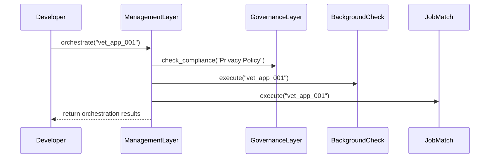

# Chapter 3: Management Layer

In [Chapter 2: Governance Layer](02_governance_layer_.md), you learned how policies are defined and enforced. Now we’ll look at the **Management Layer**—the orchestration tier that assigns tasks to services, applies those policies, and manages configurations, just like a central operations office in a federal agency.

---

## 1. Why a Management Layer?

Imagine the Veterans’ Employment and Training Service (VETS) portal receives an application from a veteran. To process it, you need to:

1. Run a **Background Check** service.  
2. Run a **Skills Assessment** service.  
3. Run a **Job Match** service.  

Without orchestration, each service could run out of order, ignore policy checks, or use wrong settings. The **Management Layer** coordinates:

- **Task sequencing**: Decide which service runs when.  
- **Policy application**: Ask the Governance Layer if it’s OK to proceed.  
- **Configuration**: Supply each service with the right parameters.

This keeps the workflow reliable and aligned with agency objectives.

---

## 2. Key Concepts

- **Orchestration Tier**  
  Coordinates a series of services into a single workflow.  
- **Service Registry**  
  A list of all services (e.g. “BackgroundCheck”, “JobMatch”) available to orchestrate.  
- **Policy Applier**  
  Checks each service against policies from the [Governance Layer](02_governance_layer_.md) before running.  
- **Configuration Manager**  
  Stores and supplies per-service settings (e.g. API endpoints, limits).

---

## 3. Using the Management Layer

Below is a minimal example. We’ll register two services, apply a policy to one, update its config, then run the orchestration on an application ID.

```python
# File: app.py
from hms_ach.management_layer import ManagementLayer

# 1. Create the management layer
mgmt = ManagementLayer()

# 2. Register services
mgmt.register_service("BackgroundCheck")
mgmt.register_service("JobMatch")

# 3. Apply a policy to BackgroundCheck
mgmt.apply_policy("BackgroundCheck", "Privacy Policy")

# 4. Give JobMatch a config setting
mgmt.update_config("JobMatch", {"postings_limit": 5})

# 5. Orchestrate all services for a given application
result = mgmt.orchestrate("vet_app_001")
print(result)
```

Explanation:
- We create `ManagementLayer()`.  
- We register two services by name.  
- We attach a policy called “Privacy Policy” to the background-check service.  
- We update the settings for the job-match service.  
- Finally, `orchestrate(...)` runs each service in turn, respecting policies and configs.

---

## 4. Under the Hood: Step-by-Step

When you call `mgmt.orchestrate("vet_app_001")`, here’s a simplified flow:



1. **Policy Check**: For each service with policies, ask the Governance Layer if it’s allowed.  
2. **Service Execution**: If allowed, call each service (simulated here).  
3. **Result Collection**: Gather responses into a final report.

---

## 5. Inside the ManagementLayer Code

Let’s peek at a very simple implementation in two parts.

### 5.1 Registration, Policy & Config Methods

```python
# File: management_layer.py
from hms_ach.governance_layer import GovernanceLayer

class ManagementLayer:
    def __init__(self):
        self.services = {}     # name -> instance or placeholder
        self.policies = {}     # name -> [policy names]
        self.configs = {}      # name -> config dict

    def register_service(self, name, instance=None):
        # In real code, 'instance' might be an API client
        self.services[name] = instance or name

    def apply_policy(self, service, policy):
        self.policies.setdefault(service, []).append(policy)

    def update_config(self, service, config):
        self.configs[service] = config
```

- `register_service` builds a registry of workhorse services.  
- `apply_policy` ties policies (from [Chapter 2](02_governance_layer_.md)) to services.  
- `update_config` holds each service’s settings.

### 5.2 Orchestration Logic

```python
# continue in management_layer.py
class ManagementLayer:
    # ... previous methods omitted

    def orchestrate(self, application_id):
        results = {}
        gov = GovernanceLayer()
        for svc in self.services:
            # 1. Enforce policies
            allowed = all(gov.check_compliance(pol)
                          for pol in self.policies.get(svc, []))
            if not allowed:
                results[svc] = "blocked by policy"
                continue
            # 2. Simulate service execution with its config
            cfg = self.configs.get(svc, {})
            results[svc] = f"{svc} executed with config {cfg}"
        return results
```

- We loop through each registered service.  
- We check its policies—if any check fails, we skip execution.  
- Otherwise, we “run” the service (here simulated) and record the result.

---

## 6. Conclusion

You’ve seen how the **Management Layer** acts as the central operations office—registering services, applying policies from the [Governance Layer](02_governance_layer_.md), and managing configurations before running workflows.

Next up, you’ll learn how the system exposes these operations to end users and external systems in the [Interface Layer](04_interface_layer_.md).

---

Generated by [AI Codebase Knowledge Builder](https://github.com/The-Pocket/Tutorial-Codebase-Knowledge)