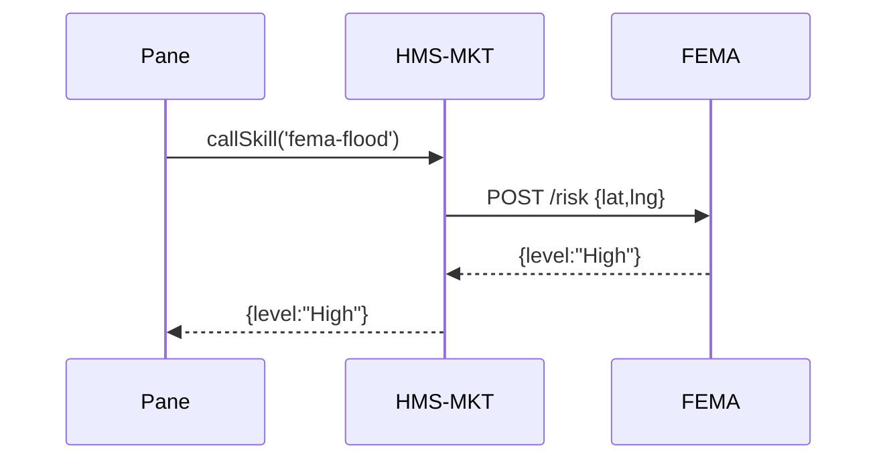

# Chapter 3: Marketplace & Discoverability (HMS-MKT)

[← Back to Chapter 2: Intent-Driven Navigation](02_intent_driven_navigation_.md)

---

## 1. Why Do We Need an *App Store for Government*?

Picture a small coastal town that wants to warn residents about rising flood risks.  
FEMA already built a “Flood-Risk Estimator” AI model last year.  
But right now the town’s IT team must:

1. Google for the code (if it is even public).  
2. Figure out how to host it.  
3. Hope the model is still maintained.

Result: many towns re-code the same thing—or give up.

**HMS-MKT** fixes this by acting like the federal **app store**:

* FEMA publishes the skill once.  
* Every town can **discover, subscribe, and run** it in minutes.  
* Updates roll out automatically, saving tax dollars and time.

---

## 2. Key Ideas (Library Analogies)

| HMS-MKT Term | Public-Library Analogy | Plain English |
|--------------|-----------------------|---------------|
| Listing      | Book on the shelf     | A data set or AI skill others can borrow. |
| Tag          | Dewey Decimal number  | Helps users search (“flood”, “climate”). |
| Publisher    | Author                | Agency or city that owns the asset. |
| Subscription | Library card checkout | Grants usage rights + sends updates. |
| Rating       | Book review           | Lets others know if the skill is accurate. |

---

## 3. A 3-Minute Walk-Through

We will:

1. Search the marketplace.  
2. Subscribe to the Flood-Risk Estimator.  
3. Call it from a micro-frontend pane.

### 3.1 Search the Catalog

```js
// search-skill.js
import { findListings } from 'hms-mkt';

const hits = await findListings({ text: 'flood risk' });
console.log(hits);
/* → [ { id:'fema-flood', name:'Flood-Risk Estimator', ... } ] */
```

Explanation  
`findListings` returns an array of matching skills with basic metadata.

---

### 3.2 Subscribe to a Skill

```js
// subscribe.js
import { subscribe } from 'hms-mkt';

await subscribe('fema-flood');
/* You now receive version updates + usage quota. */
```

Explanation  
One line stores the subscription in your agency’s profile.

---

### 3.3 Invoke the Skill from a Pane

```js
// coastal-alert-pane.js
import { callSkill } from 'hms-mkt';

export async function mount(el){
  const risk = await callSkill('fema-flood', { lat:42.1, lng:-70.6 });
  el.textContent = `Today’s risk: ${risk.level}`;
}
```

Explanation  
`callSkill` forwards your input to the hosted model and returns a JSON result.

*(If you are new to panes, see [Micro-Frontend Interface](01_micro_frontend_interface__hms_mfe__.md).)*

---

## 4. What Happens Behind the Scenes?

### 4.1 Step-by-Step (Plain English)

1. Your pane asks HMS-MKT for `fema-flood`.  
2. HMS-MKT checks that your agency has an active subscription.  
3. The request is routed to FEMA’s hosted API endpoint.  
4. FEMA’s service returns the risk score.  
5. HMS-MKT logs usage for billing & analytics.

### 4.2 Minimal Sequence Diagram



---

## 5. Peeking Inside HMS-MKT (Code-Light)

### 5.1 Listing Schema (simplified)

```jsonc
{
  "id": "fema-flood",
  "name": "Flood-Risk Estimator",
  "type": "ai-skill",          // or "dataset"
  "endpoint": "https://api.fema.gov/flood",
  "tags": ["flood", "climate", "emergency"],
  "version": "3.1.0",
  "publisher": "FEMA"
}
```

### 5.2 Tiny Implementation Snippet

```js
// core/mkt.js  (excerpt)
export async function callSkill(id, payload){
  const sub = db.subscriptions.get(id, currentUser.agency);
  if(!sub) throw 'Not subscribed';

  const { endpoint } = db.listings.get(id);
  const res = await fetch(endpoint, {
    method:'POST', body:JSON.stringify(payload)
  });
  return res.json();
}
```

Explanation  
1. Guard against unauthorized calls.  
2. Forwards the request to the agency-owned endpoint.  
3. Returns the JSON result.

*(Real HMS-MKT adds rate limiting, billing hooks, and security checks from the  
[Security & Compliance Engine](10_security___compliance_engine__hms_esq___hms_ops__.md).)*

---

## 6. Publishing Your Own Listing

```js
// publish.js
import { publish } from 'hms-mkt';

await publish({
  id: 'census-pop-proj',
  name: 'Population Projection 2030',
  type: 'dataset',
  endpoint: 'https://api.census.gov/pop2030',
  tags: ['demographics', 'planning']
});
```

Explanation  
Once approved by governance, your dataset appears in search results for others.

---

## 7. Frequently Asked Questions

1. **Do I have to host the skill myself?**  
   No. You can upload a Docker image; HMS-MKT auto-deploys it on shared infra.

2. **Can skills be private?**  
   Yes—set visibility to “agency-internal” or “invite-only”.

3. **How are updates handled?**  
   Publishers push a new version; subscribers receive it automatically unless they pin a specific version.

4. **What about costs?**  
   Usage is logged; cross-agency billing is handled quarterly via G-Invoicing.

---

## 8. Where Does HMS-MKT Fit in the Bigger Picture?

* **Discovery**: IDN in [Chapter 2](02_intent_driven_navigation_.md) can only route to panes **it knows exist**—it queries HMS-MKT under the hood.  
* **Execution**: Once a skill is found, [Agent Orchestration & Workflow](04_agent_orchestration___workflow__hms_act__.md) can chain it with other steps.  
* **Security**: Every call passes through the [Security & Compliance Engine](10_security___compliance_engine__hms_esq___hms_ops__.md).

Think of HMS-MKT as the **catalog** that glues all other layers together.

---

## 9. Summary & What’s Next

You learned:

* Why discoverability prevents redundant spending.  
* How to search, subscribe, publish, and call assets with a few lines of code.  
* What happens under the hood when a skill is invoked.

Next we’ll orchestrate multiple skills into a complete workflow in  
[Agent Orchestration & Workflow (HMS-ACT)](04_agent_orchestration___workflow__hms_act__.md). Let’s keep building!

---

Generated by [AI Codebase Knowledge Builder](https://github.com/The-Pocket/Tutorial-Codebase-Knowledge)