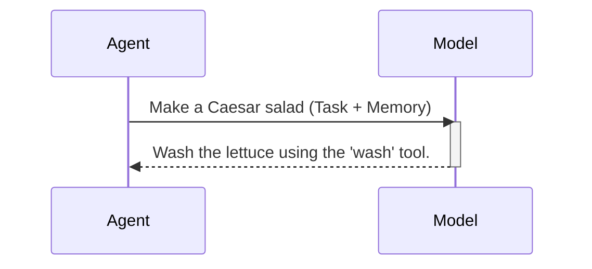

# Chapter 3: Model

In the previous chapters, we learned about the [Agent](01_agent.md) and the [Tool](02_tool.md).  The agent is like a chef who needs to follow a recipe (the task) and use kitchen tools. But how does the chef know *which* tools to use and *when*? That's where the **Model** comes in.  The model is the chef's brain, containing their knowledge and experience.

Let's say our chef agent has the task "Make a Caesar salad". The model helps the agent figure out the steps involved:  "First, wash the lettuce. Then, chop the romaine lettuce. Next, make the dressing. Finally, combine everything."  For each step, the model also suggests which tool to use: "Use the `wash` tool for the lettuce, the `knife` tool for chopping, the `whisk` tool for the dressing, and the `bowl` tool to combine."

## What is a Model?

The model is a language model, like the ones powering chatbots. It receives messages (the conversation history and the current task) and generates a response. This response can be a plan, an action (like a tool call), or a final answer.

## Using a Model

Here's a simplified example of how a model is used within an agent:

```python
from smolagents import InferenceClientModel

model = InferenceClientModel()

messages = [{"role": "user", "content": "Make a Caesar salad"}]
response = model(messages)
print(response.content) # Output: (e.g., Wash the lettuce using the 'wash' tool.)
```

This code creates a model using `InferenceClientModel`.  It then sends a message containing the task "Make a Caesar salad". The model processes this message and returns a response, which is then printed.  The response might suggest the next action and the tool to use.

## Inside a Model

Here's a simplified sequence diagram showing how a model interacts with the [Agent](01_agent.md):



1. The agent sends the task and its [Memory](04_memory.md) (previous interactions) to the model.
2. The model processes the input and generates a response, which could be a tool call or a final answer.
3. The model returns the response to the agent.

The `generate` method in the `models.py` file handles the core logic of generating a response.

```python
# Simplified code from models.py
class Model:
    def generate(self, messages):
        # ... (Preprocessing and model call)
        response = self.model(**completion_kwargs)
        # ... (Postprocessing)
        return response
```

## Conclusion

In this chapter, we learned about the `Model` abstraction in `smolagents` and how it acts as the agent's brain, deciding which tools to use and when. We saw a simple example of using a model and explored its internal workings. Next, we'll learn about [Memory](04_memory.md) and how it helps the agent remember past interactions.


---

Generated by [AI Codebase Knowledge Builder](https://github.com/The-Pocket/Tutorial-Codebase-Knowledge)