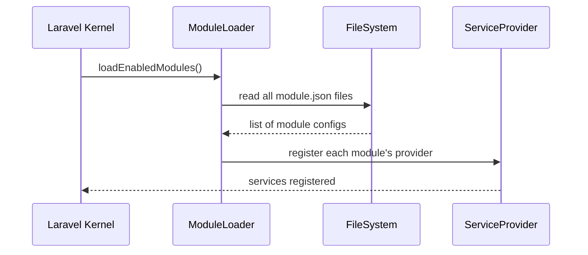

# Chapter 3: Module Layer

Welcome back! In the previous chapter, you learned about the [Protocol Model](02_protocol_model_.md) for defining step-by-step workflows. Now, let’s see how HMS-API groups related protocols, models, and rules into **Modules**—think of them as departmental offices in a government building.

---

## 1. Why Do We Need a Module Layer?

Imagine a citizen applies for healthcare benefits. Under the hood, HMS-API needs to:

- Run **Health Assessments**  
- Check **Citizenship & Income Eligibility**  
- Send **Notifications** when each step completes  

Without modules, all that logic would be mixed together—hard to maintain and reuse. A **Module Layer** lets us bundle everything related to one domain (like “Health Assessments”) into a neat package:

- Each module has its own data models and services  
- Modules can be developed, tested, and deployed separately  
- You avoid stepping on other teams’ code  

---

## 2. Key Concepts

1. **Module**  
   A self-contained unit (e.g. `HealthAssessment`) with its own code, config, and database tables.

2. **Service Provider**  
   A class that tells Laravel how to boot and register your module’s services.

3. **Configuration File**  
   Metadata (name, version, namespace) so HMS-API knows how to load your module.

4. **Module Registry**  
   A list of enabled modules that HMS-API reads at startup.

---

## 3. Defining a Module

### 3.1 module.json

Create a `module.json` in `app/Modules/HealthAssessment/`:

```json
{
  "name": "HealthAssessment",
  "namespace": "App\\Modules\\HealthAssessment",
  "provider": "HealthAssessmentServiceProvider"
}
```
This tells HMS-API:
- The module’s unique **name**  
- Its PHP **namespace**  
- Which **provider** to register  

### 3.2 Service Provider

In `app/Modules/HealthAssessment/HealthAssessmentServiceProvider.php`:

```php
<?php namespace App\Modules\HealthAssessment;

use Illuminate\Support\ServiceProvider;

class HealthAssessmentServiceProvider extends ServiceProvider
{
  public function register()
  {
    // Bind a service into Laravel's container
    $this->app->singleton('health.assess', function($app) {
      return new Services\AssessmentService();
    });
  }

  public function boot()
  {
    // Load module routes, migrations, etc.
    $this->loadRoutesFrom(__DIR__.'/routes.php');
  }
}
```
Explanation:
- `register()` makes our `AssessmentService` available as `health.assess`.
- `boot()` loads routes or other resources for this module.

---

## 4. Using a Module in a Controller

Once loaded, call the module’s service in any controller:

```php
<?php
use Illuminate\Routing\Controller;
use App\Http\Controllers\Controller as Base;

class AssessmentController extends Base
{
  public function check($userId)
  {
    // Resolve the module service
    $service = app('health.assess');
    $result  = $service->evaluate($userId);
    return response()->json($result);
  }
}
```

Here, `app('health.assess')` gives you the module’s main service. You call `evaluate()` to run assessment logic.

---

## 5. Under the Hood: What Happens at Startup

When HMS-API boots, it:



1. **Kernel** asks **ModuleLoader** which modules are enabled.  
2. **ModuleLoader** scans `app/Modules/*/module.json`.  
3. For each module, it instantiates the listed **ServiceProvider**.  
4. Providers bind services and load resources.

---

## 6. Deeper Dive: ModuleLoader (Simplified)

File: `app/Core/Module/ModuleLoader.php`

```php
<?php namespace App\Core\Module;

class ModuleLoader
{
  protected $app;
  public function __construct($app) { $this->app = $app; }

  public function loadEnabledModules()
  {
    $modules = glob(app_path('Modules/*/module.json'));
    foreach ($modules as $configFile) {
      $cfg = json_decode(file_get_contents($configFile), true);
      $provider = $cfg['namespace'].'\\'.$cfg['provider'];
      $this->app->register($provider);
    }
  }
}
```

Explanation:
- `glob()` finds every `module.json`.  
- We decode each file to get `namespace` and `provider`.  
- We call Laravel’s `register()` to load that module.

---

## 7. Recap

In this chapter, you learned how to:

- Group related business logic into **Modules**  
- Describe a module via `module.json`  
- Register your module with a **Service Provider**  
- Call module services through Laravel’s container  

With your first module in place, you can build clean, reusable domains like **Eligibility**, **Notifications**, or **Assessments**.  

Next, we’ll see how to connect these modules to external assistants and bots in [Agent Integration](04_agent_integration_.md).  

Happy coding!

---

Generated by [AI Codebase Knowledge Builder](https://github.com/The-Pocket/Tutorial-Codebase-Knowledge)