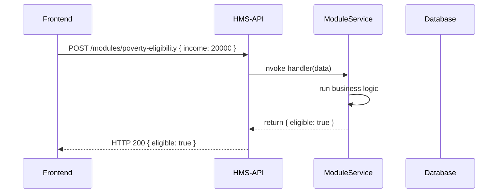

# Chapter 3: Module (Modules/)

Welcome back! In [Chapter 2: Protocol (Core/Protocol)](02_protocol__core_protocol__.md), you learned how to steer users through a workflow. Now we’ll package individual capabilities—like eligibility checks or assessment engines—into **Modules** that any front-end can plug into via the HMS-API.

---

## 3.1 Why “Module”? A Real-World Analogy

Imagine a government service center with separate desks for health, finance, and education:

- Each desk has its own specialist (an assessment engine, an eligibility checker, a data validator).
- Citizens walking in can go to **any desk** without changing buildings.
- Behind the scenes, all desks are connected to the same central corridor (the HMS-API).

A **Module** in HMS-CDF is like one of those desks: it offers a self-contained business function, exposes a single endpoint, and can be called by any front-end (HMS-GOV, HMS-MKT, or your custom UI).

**Use Case**  
Your city runs a “No Poverty” subsidy. You need a **Poverty Eligibility Checker** that:

1. Accepts household details (income, size).  
2. Returns `eligible: true/false`.  
3. Can be reused by multiple programs or portals.

---

## 3.2 Key Concepts of a Module

1. **id**  
   Unique identifier (e.g., `"poverty-eligibility"`).

2. **name & description**  
   Human-readable labels for admin UIs.

3. **handler**  
   The business logic function that processes input and returns output.

4. **API route**  
   Modules register a POST route at `/modules/{id}` via HMS-API.

---

## 3.3 Defining and Registering a Module

Below is a minimal example of a Poverty Eligibility Checker.

Step 1: Configure the module  
```js
import { Module } from 'hms-cdf/modules/module';

const povertyChecker = new Module({
  id: 'poverty-eligibility',
  name: 'Poverty Eligibility Checker',
  description: 'Determines subsidy eligibility based on income',
  handler: async (data) => {
    // Simple rule: income under $25k per year
    const eligible = data.income < 25000;
    return { eligible };
  }
});
```
Explanation:  
- We import `Module` and instantiate it with an `id`, labels, and a `handler` function.

Step 2: Initialize (register) it  
```js
povertyChecker.initialize();
// → Saves config in the database
// → Creates POST /modules/poverty-eligibility
```
Explanation:  
- Calling `initialize()` makes the module available via HMS-API. No further wiring needed.

---

## 3.4 How a Front-End Calls a Module

Any client can now call your module through HMS-API. For example, from a React app:

```js
const response = await fetch('/api/modules/poverty-eligibility', {
  method: 'POST',
  headers: { 'Content-Type': 'application/json' },
  body: JSON.stringify({ income: 20000 })
});
const result = await response.json();
// result → { eligible: true }
```
Explanation:  
- We POST to `/modules/poverty-eligibility` with JSON input.  
- The module’s `handler` runs and returns `{ eligible: true }`.

---

## 3.5 What Happens Under the Hood?

### 3.5.1 Runtime Flow



1. **Frontend** calls the registered route.  
2. **HMS-API** routes it to the `ModuleService`.  
3. The module’s `handler` runs the logic.  
4. **ModuleService** returns the result back to the client.

### 3.5.2 Inside `modules/module.ts`

Here’s a simplified version of how `Module` is implemented:

```ts
// File: modules/module.ts
export class Module {
  constructor(private config: ModuleConfig) {}

  initialize() {
    // 1) Persist module metadata
    Database.save('modules', this.config);

    // 2) Register HTTP endpoint
    ApiRouter.post(`/modules/${this.config.id}`, async (req, res) => {
      try {
        const result = await this.config.handler(req.body);
        res.send(result);
      } catch (err) {
        res.status(500).send({ error: err.message });
      }
    });
  }
}
```

Explanation:  
- The constructor holds your config.  
- `initialize()` does two things:  
  1. Saves the module info for discovery.  
  2. Hooks up a POST route that executes your `handler`.

---

## 3.6 Recap and Next Steps

You’ve learned how to:

- Define a **Module** with an `id`, labels, and a `handler`.  
- Register it via `initialize()` so any front-end can call it.  
- See how HMS-API routes requests to your module logic.

Next up, we’ll explore the central **Backend API (HMS-API)** that connects front-ends, modules, and other services. See you in [Chapter 4: Backend API (HMS-API)](04_backend_api__hms_api__.md)!

---

Generated by [AI Codebase Knowledge Builder](https://github.com/The-Pocket/Tutorial-Codebase-Knowledge)