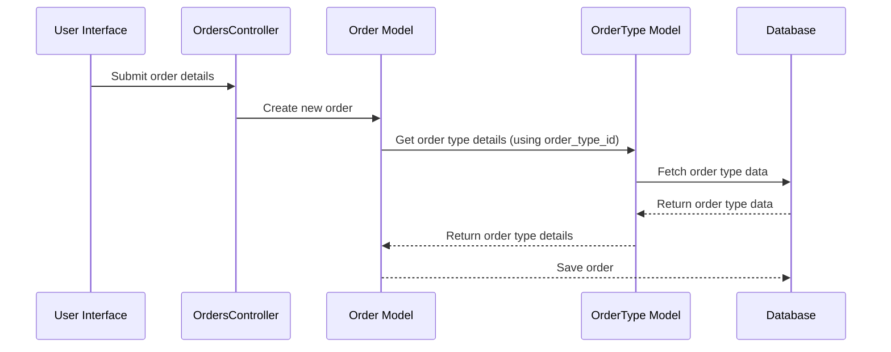

# Chapter 3: Order Type

Coming from learning about [Order](02_order.md)s, let's now explore how we can categorize different kinds of orders.  Remember Alice's pizza order?  What if our online store also sells salads and drinks? We need a way to distinguish between these different kinds of orders. That's where the `Order Type` concept comes in.

## What is an Order Type?

An `Order Type` is like a template or blueprint for different kinds of orders.  Think of it like a menu in a restaurant.  Each item on the menu represents a different `Order Type`.  For our online store, we might have "Pizza Order", "Salad Order", and "Drink Order" as different `Order Type`s.  Each `Order Type` defines what information is needed for that specific kind of order.

## Key Concepts

* **Name:** A descriptive name for the order type (e.g., "Pizza Order").
* **Code:** A unique short code for the order type (e.g., "pizza").
* **Custom Fields:** These define the specific information needed for each order type. For a "Pizza Order", this might include "toppings", "crust", and "size".  For a "Support Request" order type, it might be "problem description" and "contact information". You'll learn more about this in the [Custom Fields](07_custom_fields.md) chapter.
* **Print Form Code:**  This specifies the template used to print the order.

## Defining an Order Type (Pizza Order)

Let's define the "Pizza Order" `Order Type`.  Imagine this information is stored in a file named `pizza_order.yml`:

```yaml
order_type:
  code: pizza
  name: Pizza Order
  print_form_code: pizza_form
  fields:
    toppings:
      type: string
      label: Toppings
    crust:
      type: string
      label: Crust
    size:
      type: string
      label: Size
```

This YAML file defines the "Pizza Order" `Order Type`. It has a `code` of "pizza", a `name` of "Pizza Order", a `print_form_code` of "pizza_form", and three custom fields: `toppings`, `crust`, and `size`.

## Using Order Types

When Alice places her pizza order, the system uses the "Pizza Order" `Order Type` to determine what information to collect.  Remember the `order_type_id` from the [Order](02_order.md) chapter?  This ID links the order to its corresponding `Order Type`.

```ruby
# app/controllers/orders_controller.rb (simplified)
def create
  @order = Order.new(order_type_id: 1, # Assuming 1 is the ID for "Pizza Order"
                     # ... other order details
                     )
  # ...
end
```

## Under the Hood

When an order is created, the application uses the `OrderType` model to access the information about the order type.



The `OrderType` model is defined in `app/models/order_type.rb`.  It handles database interactions related to order types.

```ruby
# app/models/order_type.rb (simplified)
order_type = OrderType.find(1) # Retrieve the "Pizza Order" type
```

This code retrieves the "Pizza Order" `Order Type` from the database based on its ID.

## Conclusion

You've learned about the `Order Type` concept and how it acts as a template for different kinds of orders. You've seen how it defines the required information for each order type and how it's used when creating new [Order](02_order.md)s.  Next, let's explore how we can define the workflow for processing these orders using [Business Process (BP)](04_business_process__bp_.md). [Next: Business Process (BP)](04_business_process__bp_.md)


---

Generated by [AI Codebase Knowledge Builder](https://github.com/The-Pocket/Tutorial-Codebase-Knowledge)