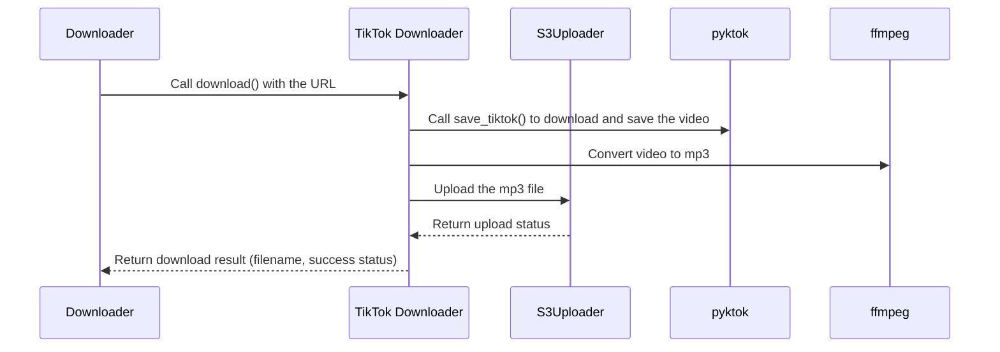

# Chapter 3: Platform-Specific Downloaders (TikTok, YouTube, Instagram)

In the previous chapter, [Downloader](02_downloader.md), we learned how the `Downloader` acts like a universal remote, choosing the right "specialized remote" for each platform. This chapter dives into those specialized remotes: the platform-specific downloaders for TikTok, YouTube, and Instagram.

## What Problem Do Platform-Specific Downloaders Solve?

Imagine you want to download a TikTok video. The `Downloader` knows it needs a TikTok downloader, but *how* does it actually download the video?  That's the job of the platform-specific downloader. It handles all the nitty-gritty details of interacting with each platform.

## Key Concepts

1. **Specialized Downloaders:** Each platform (TikTok, YouTube, Instagram) has its own downloader.  Think of them as experts in their respective platforms. The TikTok downloader knows how to talk to TikTok's servers, the YouTube downloader understands YouTube's structure, and so on.

2. **Handling Platform Quirks:** Each platform has its own way of storing and delivering videos.  These downloaders handle those quirks, so the `Downloader` doesn't have to worry about them.

3. **Abstracting Away Complexity:**  These downloaders hide the complex details of interacting with each platform.  They provide a simple interface (like a `download()` function) that the `Downloader` can use.

## Using a Platform-Specific Downloader

Let's say we want to download a TikTok video. Here's a simplified example of how the TikTok downloader would be used:

```python
from lib.tiktok import TikTok # Import the TikTok downloader

tiktok_downloader = TikTok("https://www.tiktok.com/@example/video/12345") # Create a TikTok downloader object
download_result = tiktok_downloader.download() # Download the video
# ... (process the download_result, which contains information about the download)
```

This code creates a `TikTok` object, providing the video URL. Then, it calls the `download()` function to download the video. The `download()` function returns a dictionary containing information about the download, such as whether it was successful and the filename.

## Internal Implementation

Let's see how the `Downloader` interacts with the TikTok downloader:



The `Downloader` calls the `download()` function of the `TikTok Downloader`.  The `TikTok Downloader` uses the `pyktok` library to fetch the video, converts it to mp3 using `ffmpeg`, and uploads it to S3 using the [S3Uploader](07_s3uploader.md). Finally, it returns the download result to the `Downloader`.

### Code Example: `lib/tiktok.py`

```python
from .pyktok import save_tiktok # Import the function from pyktok library
# ... (other imports)

class TikTok:
    # ... (other code)

    def download(self):
        # ... (other code)
        save_tiktok(video_url=self.url, ...) # Use pyktok to download the video
        # ... (convert to mp3 and upload to S3)
        return self.result
```

This simplified code snippet shows how the `TikTok` downloader uses the `save_tiktok` function from the [pyktok Library](04_pyktok_library.md) to download the video. Similar structures exist for YouTube and Instagram, using their respective libraries ([pytubefix Library](05_pytubefix_library.md) and [instaloader Library](06_instaloader_library.md)).

## Conclusion

This chapter explored the platform-specific downloaders, the specialized remotes that handle the details of downloading from each platform.  Next, we'll delve into the [pyktok Library](04_pyktok_library.md), which is the engine behind the TikTok downloader.


---

Generated by [AI Codebase Knowledge Builder](https://github.com/The-Pocket/Tutorial-Codebase-Knowledge)