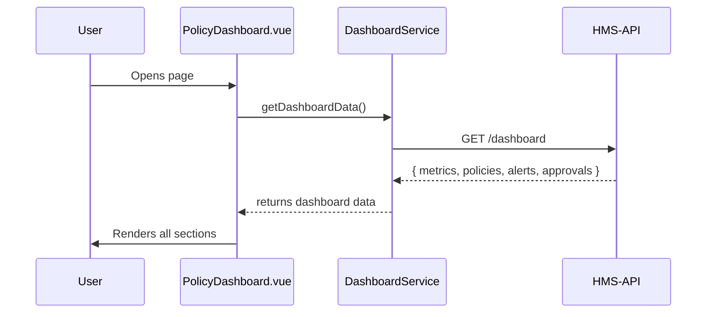

# Chapter 3: Policy Dashboard

Welcome back! In [Chapter 2: Interface Layer](02_interface_layer_.md), we built reusable UI components like `<GovButton>` and `<GovInput>`. Now let’s assemble them into our **Policy Dashboard**—the control tower for policymakers and managers.

---

## 3.1 Why a Policy Dashboard?

Imagine you work at a federal arts commission. You need one screen to track:

- Active design guidelines rolling out to agencies  
- Public feedback status (how many comments came in?)  
- Any conflicts or alerts between policies  
- Which policy changes are waiting for approval  

The **Policy Dashboard** gives you that bird’s-eye view—just like an air traffic control tower displays flight plans, alerts, and pending takeoffs all in one place.

---

## 3.2 Key Components

A typical dashboard has five simple parts:

1. **Header**  
   Shows the page title and last-refreshed time.  

2. **Metrics Panel**  
   Cards with counts: “Active Policies”, “Pending Proposals”, “Open Alerts”.  

3. **Policy List**  
   A table of policies with status badges (Active, Draft, Archived).  

4. **Alerts Section**  
   Conflicts or high-severity items that need attention.  

5. **Approval Queue**  
   A list of proposed changes awaiting review.

We’ll build each part using our HMS-GOV components and a little custom code.

---

## 3.3 Building the Dashboard UI

### 3.3.1 The Main Template

Create `src/components/PolicyDashboard.vue`:

```vue
<template>
  <div class="policy-dashboard">
    <h1>Policy Management Dashboard</h1>
    <small>Last updated: {{ lastUpdated }}</small>

    <MetricsPanel :data="metrics" />
    <PolicyTable :policies="policies" />
    <AlertsList :alerts="alerts" />
    <ApprovalQueue :queue="approvals" />
  </div>
</template>
```

Explanation:  
- We render our five sections as sub-components.  
- `lastUpdated`, `metrics`, `policies`, `alerts`, `approvals` come from data.

### 3.3.2 The Script

Below 20 lines, we fetch all dashboard data at once:

```js
<script>
import DashboardService from '../services/DashboardService'
import MetricsPanel from './MetricsPanel.vue'
import PolicyTable from './PolicyTable.vue'
// import AlertsList, ApprovalQueue similarly

export default {
  components: { MetricsPanel, PolicyTable, AlertsList, ApprovalQueue },
  data() {
    return {
      lastUpdated: '',
      metrics: {},
      policies: [],
      alerts: [],
      approvals: []
    }
  },
  async mounted() {
    const dp = await DashboardService.getDashboardData()
    this.lastUpdated = dp.updatedAt
    ;({ metrics: this.metrics, policies: this.policies,
        alerts: this.alerts, approvals: this.approvals } = dp)
  }
}
</script>
```

Explanation:  
- On mount, we call `getDashboardData()`.  
- We unpack the returned object into our local state.

---

## 3.4 What Happens Under the Hood?

Here’s a simple sequence when the dashboard loads:



---

## 3.5 Inside DashboardService

Let’s peek at `src/services/DashboardService.js`:

```js
import axios from 'axios'

export default {
  async getDashboardData() {
    const res = await axios.get('/api/dashboard')
    return {
      updatedAt: res.data.updatedAt,
      metrics: res.data.metrics,
      policies: res.data.policies,
      alerts: res.data.alerts,
      approvals: res.data.approvals
    }
  }
}
```

Explanation:  
- We call our backend endpoint `/api/dashboard` (implemented by HMS-API).  
- The response includes all five pieces of info we need.

---

## 3.6 Building a Metrics Card

We can break the Metrics Panel into cards. Here’s a minimal `MetricsCard.vue`:

```vue
<template>
  <div class="metrics-card">
    <h2>{{ title }}</h2>
    <p class="count">{{ count }}</p>
  </div>
</template>
<script>
export default { props: ['title','count'] }
</script>
<style>
.metrics-card { border: 1px solid #ccc; padding:1rem; border-radius:4px; }
.count { font-size:2rem; font-weight:bold; }
</style>
```

Explanation:  
- A simple card that shows a title and a big number.  
- We can reuse it inside `MetricsPanel.vue`.

---

## 3.7 Putting It All Together

Now when you start your app and navigate to `/dashboard`, you’ll see:

- A clear header with the last refresh time  
- Four metric cards (Active, Pending, Alerts, etc.)  
- A table of all policies with statuses  
- A list of alerts (e.g., “Conflict between Policy A and B”)  
- A queue of pending approvals  

All built from tiny, beginner-friendly components and backed by a single API call.

---

## 3.8 Summary

In this chapter you learned how to:

- Structure a **Policy Dashboard** with five key areas  
- Fetch dashboard data with `DashboardService`  
- Use sub-components (`MetricsPanel`, `PolicyTable`, etc.)  
- Visualize the flow with a Mermaid sequence diagram  

Next up, we’ll dive into editing those policies in the [Chapter 4: Policy Editor](04_policy_editor_.md).

---

Generated by [AI Codebase Knowledge Builder](https://github.com/The-Pocket/Tutorial-Codebase-Knowledge)