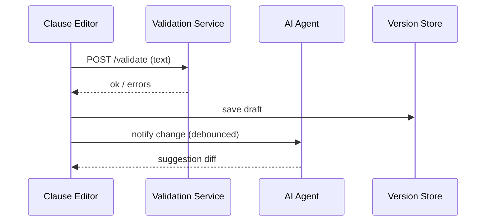

# Chapter 3: Policy Editor Interface ✍️

➡️ *Picking up from* [Micro-Frontend Architecture (HMS-MFE)](02_micro_frontend_architecture__hms_mfe__.md)

---

## 0. Why Do We Need a “Legislative Word-Processor”?

Picture a policy officer at the **Federal Bureau of Prisons (FBOP)**.  
She must update the *Visitation Rules* so video calls count toward total visiting hours. A normal text editor can type words, but it can’t:

* warn her that Title 18 §4001 cross-reference is missing,  
* show downstream impact on the inmate‐notification mailer, or  
* instantly push the approved change to production without an IT ticket.

That magic is delivered by the **Policy Editor Interface**—think *Google Docs* meets *Capitol Hill*.

---

## 1. Key Concepts (Plain English)

| Term                       | What It Means (Beginner Version)                                       |
|----------------------------|------------------------------------------------------------------------|
| Smart Clause               | A sentence wrapped in metadata so the system “knows” its legal topic.  |
| Validation Pane            | Sidebar that shouts 💚 **Valid** or 🔴 **Error** while you type.       |
| Impact Panel               | List of other rules, APIs, or notices touched by this edit.            |
| Version Timeline           | Every keystroke is saved; you can scrub back like in Google Docs.      |
| AI Suggestion Drawer       | Button that lets an AI agent propose wording optimizations.            |
| Live-Deploy Toggle         | When green, the saved draft flows straight to the running system.      |

---

## 2. A Quick Tour with a Real Use Case 🚶

Goal: FBOP officer changes “Each inmate may receive **1** video visit per week” ➡️ **2**.

Steps you will perform:

1. Open the rule from the Dashboard.  
2. Edit the clause.  
3. Watch validation & impact update in real time.  
4. Accept the AI agent’s readability fix.  
5. Click **Deploy**—no waiting for IT.

We’ll build a tiny mock-up to illustrate the flow.

---

## 3. Minimal Code Walk-Through

### 3.1 Clause Editor Component

```vue
<!-- File: components/ClauseEditor.vue -->
<template>
  <textarea v-model="text" @input="validate"></textarea>
  <p>Status: {{ status }}</p>
</template>

<script setup>
import { ref } from 'vue'
const props = defineProps({ initial: String })
const text = ref(props.initial)
const status = ref('checking…')

async function validate () {
  const res = await fetch('/api/validate', {
    method: 'POST',
    body: JSON.stringify({ text: text.value })
  })
  status.value = (await res.json()).ok ? '✅ Valid' : '❌ Error'
}
</script>
```

What happens?

1. `v-model="text"` binds the textarea to `text`.  
2. On every keystroke `validate()` sends the clause to the backend.  
3. Server replies `ok: true/false`, and the status line updates live.

*(Under 20 lines!)*

### 3.2 Impact Panel (Super Simplified)

```vue
<!-- components/ImpactPanel.vue -->
<template>
  <div>
    <h3>Impacted Items</h3>
    <ul>
      <li v-for="item in impacts" :key="item">{{ item }}</li>
    </ul>
  </div>
</template>

<script setup>
import { onMounted, ref } from 'vue'
const props = defineProps({ clauseId: Number })
const impacts = ref([])

onMounted(async () => {
  impacts.value = await fetch(`/api/impacts/${props.clauseId}`)
                    .then(r => r.json())
})
</script>
```

Shows a bulleted list like:

* Inmate Email Notice  
* Victim Notification Batch Job  
* Title 18 §4001 Reference

### 3.3 Putting It Together

```vue
<!-- pages/PolicyEditor.vue -->
<template>
  <h1>FBOP – Visitation Rules</h1>
  <ClauseEditor :initial="clauseText" />
  <ImpactPanel :clause-id="42" />
  <button @click="deploy">Deploy</button>
</template>

<script setup>
import ClauseEditor from '../components/ClauseEditor.vue'
import ImpactPanel  from '../components/ImpactPanel.vue'
const clauseText = 'Each inmate may receive 1 video visit per week.'
function deploy () { alert('🚀 Live!') }
</script>
```

Run `npm run dev`, navigate to `/policy/42`, and play with edits.  
(Of course the real HMS-GOV app is richer; this is the baby step.)

---

## 4. Under the Hood – What Happens When You Type?



1. Each keystroke travels to *Validation Service* for syntax & legal checks.  
2. Draft is versioned in *Version Store* (Git-like history).  
3. Every few seconds the *AI Agent* offers clearer language.  
4. When you hit **Deploy**, the latest version is promoted via the [Backend Policy API](08_backend_policy_api__hms_svc___hms_api__.md).

---

## 5. Peek Inside the Validation Service (Node.js, 15 lines)

```js
// File: services/validation.js
import { parse } from './legalGrammar.js'  // tiny PEG parser
export async function validate(req, res) {
  const { text } = await req.json()
  try   { parse(text);  res.json({ ok: true }) }
  catch { res.json({ ok: false }) }
}
```

• `parse()` throws if the clause breaks the formal grammar (e.g., missing reference).  
• The front-end only cares about the boolean.

---

## 6. Versioning Every Change

Instead of Git we use a thin wrapper around SQLite:

```js
// File: services/versionStore.js
import db from './db.js'
export function saveDraft(id, text) {
  db.run('INSERT INTO versions(clause_id, body) VALUES (?,?)', [id, text])
}
```

Called inside the request handler that receives edits.

---

## 7. Live Deployment in a Single Click

The “Deploy” button from §3.3 simply calls:

```js
await fetch('/api/deploy/42', { method: 'POST' })
```

The server bundles:

1. Latest approved version,  
2. Cross-reference map,  
3. Metadata for the [Legislative Process Engine](10_legislative_process_engine__hms_cdf__.md),

…then flips the rule to **active**. No IT ticket, no downtime.

---

## 8. Where Does This Interface Touch Other Chapters?

* Rendered inside the micro-frontend shell from [HMS-MFE](02_micro_frontend_architecture__hms_mfe__.md).  
* Talks to the **AI Representative Agent** for wording help – see next chapter!  
* Persists drafts and deployments through the [Backend Policy API](08_backend_policy_api__hms_svc___hms_api__.md).  
* Human reviewers can pause or veto via [Human-in-the-Loop Oversight](11_human_in_the_loop_oversight__hitl__.md).

---

## 9. Summary & Next Steps

You now know how the **Policy Editor Interface** turns dry legislation into an interactive experience:

1. Smart Clauses are validated instantly.  
2. Impact analysis prevents accidental breakage.  
3. Every keystroke is versioned, and AI can polish wording.  
4. A single toggle deploys the rule straight to production.

Ready to meet the AI helper who whispers “better phrasing” in the officer’s ear?  
➡️ Continue to [AI Representative Agent (HMS-AGT / HMS-AGX)](04_ai_representative_agent__hms_agt___hms_agx__.md)

---

Generated by [AI Codebase Knowledge Builder](https://github.com/The-Pocket/Tutorial-Codebase-Knowledge)