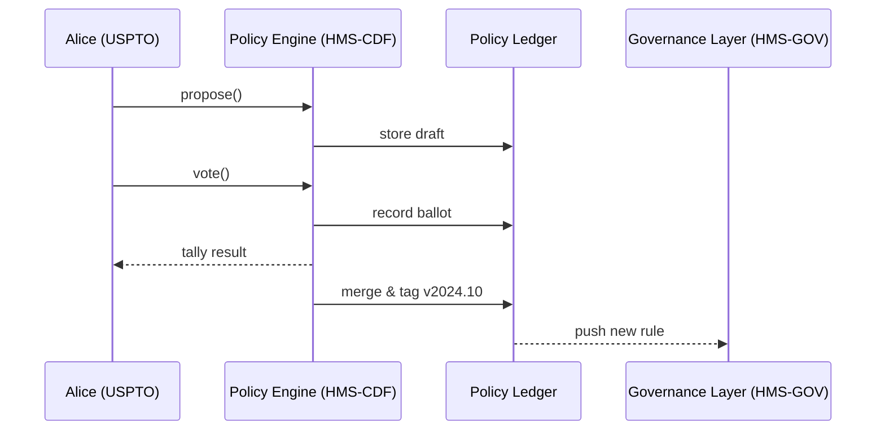

# Chapter 3: Policy Engine – HMS-CDF (Codified Democracy Foundation)

*Transition from [Chapter 2: Governance Layer (HMS-GOV)](02_governance_layer__hms_gov__.md)*  
In the last chapter the Gateway decided **whether** a citizen’s request should be allowed.  
But who decides **what the rules are in the first place?**  
Welcome to HMS-CDF, the rule-making brain of the platform.

---

## 1. Why do we need HMS-CDF?

Imagine the **U.S. Patent and Trademark Office (USPTO)** wants to reduce the patent-renewal fee for small inventors.  
Traditionally this means:

1. Draft regulation text.  
2. Accept public comments.  
3. Publish amendments.  
4. Get an official vote or sign-off.  
5. Release the final rule in the Federal Register.

That can take **months**.

With HMS-CDF, the whole workflow is captured in software.  
A policy change becomes a version-controlled object you can:

* Propose  
* Amend  
* Vote on  
* Merge into the canonical “law ledger”

All actions are timestamped and cryptographically signed so auditors (and courts) can replay every step.

---

## 2. Key Concepts (Beginner Friendly)

| Term | Think of it as… | Why it matters |
|------|-----------------|----------------|
| **Proposal** | A pull-request on the rulebook | Introduces new or changed text. |
| **Amendment** | “Suggested edits” on a proposal | Allows collaborative refinement. |
| **Ballot** | 👍 or 👎 vote attached to a proposal | Determines acceptance. |
| **Policy Ledger** | Git repository for laws | Stores every committed change forever. |
| **Reconciler** | Auto-merger & spell-checker | Ensures the final text is conflict-free and legally valid. |

---

## 3. Quick-Start: Lowering the Patent Renewal Fee

We will walk through the USPTO scenario in **4 tiny API calls**.

### 3.1 Create a Proposal

```python
# client.py (10 lines)
from hms_cdf import CDFClient

cdf = CDFClient(user="alice@uspto.gov")

proposal_id = cdf.propose(
    title="Lower small-entity renewal fee",
    text="""
    §1.20(e) The renewal fee for small entities is lowered from $800 to $400.
    """,
    tags=["USPTO", "FEE_CHANGE"]
)
print("Proposal:", proposal_id)
```

Explanation  
1. `CDFClient` signs the request with Alice’s government credential.  
2. `propose()` stores the draft in the Policy Ledger and returns an ID like `prop_125`.

### 3.2 Submit an Amendment

```python
cdf.amend(
    proposal_id,
    text="Change fee to **$450** instead of $400.",
    reason="Budget impact analysis"
)
```

Beginners’ note: amendments don’t overwrite; they are layered suggestions.

### 3.3 Cast Votes

```python
cdf.vote(proposal_id, ballot="YES")
```

• Anyone with the `PolicyCommittee` role can call `vote()`.  
• Ballots are immutable once cast.

### 3.4 Finalize (Automatic)

Once the quorum rule (e.g., *3 yes, 0 no*) is met, the Reconciler:

1. Merges amendments.  
2. Runs the Legal Linter (checks references, dates).  
3. Commits the final artifact to the *main* branch of the Policy Ledger.

Result:

```json
{
  "status": "MERGED",
  "effective_date": "2024-10-01"
}
```

---

## 4. What Happens Under the Hood?



Plain-English steps  
1. PE validates signatures and schema.  
2. All objects are saved to the append-only Ledger.  
3. On merge, HMS-CDF notifies [HMS-GOV](02_governance_layer__hms_gov__.md) so gateways enforce the new rule instantly.

---

## 5. Under the Hood – Tiny Code Peeks

### 5.1 Ledger Commit (`ledger.py`, 14 lines)

```python
import git, datetime, json

def commit(obj_type, obj):
    repo = git.Repo("/var/cdf/ledger")
    branch = repo.head.reference
    path = f"{obj_type}/{obj['id']}.json"
    
    with open(repo.working_tree_dir + "/" + path, "w") as f:
        json.dump(obj, f, indent=2)
    
    repo.index.add([path])
    repo.index.commit(
        f"{obj_type}:{obj['id']}",
        author=git.Actor(obj["author"], obj["author"]),
        commit_date=datetime.datetime.utcnow().isoformat()
    )
    return repo.head.object.hexsha[:7]
```

Explanation  
• Each proposal, amendment, or ballot is just a JSON file committed to Git.  
• The commit hash becomes a public, tamper-evident timestamp.

### 5.2 Quorum Rule (`quorum.py`, 8 lines)

```python
def passed(ballots, yes_needed=3):
    yes_votes = [b for b in ballots if b["ballot"] == "YES"]
    return len(yes_votes) >= yes_needed
```

Simple logic you can swap out for majority, super-majority, etc.

---

## 6. How HMS-CDF Integrates with the Rest of the Stack

```
Citizen Requests ┐
                 ▼
        [HMS-GOV Gateway] ── consults ──► [HMS-CDF Ledger]
                 ▲                              ▲
AI Agent Proposes┘                              │
                 └───── automatic updates ──────┘
```

Key points  

• The **Gateway** always reads the *current* policy version, so new rules apply immediately without redeploying services.  
• **AI Representative Agents** (see [Chapter 11](11_ai_representative_agent_.md)) can draft proposals, but they can’t merge without human or committee approval—built-in guardrail.

---

## 7. Frequently Asked Beginner Questions

**Q: Do I need to understand Git to use HMS-CDF?**  
A: No. The Git layer is hidden behind simple API calls like `propose()` and `vote()`.

**Q: Can citizens see the policy process?**  
A: Yes. The Ledger can be mirrored to a public “read-only” site so anyone can audit changes—transparency by default.

**Q: What if two amendments conflict?**  
A: The Reconciler flags the conflict and requires a human resolution before merging.

---

## 8. Recap

You now know how HMS-CDF:

1. Turns the messy legislative workflow into clear API calls.  
2. Stores every decision in an immutable Policy Ledger.  
3. Pushes merged rules to the Gateway so they take effect instantly.

In the next chapter we’ll zoom out to see how lawyers and compliance officers verify these machine-authored rules:  
[Chapter 4: Compliance & Legal Reasoner (HMS-ESQ)](04_compliance___legal_reasoner__hms_esq__.md)  

*Ready to let the lawyers have their say?*

---

Generated by [AI Codebase Knowledge Builder](https://github.com/The-Pocket/Tutorial-Codebase-Knowledge)