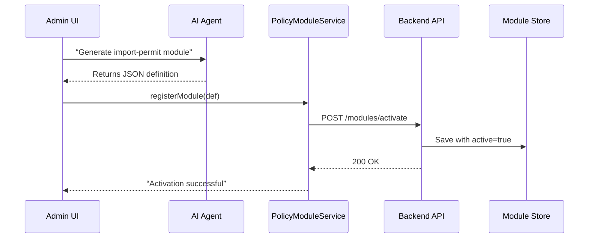

# Chapter 3: Policy/Process Module

In [Chapter 2: Management Layer](02_management_layer_.md) we saw how workflows are started and advanced. Now we zoom in on the **Policy/Process Module**, the discrete unit that defines one business process or policy rule—like a single chapter in a city codebook.

---

## 1. Why We Need a Policy/Process Module

Imagine the Animal and Plant Health Inspection Service needs a process for approving animal import permits. We want a self-contained definition that says:

- What steps to follow  
- Who is responsible at each step  
- What criteria must be met before approval  

Each of these definitions is a **Policy/Process Module**. It keeps our system modular—easy to read, update, and version.

---

## 2. Key Concepts

1. **Module**  
   A JSON object defining one policy or process.

2. **Steps**  
   Sequential actions (e.g., submit, review, approve).

3. **Roles**  
   Who performs each step (e.g., applicant, inspector, manager).

4. **Approval Criteria**  
   Conditions to check before moving on (e.g., required fields, time limits).

5. **Activation**  
   Making the module “live” via our Backend API.

---

## 3. Solving Our Use Case

### 3.1 Define a Module

Here’s a minimal JSON for an “import-permit” process:

```json
{
  "id": "import-permit",
  "description": "Approve animal import permits",
  "steps": [
    { "name": "submit-application", "role": "applicant",   "next": "review-docs" },
    { "name": "review-docs",      "role": "inspector",   "next": "final-approval" },
    { "name": "final-approval",   "role": "manager",     "next": null }
  ],
  "approvalCriteria": {
    "requiredFields": ["species", "originCountry"],
    "maxDays": 30
  }
}
```

> This says: applicant submits, inspector reviews docs, then manager gives final approval. We also require two fields and a 30-day limit.

### 3.2 Register & Activate in Code

```javascript
// policy_module.js
class PolicyModuleService {
  constructor(apiClient) {
    this.modules = {};
    this.api = apiClient; // wrapper for Backend API calls
  }

  registerModule(definition) {
    this.modules[definition.id] = definition;
  }

  activateModule(id) {
    const mod = this.modules[id];
    // POST to /modules/activate
    return this.api.post('/modules/activate', mod);
  }
}

module.exports = PolicyModuleService;
```

> We keep definitions locally, then call our Backend API to activate them.

### 3.3 Using the Service

```javascript
const apiClient = new ApiClient('https://hms-sme.example.com');
const svc = new PolicyModuleService(apiClient);

// Load or AI-generate the JSON definition above as `importPermit`
svc.registerModule(importPermit);

svc.activateModule('import-permit')
  .then(response => console.log('Activated:', response.status))
  .catch(err => console.error('Error:', err.message));
```

> This registers and activates your module in three lines of code.

---

## 4. What Happens Under the Hood?

### 4.1 High-Level Flow



1. **AI** helps author or update a module.  
2. **PolicyModuleService** holds it in memory.  
3. On **activate**, we POST to the **Backend API**.  
4. The API saves it to a store and marks it active.  

### 4.2 Inside the Backend API

File: `backend/modules.js`

```javascript
// Simple in-memory store
const modulesDB = {};

function activateModule(req, res) {
  const modDef = req.body;
  // Mark as active and persist
  modulesDB[modDef.id] = { ...modDef, active: true };
  res.status(200).json({ id: modDef.id, active: true });
}

module.exports = { activateModule };
```

> The API handler takes the JSON, saves it, and returns a success message.

---

## 5. Summary & Next Steps

You’ve learned how a **Policy/Process Module**:

- Encapsulates a single business process or rule  
- Defines steps, roles, and approval criteria  
- Is registered and activated via our Backend API  

Next up, we’ll explore the **[AI Representative Agent](04_ai_representative_agent_.md)**—how AI helps you author and update these modules automatically.

---

Generated by [AI Codebase Knowledge Builder](https://github.com/The-Pocket/Tutorial-Codebase-Knowledge)