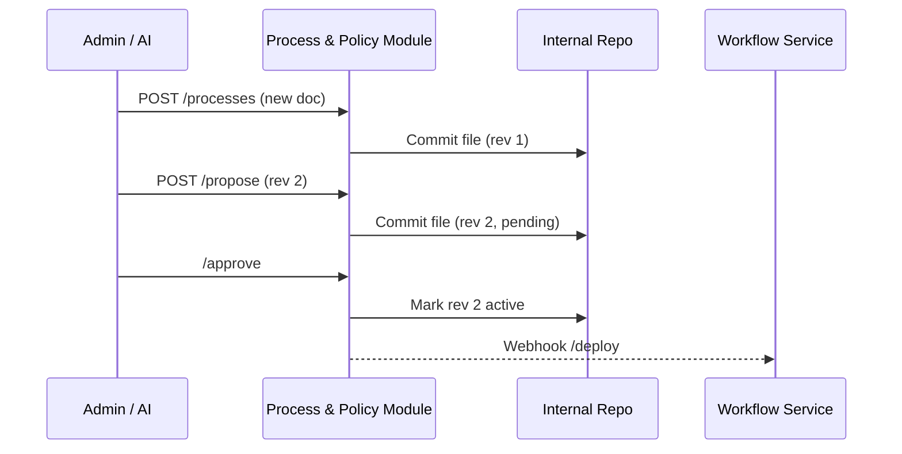

# Chapter 3: Process & Policy Module  
*Coming from [Governance Layer (HMS-GOV)](02_governance_layer__hms_gov__.md).*

---

## 1. Why Do We Need It? – A One-Minute Story  

The **Department of Transportation (DOT)** offers a “Safe Roads” grant.  
Today the playbook for reviewing an application sits in a 28-page PDF:

1. Check applicant eligibility.  
2. Evaluate environmental impact.  
3. Issue funding decision.

Last week Congress added a *new* “Equity Impact” check.  
If the PDF lives on someone’s desktop, updating every microservice by hand becomes a nightmare.

**Process & Policy Module (PPM)** turns that PDF into *machine-readable* steps that can be:

* Versioned (like Git).  
* Edited by a human **or** an AI Agent.  
* Auto-deployed to all services that depend on it.

Think of PPM as **“GitHub for government rules.”**

---

## 2. The Big Picture in 3 Concepts  

| Real-World Analogy | PPM Term | Beginner Explanation |
|--------------------|---------|----------------------|
| Recipe Card        | **Process Document** | YAML/JSON file that lists each step (ingredients + instructions). |
| Version Sticker    | **Revision** | Every save creates a new, numbered snapshot. |
| Taste Test         | **Validation Hook** | Script that checks the recipe before it ships (e.g., “No step has zero reviewers”). |

---

## 3. Our Running Example – The Updated DOT Grant Flow  

Desired 4-step playbook:

```yaml
id: safe-roads-grant
version: 2.0
steps:
  - id: 10_check-eligibility
    reviewers: ["analyst"]
  - id: 20_environmental-impact
    reviewers: ["env_officer"]
  - id: 30_equity-impact      # <-- NEW!
    reviewers: ["equity_team"]
  - id: 40_final-decision
    reviewers: ["director"]
```

We will:

1. Store this YAML in PPM.  
2. Let an AI Agent append a fifth “Post-award Monitoring” step.  
3. Roll back if legal says “Too soon!”

---

## 4. How To Use the Module (Hands-On)

### 4.1 Upload / Commit a Process

```python
# client_commit.py
import requests, yaml, json

doc = yaml.safe_load(open("dot_safe_roads.yml"))
resp = requests.post("https://ppm.hms.gov/processes", json=doc)
print(resp.json())   # {"processId":"PRC-42","rev":"1"}
```

Explanation:  
We send the YAML (already loaded as a Python dict) to PPM.  
PPM returns a unique process ID and revision number.

---

### 4.2 Let the AI Agent Propose a Change

```python
# ai_agent_edit.py  (runs inside HMS-A2A)
change = {
  "add_step": {
    "id": "50_post-award-monitoring",
    "reviewers": ["audit_team"]
  }
}
requests.post("https://ppm.hms.gov/processes/PRC-42/propose",
              json=change)
```

Explanation:  
The AI suggests adding a monitoring step. The proposal waits for approval in [Human-in-the-Loop (HITL) Oversight](16_human_in_the_loop__hitl__oversight_.md).

---

### 4.3 Approve & Deploy

```python
# human_approve.py
requests.post("https://ppm.hms.gov/processes/PRC-42/approve?rev=2")
```

What happens?  
1. Revision **2** becomes active.  
2. PPM fires a webhook: `POST /deploy` to all subscribed services (Form, Workflow Engine, etc.).  
3. Citizens submitting new applications immediately follow the 5-step flow—no redeploy needed.

---

### 4.4 Roll Back (if Policy Changes Again)

```python
# rollback.py
requests.post("https://ppm.hms.gov/processes/PRC-42/rollback?to=1")
```

PPM now redeploys revision **1** (original 4-step flow) and keeps full history.

---

## 5. Under the Hood – What Really Happens?



PPM is basically a tiny Git server + API wrapper + webhook dispatcher.

---

## 6. Peek at an Ultra-Light Implementation  

Folder layout:

```
ppm/
 ├─ app.py
 ├─ repo/            # flat files, one per process ID
 └─ hooks.py
```

### 6.1 `app.py` – Core API (≃15 lines each endpoint)

```python
# app.py
from fastapi import FastAPI, HTTPException
import json, uuid, os, shutil, difflib, datetime

app = FastAPI()
REPO = "repo"

def path(pid, rev): return f"{REPO}/{pid}_v{rev}.json"

@app.post("/processes")
def add(doc: dict):
    pid = "PRC-"+uuid.uuid4().hex[:4]
    open(path(pid,1),"w").write(json.dumps(doc,indent=2))
    return {"processId": pid, "rev": "1"}

@app.post("/processes/{pid}/propose")
def propose(pid: str, change: dict):
    # load latest
    rev = max(int(f.split("_v")[1].split(".")[0])
              for f in os.listdir(REPO) if f.startswith(pid))
    doc = json.load(open(path(pid,rev)))
    # naive merge
    doc["steps"].append(change["add_step"])
    new_rev = rev+1
    open(path(pid,new_rev),"w").write(json.dumps(doc,indent=2))
    return {"rev": str(new_rev), "status":"pending"}

@app.post("/processes/{pid}/approve")
def approve(pid:str, rev:int):
    # flag file as active
    open(f"{REPO}/{pid}_active","w").write(str(rev))
    from hooks import deploy; deploy(pid, rev)
    return {"status":"active"}

@app.post("/processes/{pid}/rollback")
def rollback(pid:str, to:int):
    return approve(pid,to)
```

Explanation:  
• Each revision is a standalone JSON file (`PRC-42_v2.json`).  
• `approve()` writes an `*_active` pointer and triggers a deployment hook.  
• Error handling, auth, and diff visualization are trimmed for clarity.

### 6.2 `hooks.py` – Deployment Hook (8 lines)

```python
# hooks.py
import requests, json, os
def deploy(pid, rev):
    doc = json.load(open(f"repo/{pid}_v{rev}.json"))
    for url in os.getenv("WEBHOOKS","").split(","):
        if url:
            requests.post(url, json={"pid":pid,"rev":rev,"doc":doc})
```

Explanation:  
Reads the freshly approved document and `POST`s it to every service URL listed in the `WEBHOOKS` env var.

---

## 7. Viewing Diffs (CLI Helper)

```python
# diff_view.py
import difflib, sys, json
a=json.load(open(sys.argv[1])); b=json.load(open(sys.argv[2]))
for line in difflib.unified_diff(
        json.dumps(a,indent=2).splitlines(),
        json.dumps(b,indent=2).splitlines(),
        fromfile=sys.argv[1], tofile=sys.argv[2]):
    print(line)
```

Run:  
`python diff_view.py repo/PRC-42_v1.json repo/PRC-42_v2.json` ➜ clear colored diff, just like Git.

---

## 8. How Other Services Consume the Process

Inside the **Workflow Service** (simplified):

```python
# on_webhook.py
def on_process_update(doc):
    GLOBAL_PROCESS_CACHE[doc["id"]] = doc
```

Every incoming application then follows `GLOBAL_PROCESS_CACHE["safe-roads-grant"]["steps"]`.

No restart required!

---

## 9. Key Takeaways

1. PPM stores government playbooks as easy-to-edit YAML/JSON.  
2. Every change is versioned, diffable, and rollback-able.  
3. AI Agents can propose edits; humans keep the final say.  
4. Deployment hooks push updates instantly—no microservice redeploys.

---

## 10. What’s Next?

Behind the scenes, PPM leans heavily on **change management** principles—approvals, audits, and rollback policies.  
We explore those mechanics in [Change Management & Versioning](04_change_management___versioning_.md).

---

Generated by [AI Codebase Knowledge Builder](https://github.com/The-Pocket/Tutorial-Codebase-Knowledge)