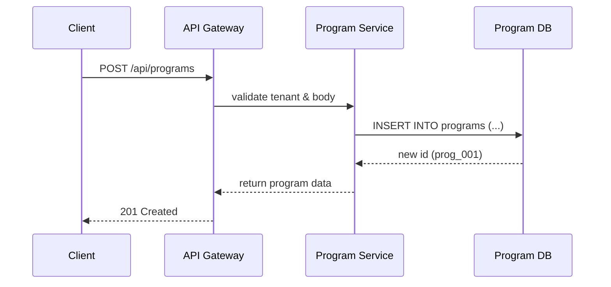

# Chapter 3: Program Model

Welcome back! In [Chapter 2: Tenant Management](02_tenant_management_.md), you learned how HMS-API isolates each agency or region. Now we’ll attach real-world services—like unemployment benefits or public housing applications—to those tenants using the **Program Model**.

---

## 3.1 Why a Program Model?

**Use Case:**  
Your state’s Housing Department (tenant `tenant_state_123`) wants to launch a **Public Housing Application** service. They need to:

1. Bundle all the steps (eligibility checks, document uploads)
2. Store settings (deadlines, max units per applicant)
3. Link to resources (PDF forms, policy documents)

Without a Program Model, these bits would live in separate tables and the system wouldn’t know how they fit together. With it, you get one “service folder” that sinks protocols, settings, and resources in one place.

> Analogy: A Program Model is like a project folder on your computer. It contains sub-folders (protocols), configuration files (settings), and linked documents (resources). Everything you need to run that “project”—or in our case, that government service—is right in one place.

---

## 3.2 Key Concepts

1. **Program**  
   The main container for a government service (e.g., “Unemployment Benefits”).

2. **Protocols**  
   The ordered steps or workflows—like the five-step legislative negotiation process to pass a law. Example: “Submit Claim ➔ Review Eligibility ➔ Approve Payment.”

3. **Settings**  
   Configurable options: deadlines, maximum allowances, notification templates.

4. **Relationships**  
   Links between a Program and its Protocols, Resources, or Policies.

---

## 3.3 How to Use the Program Model

### 3.3.1 Create a Program

```http
POST /api/programs
Content-Type: application/json

{
  "name": "Public Housing Application",
  "tenant_id": "tenant_state_123",
  "description": "Apply for public housing assistance"
}
```

What happens:  
- HMS-API checks your `X-Tenant-ID` (tenant isolation)  
- Inserts a new record into `programs`  
- Returns the new program’s ID and summary

```json
{
  "id": "prog_001",
  "name": "Public Housing Application",
  "tenant_id": "tenant_state_123"
}
```

### 3.3.2 Add a Protocol to Your Program

```http
POST /api/programs/prog_001/protocols
Content-Type: application/json

{
  "name": "Eligibility Check",
  "steps": ["Verify Identity", "Check Income", "Confirm Residency"]
}
```

Response:

```json
{
  "id": "proto_01",
  "program_id": "prog_001",
  "name": "Eligibility Check",
  "steps": ["Verify Identity", "Check Income", "Confirm Residency"]
}
```

### 3.3.3 Retrieve Program Details

```http
GET /api/programs/prog_001
X-Tenant-ID: tenant_state_123
```

Response includes:
- Program metadata
- Linked protocols
- Settings and resources

---

## 3.4 What Happens Under the Hood?



1. **API Gateway** enforces tenant isolation and authentication.  
2. **Program Service** handles business logic and talks to the database.  
3. The database generates a new `program_id`.  
4. Data flows back to the client.

---

## 3.5 Internal Implementation

### File: app/Models/Core/Program/Program.php

```php
<?php
namespace App\Models\Core\Program;

class Program {
  protected $attributes = [];

  public function __construct(array $data = []) {
    $this->attributes = $data;
  }

  public function protocols() {
    // Defines relationship to Protocol model
    // e.g. return $this->hasMany(Protocol::class);
  }
}
```

Explanation:  
- We store all program fields in `$attributes`.  
- `protocols()` would fetch related Protocol records.

### Middleware: requireProgram (Node.js example)

```js
// middleware/program.js
const ProgramModel = require('../models/program_model');

async function requireProgram(req, res, next) {
  const program = await ProgramModel.findById(req.params.programId);
  if (!program) {
    return res.status(404).json({ error: 'Program not found' });
  }
  req.program = program;
  next();
}

module.exports = requireProgram;
```

Explanation:  
- Looks up the program by ID.  
- Attaches it to `req.program` for controllers to use.

---

## 3.6 UI Documentation Tips

When documenting Program endpoints in your government portal, consider:

- **notyf-blue** to show success/failure messages in a clear, official style.  
- **tabs-slider-dsquare** to switch between “Citizen View” and “Admin View.”  
- **select-rounded** for dropdowns listing available Programs or Protocols.

---

## Conclusion

You’ve learned how the **Program Model** unifies the rules, workflows, and resources of a government service under one roof. This lets tenants launch and manage services—like public housing or unemployment benefits—smoothly on HMS-API.

Next up: dive into the **Protocol Model**, where you’ll define each step in these workflows.  
[👉 Chapter 4: Protocol Model](04_protocol_model_.md)

---

Generated by [AI Codebase Knowledge Builder](https://github.com/The-Pocket/Tutorial-Codebase-Knowledge)