# Chapter 3: Program Module  
*(Filename: 03_program_module_.md)*  

[← Back to Chapter 2: Intent-Driven Navigation & Guided Journeys](02_intent_driven_navigation___guided_journeys_.md)

---

## 1. Why Do We Need “Program Modules”?

Imagine two citizens using the same HMS-MKT site on the same day:

* **Carlos** wants to check his **Pell Grant eligibility** for college.  
* **Ava** lives in coastal Louisiana and needs **Severe-Weather alerts** during hurricane season.

Their goals live in *different* federal programs, each with its own forms, data rules, and UI quirks.  
If we dump every rule into one monolithic app, the codebase turns into a spaghetti plate nobody can maintain.

**Program Modules** solve this by letting every federal program live in a *plug-in*:

```
┌───────────────┐     ┌───────────────┐
│ Pell Grant    │     │ Weather Alert │
│  Module       │ ... │  Module       │
└───────────────┘     └───────────────┘
         ↘                ↙
          HMS-MKT Framework
```

Each module can:

* Ship its own Vue widgets
* Own its data schema & validations
* Update at its own speed—while still obeying the common governance, security, and design rules

> Analogy: Federal agencies all follow the Administrative Procedure Act, but each agency can publish its own regulations.  
> HMS-MKT plays the role of the Act; every Program Module is an “agency regulation package.”

---

## 2. Key Concepts (Plain English)

| Term                | Beginner Explanation                                    |
|---------------------|---------------------------------------------------------|
| Program Module      | A self-contained folder that *knows everything* about one federal program. |
| Module Registry     | A short list that tells HMS-MKT which modules exist.    |
| Business Rules      | IF-THEN checks (age, income, disaster zone, …).         |
| Schema              | The exact shape of data the module stores/transmits.    |
| UI Fragment         | The tiny Vue components users actually click on.        |

---

## 3. 10-Minute “Hello Module”: Pell Grant Eligibility

We will create the **tiniest** Pell Grant Module that asks a single question:  
“Is your household income below \$75,000?”

### 3.1 Folder Setup

```
/modules
   pell-grant/
      module.js
      PellForm.vue
```

---

### 3.2 UI Fragment (≤ 20 lines)

```vue
<!-- File: modules/pell-grant/PellForm.vue -->
<template>
  <div>
    <label>Household Income ($):</label>
    <input v-model.number="income" />
    <p v-if="eligible">🎉 Likely eligible!</p>
  </div>
</template>

<script setup>
import { ref, computed } from 'vue'
const income = ref(0)
const eligible = computed(() => income.value < 75000)
</script>
```

**What just happened?**  
1. User types a number.  
2. If < 75k, Vue shows a friendly eligibility note.  
3. Design colors come automatically from the global Design System introduced in [Chapter 1](01_interface_layer__hms_mfe__.md).

---

### 3.3 Module Definition (≤ 20 lines)

```js
// File: modules/pell-grant/module.js
export default {
  id: 'pell-grant',
  title: 'Pell Grant',
  routes: [
    { path: '/pell/check', component: () => import('./PellForm.vue') }
  ],
  schema: {
    type: 'object',
    properties: { income: { type: 'number', minimum: 0 } }
  },
  rules: [
    { if: 'income < 75000', then: 'eligible = true' }
  ]
}
```

Line-by-line:  
• `id` = unique slug.  
• `routes` plug into Vue Router so the form is reachable.  
• `schema` & `rules` are super-tiny JSON snippets; real projects can point to larger files or a rules engine.  

---

### 3.4 Registering the Module (≤ 10 lines)

```js
// File: src/moduleRegistry.js
import pell from '@/modules/pell-grant/module.js'

export const modules = [ pell ]
```

HMS-MKT will loop through this array at startup to install routes, menus, RBAC scopes, and so on.

---

## 4. How Does HMS-MKT Use a Program Module?

```mermaid
sequenceDiagram
    participant UI as HMS-MFE
    participant REG as Module Registry
    participant PG as Pell Grant Module
    participant API as HMS-API

    UI->>REG: list modules
    REG-->>UI: [Pell Grant, Weather, …]
    UI->>PG: load /pell/check
    PG->>API: POST household income
    API-->>PG: eligibility=true
    PG-->>UI: render success banner
```



**Plain walkthrough**

1. On startup HMS-MFE asks the Registry what modules exist.  
2. User navigates to `/pell/check`—the route came from the module definition.  
3. The Pell Module talks to back-end services (or runs rules locally).  
4. UI shows the result.

---

## 5. Under the Hood (A Peek at Framework Code)

### 5.1 Auto-Wiring Routes (≤ 15 lines)

```js
// File: src/boot/modules.js
import { modules } from '@/moduleRegistry'
import router from '@/router'

modules.forEach(m => {
  m.routes?.forEach(r => router.addRoute(r))
})
```

Explanation:  
• Loops over every module, then over its declared routes, and hot-adds them to Vue Router.  
• No core file has to know *which* modules exist.

### 5.2 Guarding with RBAC (≤ 15 lines)

```js
// File: src/boot/routeGuard.js
router.beforeEach((to) => {
  const modId = to.path.split('/')[1]   // 'pell'
  const allowed = user.roles.includes(modId)
  if (!allowed) return '/403'
})
```

Where did `user.roles` come from? The [RBAC Service](05_authorization___role_based_access_control__rbac__.md) we’ll meet in Chapter 5.

---

## 6. Expanding the Module: Severe-Weather Alerts (Teaser)

A “Severe-Weather” module could export:

* **Schema**: county FIPS code, alert severity  
* **Rules**: `if severity >= 3 then push SMS`  
* **UI Fragment**: a flashing banner similar to the one we built in Chapter 1

The pattern is the same—drop a folder in `/modules`, add to the registry, and go.

---

## 7. Frequently Asked Questions

**Q: Can a module have a database table?**  
A: Yes. Each module can own tables or document collections, but they should be accessed through the [Management / Service Layer (HMS-API, HMS-SVC)](04_management___service_layer__hms_api__hms_svc__.md) so all audits & policies are centralized.

**Q: What if two modules need the *same* data field?**  
A: Put shared fields in a *core schema* and let modules extend it. Think “inheritance,” not “copy-paste.”

**Q: How do we update a module without redeploying the whole app?**  
A: Modules are packaged as independent NPM bundles. The framework’s CI/CD can hot-swap bundles, exactly like browser extensions.

**Q: Are Program Modules the *same* as Micro-Front-Ends?**  
A: Overlapping but different.  
*Micro-Front-End* = any UI widget.  
*Program Module* = a full **bundle** (UI + rules + schemas). One module may expose several micro-front-ends.

---

## 8. Recap

You learned how Program Modules:

1. Encapsulate one federal program’s UI, data, and business logic.  
2. Plug into HMS-MKT via a simple Registry file.  
3. Can evolve independently while still obeying shared governance and RBAC rules.

Ready to see how these modules talk to back-end services and databases?  
Jump to [Chapter 4: Management / Service Layer (HMS-API, HMS-SVC)](04_management___service_layer__hms_api__hms_svc__.md) →

---

Generated by [AI Codebase Knowledge Builder](https://github.com/The-Pocket/Tutorial-Codebase-Knowledge)