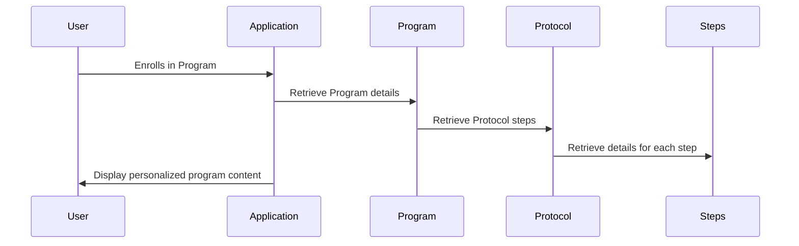

# Chapter 3: Protocol

In the previous chapter, [Program](02_program.md), we learned how tenants create specific offerings for their users.  This chapter introduces the "Protocol" – the blueprint or template that defines the structure and steps within a program.

## What is a Protocol?

Think of a protocol as a recipe. It defines a series of steps ([Tasks](04_task.md) and [Modules](05_module.md)) to achieve a specific goal, like completing a health program. Each program can use a protocol as its template.  For example, a tenant might have a "Weight Loss Protocol" that outlines the general steps for losing weight.  Different programs, like "Summer Slim Down" or "New Year, New You," can then be based on this protocol, customizing details like duration or specific exercises.

## Key Concepts

* **Steps:** A Protocol is made up of individual steps. These steps can be [Tasks](04_task.md) (like "Drink 8 glasses of water") or [Modules](05_module.md) (like a pre-built "Nutrition Module").
* **Template:**  A Protocol acts as a template.  Multiple [Programs](02_program.md) can be created based on the same Protocol, saving time and ensuring consistency.
* **Flexibility:** While a Protocol defines the overall structure, individual [Programs](02_program.md) can customize specific aspects, like scheduling or content within the steps.

## Using a Protocol

Let's say a tenant wants to create a "Weight Loss Protocol." They would define the steps involved:

```php
// Create a new protocol
$protocol = new Protocol();
$protocol->name = "Weight Loss Protocol";
$protocol->owner_id = 1; // ID of the tenant owner
$protocol->save();

// Add steps to the protocol (simplified)
// ... code to add tasks and modules ...
```

This code creates a new Protocol and sets its name and owner.  Later, individual steps ([Tasks](04_task.md) and [Modules](05_module.md)) would be added to this protocol.

## Under the Hood

When a user enrolls in a [Program](02_program.md), the application retrieves the associated Protocol and its steps.  It then creates a personalized instance of the protocol for the user, allowing them to track their progress.



### Internal Implementation

The `Program` model (located in `app/Models/Tenant/Program/Program.php` and `app/Models/Core/Program/Program.php`) handles the relationship with the `Protocol` model:

```php
// Inside the Program model (simplified)
public function protocol()
{
    return $this->belongsTo(Protocol::class);
}
```

This code defines a relationship where a [Program](02_program.md) belongs to a Protocol.

The `Protocol` model itself (located in `app/Models/Tenant/Protocol/Protocol.php` and `app/Models/Core/Protocol/Protocol.php`) manages the steps ([Tasks](04_task.md) and [Modules](05_module.md)) through the `chain` relationship:

```php
// Inside the Protocol model (simplified)
public function chain()
{
    return $this->hasMany(ProtocolChain::class);
}
```

This code defines a relationship where a Protocol has many steps, represented by the `ProtocolChain` model.  This model stores the order and details of each step within the protocol.

## Conclusion

In this chapter, we explored the concept of a Protocol, the blueprint for a [Program](02_program.md). We learned how protocols define steps, act as templates, and offer flexibility for customization. In the next chapter, we'll delve into the specifics of a [Task](04_task.md).


---

Generated by [AI Codebase Knowledge Builder](https://github.com/The-Pocket/Tutorial-Codebase-Knowledge)