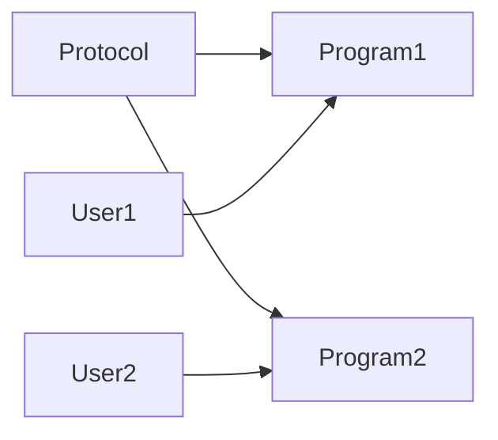
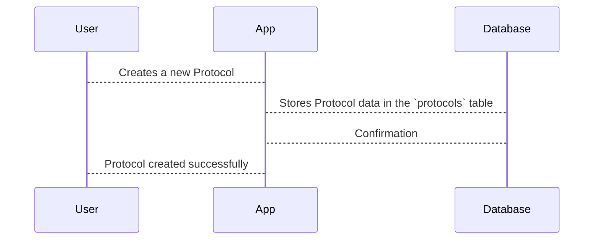

# Chapter 3: Protocols

In the previous chapter, [Programs](02_programs.md), we learned about specific workout routines users can follow.  Now, let's explore the blueprints behind those routines: *Protocols*.

Imagine Alice, our user, wants to create a brand new workout program.  She doesn't want to start completely from scratch.  She needs a template, a structure to guide her. This template is the *Protocol*.

## What is a Protocol?

A Protocol is like a recipe for a workout routine. It defines the steps involved, like exercises, assessments, reminders (nudges), and follow-ups.  Think of it like a cooking recipe.  The recipe lists the ingredients and the steps to make a dish.  A Protocol lists the "ingredients" (exercises, challenges, etc.) and the steps to complete a workout routine.

## Key Concepts in a Protocol

* **Steps/Modules:** These are the individual actions within the Protocol.  In our cooking analogy, these are like the individual instructions in the recipe (e.g., "mix flour and sugar", "bake for 30 minutes").  These steps can be [Protocol Modules](06_protocol_modules.md), which we'll learn about later.
* **Challenges/Assessments:** These are ways to test progress.  Think of it like a taste test in our recipe – checking if the dish is seasoned correctly.
* **Nudges/Reminders:** These are helpful prompts to keep users on track.  Like a reminder on your phone to take the cake out of the oven.
* **Follow-ups:** These are actions taken after a step is completed.  Like letting the cake cool before frosting it.

## Creating a Protocol

Let's say Alice wants to create a "Morning Yoga" Protocol.  Here's a simplified example of how we might represent that in code:

```php
// File: factories/Core/Protocol/ProtocolFactory.php

use App\Models\Core\Protocol\Protocol;

$protocol = Protocol::factory()->create([
    'name' => 'Morning Yoga',
    'owner_id' => 1, // Alice's User ID
    // ... other fields ...
]);
```

This code creates a new Protocol in the `protocols` table.  We're skipping some details for now, like the specific steps within the Protocol.

## Using a Protocol

Once Alice creates the "Morning Yoga" Protocol, she can use it as a template to create multiple [Programs](02_programs.md).  Other [Users](01_users.md) can also use her Protocol to create their own Programs.



## Under the Hood

When a Protocol is created, the code interacts with the database to store the Protocol's information.



The `CreateProtocolsTable` migration file defines the structure of the `protocols` table.

```php
// File: migrations/2022_06_08_090318_create_protocols_table.php
// ... code to create the protocols table ...
```

Other migration files, like `ExtendProtocolWithArchivedAndPublishedTable`, add more columns to the `protocols` table over time.

```php
// File: migrations/2023_11_22_104747_extend_protocol_with_archived_and_published_table.php
// ... code to add 'is_archived' and 'is_published' columns ...
```

## Conclusion

In this chapter, we learned about Protocols, the templates for workout routines. We saw how Protocols are created and how they can be used to create multiple Programs.  In the next chapter, we'll explore [Personal Chains](04_personal_chains.md), which represent an individual user's progress through a specific Program.


---

Generated by [AI Codebase Knowledge Builder](https://github.com/The-Pocket/Tutorial-Codebase-Knowledge)