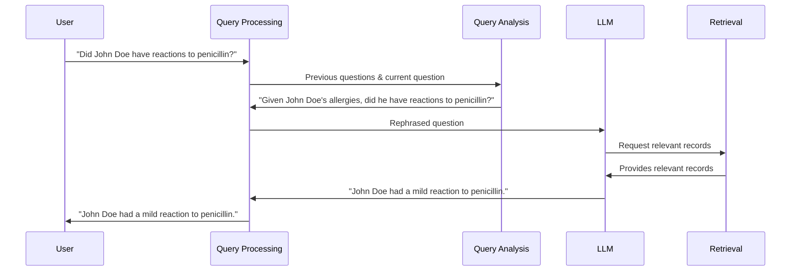

# Chapter 3: Query Analysis

In the previous chapter, [LLM (Large Language Model)](02_llm__large_language_model_.md), we learned about the "brain" of HMS-MED.  Now, let's explore how we can make sure the brain gets the best possible instructions. This is where Query Analysis comes in.

Imagine you're asking a medical question like, "What are John Doe's issues with his heart?".  You might have previously asked about John Doe's blood pressure.  Query analysis is like a helpful assistant that remembers your previous questions and clarifies your current question. It might rephrase your question to be "Given John Doe's previous high blood pressure, what are his specific heart problems?", providing more context for the LLM.

## Why Query Analysis?

Query analysis helps the [LLM (Large Language Model)](02_llm__large_language_model_.md) understand exactly what you're looking for, especially when you're asking follow-up questions.  It's like giving the librarian more clues to find the right book.

## How Query Analysis Works

Think of query analysis as having two main steps:

1. **Remembering the Past:**  Query analysis keeps track of your previous questions, just like a notepad.

2. **Clarifying the Present:**  It uses your past questions to make your current question clearer. For example, if you first asked about a patient's allergies and then asked about their reaction to a medication, query analysis might combine these to ask the LLM, "Considering the patient's known allergies, what was their reaction to this specific medication?"

## Using Query Analysis in HMS-MED

Let's say you ask HMS-MED:

1. "What are John Doe's allergies?"
2. "Did he have any reactions to penicillin?"

HMS-MED's query analysis might rephrase the second question for the LLM as:

"Given that John Doe is allergic to peanuts and pollen, did he have any reactions to penicillin?"

This gives the LLM more context and helps it provide a more accurate and relevant answer.

## Internal Implementation

Here's a simplified view of how query analysis works within HMS-MED:



The code for query analysis can be found in files like `HMS-EHR/_scripts/evaluate_chains.py`.  Look for the `CONDENSE_QUESTION_PROMPT`. This prompt template is used to rephrase the question.

```python
# ... other code ...

_template = """Given the following conversation and a follow up question, rephrase the follow up question to be a standalone question.

    Chat History:
    {chat_history}
    Follow Up Input: {question}
    Standalone Question:"""

CONDENSE_QUESTION_PROMPT = PromptTemplate.from_template(_template)

# ... more code ...
```

This code snippet shows how the current question and chat history are used to create a new, standalone question.  The actual implementation is more complex, but this simplified example shows the core idea.

## Conclusion

Query analysis helps refine user questions, making them clearer for the [LLM (Large Language Model)](02_llm__large_language_model_.md) and improving the accuracy and relevance of the answers.  Now, let's explore how HMS-MED retrieves relevant information from the medical records: [Retrieval](04_retrieval.md).


---

Generated by [AI Codebase Knowledge Builder](https://github.com/The-Pocket/Tutorial-Codebase-Knowledge)