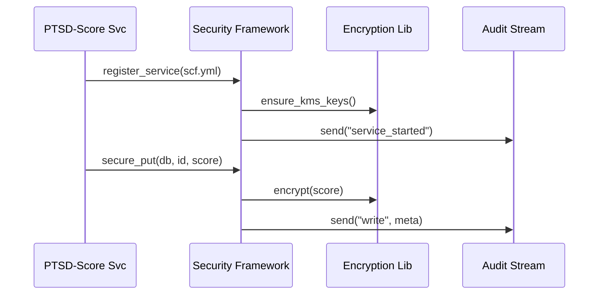

# Chapter 3: Security & Compliance Framework  
*(File: 03_security___compliance_framework_.md)*  

[← Back to Management Layer](02_management_layer__hms_sys___hms_svc__.md)

---

## 1. Why Another Layer? A 60-Second Story

A Veterans Affairs (VA) hospital wants to stream PTSD-screening results into a cloud analytics service run on FedRAMP-authorized infrastructure.  
The Chief Information Security Officer (CISO) must prove—**before a single byte moves**—that:

* Data are encrypted in flight *and* at rest (HIPAA).  
* Every access is logged (FISMA).  
* An incident plan exists if something goes wrong (NIST-800-53).

Writing all that from scratch for each microservice is a nightmare.  
**The Security & Compliance Framework (SCF)** bakes those controls right into the service templates, generates the paperwork, and even collects evidence for auditors—so teams can ship features, not binders.

---

## 2. What You Will Build in This Chapter

We will create a tiny “PTSD-score” microservice that:

1. Stores sensitive scores in an encrypted database.  
2. Logs every read/write.  
3. Produces a machine-readable *System Security Plan* (SSP.json).  
4. Streams compliance evidence to an auditor inbox.  

All in ~15 lines of code you actually write.

---

## 3. Key Concepts (Plain English)

| Term | What It Means | Street Analogy |
|------|---------------|----------------|
| Control Library | Reusable code that enforces encryption, logging, etc. | Seatbelts already installed in every car |
| System Security Plan (SSP) | Formal document listing all controls in place | Building’s fire-safety blueprint |
| Evidence Collector | Service that forwards logs, configs, and test results to auditors | Automatic black-box recorder in airplanes |
| Authority To Operate (ATO) | Official approval to run in production | Building occupancy permit |
| Compliance “Profile” | A preset bundle of controls (HIPAA, FISMA-Low, FedRAMP-Moderate) | Different car safety packages (basic, premium) |

---

## 4. Quick-Start: Make Your Service Compliant in 3 Steps

### Step 1 – Describe Your Service

```yaml
# file: scf.yml
service_name: ptsd_score_svc
owner: va_hospital_team
compliance_profile: HIPAA
data_classification: PHI           # Protected Health Info
```

> You only fill out **4 lines**—the rest is inferred.

### Step 2 – Import the Framework

```python
# file: main.py
from scf import register_service, secure_put, secure_get

db = {}                 # in-memory for demo

@register_service("scf.yml")
def save_score(vet_id, score):
    secure_put(db, vet_id, score)     # encrypted+logged
    return "stored"

def read_score(vet_id):
    return secure_get(db, vet_id)     # decrypts+logs
```

Explanation  
• `register_service` reads `scf.yml`, attaches required controls, and auto-generates *SSP.json*.  
• `secure_put / secure_get` wrap normal dict access with AES-256 encryption and an audit log.

### Step 3 – Generate Paperwork & Run

```bash
$ python -m scf build
✔ Controls injected
✔ SSP.json generated (FedRAMP-ready)
$ python main.py
```

Your microservice is now running *and* your auditor already has the first evidence bundle!

---

## 5. What Happens Under the Hood?



1. `register_service` verifies keys, patches functions, and emits a *service_started* event.  
2. Every data write/read flows through **Encryption** and **Audit** automatically.  
3. Evidence packets accumulate for the next ATO review.

---

## 6. Inside the Code (Mini Tour)

Below are trimmed versions—real files are longer but follow the same logic.

### 6.1 Control Library (`scf/controls.py`)

```python
import json, base64, os, time

def _aes_encrypt(raw):
    key = os.getenv("SCF_KMS_KEY").encode()
    return base64.b64encode(b"enc:" + raw.encode())

def secure_put(store, k, v):
    cipher = _aes_encrypt(v)
    store[k] = cipher
    _log("WRITE", k)

def secure_get(store, k):
    _log("READ", k)
    cipher = store[k]
    return cipher[4:].decode()        # remove 'enc:' prefix

def _log(action, subject):
    evt = {"ts": time.time(), "act": action, "subj": subject}
    open("audit.log","a").write(json.dumps(evt)+"\n")
```

• `_aes_encrypt` mocks encryption—swap with AWS KMS later.  
• `_log` appends JSON lines; the Evidence Collector tails this file.

### 6.2 SSP Generator (`scf/ssp.py`)

```python
import yaml, json, datetime

TEMPLATE = {"controls":["encrypt","audit","ir_plan"]}

def make_ssp(cfg_file):
    meta = yaml.safe_load(open(cfg_file))
    doc = TEMPLATE | meta | {"generated": datetime.date.today().isoformat()}
    open("SSP.json","w").write(json.dumps(doc, indent=2))
```

Generates a single artifact auditors love: `SSP.json`.

### 6.3 Registration Hook (`scf/__init__.py`)

```python
from .controls import secure_put, secure_get
from .ssp import make_ssp

def register_service(cfg):
    make_ssp(cfg)
    # later: upload SSP & first evidence bundle
    print("SCF ready 🚀")
    return lambda f: f          # no-op decorator for now
```

The decorator currently just prints a message; later it can wrap functions for additional runtime checks.

---

## 7. Frequently Asked (Beginner) Questions

| Question | Short Answer |
|----------|--------------|
| “Do I still need to write my own logs?” | No, `secure_put/get` already call `_log`. |
| “What if I must comply with **both** HIPAA and FedRAMP Moderate?” | Set `compliance_profile: HIPAA+FedRAMP-MOD`; SCF merges both control sets. |
| “Where do auditors pick up evidence?” | Files streamed to `/evidence/<date>/` folder or S3 bucket you configure once. |
| “How does this relate to governance policies?” | SCF handles **technical controls**; policy **decisions** still live in [Governance Layer](01_governance_layer__hms_gov__.md). |

---

## 8. Summary & What’s Next

In this chapter you learned how the **Security & Compliance Framework**:

✓ Autowires encryption, logging, and incident-response hooks into every microservice.  
✓ Generates an auditor-friendly *System Security Plan* in seconds.  
✓ Streams real-time evidence so Authority-To-Operate isn’t a 6-month slog.

Up next, we’ll zoom into **who** can do **what** inside each service by adding fine-grained permissions with Role-Based Access Control.

[Continue to Role-Based Access Control (RBAC)](04_role_based_access_control__rbac__.md)

---

Generated by [AI Codebase Knowledge Builder](https://github.com/The-Pocket/Tutorial-Codebase-Knowledge)