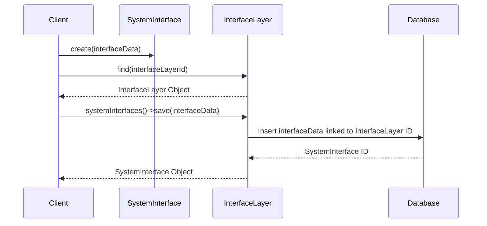

# Chapter 3: SystemInterface

In the previous chapter, [InterfaceLayer](02_interfacelayer.md), we learned how to create different ways for users to interact with our system, like a website for Sunnyside Elementary.  But what about the specific parts of that website, like the homepage, the admissions page, or the contact page?  These are `SystemInterface` components.

## What problem does SystemInterface solve?

Imagine you're on Sunnyside Elementary's website. You click on "Admissions" to learn about enrolling your child.  That "Admissions" page is a `SystemInterface`.  `SystemInterface` represents the individual points of interaction *within* an interface layer, like pages on a website or screens in a mobile app.  They define how users access specific functionalities of the system.

## Key Concepts

1. **Interface Layer:**  Remember from the last chapter, this is the overall method of interaction (website, mobile app, etc.).  The `SystemInterface` lives *inside* the `InterfaceLayer`.

2. **Functionality:** Each `SystemInterface` provides access to a specific function of the system.  The "Admissions" page lets you access admissions information, while the "Contact" page lets you contact the school.

3. **URL Path:**  This is the specific address of the `SystemInterface` within the `InterfaceLayer`. For example, if the school's website is `https://sunnyside.edu`, the admissions page might be `https://sunnyside.edu/admissions`.

## Using SystemInterface: Navigating Sunnyside Elementary's Website

Let's create the "Admissions" `SystemInterface` for Sunnyside Elementary's website.

```php
// Simplified example - see SystemInterface.php for full implementation
use Modules\Gov\Entities\SystemInterface;
use Modules\Gov\Entities\InterfaceLayer;

$interfaceLayer = InterfaceLayer::find(1); // Assuming the website has ID 1

$admissionsPage = new SystemInterface([
    'name' => 'Admissions',
    'url_path' => 'admissions',
    'description' => 'Information about enrolling at Sunnyside Elementary',
    'active' => true // Make the page accessible
]);

$interfaceLayer->systemInterfaces()->save($admissionsPage);
```

This code creates a new `SystemInterface` for the "Admissions" page.  We link it to the `InterfaceLayer` representing the school's website.  Setting `active` to `true` makes the page accessible to users.

## Internal Implementation

When you call `save` on the `systemInterfaces` relationship, it creates a new entry in the database representing the `SystemInterface` and links it to the corresponding `InterfaceLayer`.



The code for saving the `SystemInterface` leverages the relationship defined in `Gov/Entities/InterfaceLayer.php`:

```php
// Gov/Entities/InterfaceLayer.php (simplified)
public function systemInterfaces(): HasMany
{
    return $this->hasMany(SystemInterface::class);
}
```

And in `Gov/Entities/SystemInterface.php`:

```php
// Gov/Entities/SystemInterface.php (simplified)
public function interfaceLayer(): BelongsTo
{
    return $this->belongsTo(InterfaceLayer::class);
}
```

These code snippets define the relationship between the `InterfaceLayer` and the `SystemInterface`.

## Conclusion

In this chapter, we learned about `SystemInterface`, which represents the individual points of interaction within an `InterfaceLayer`. We saw how to create an "Admissions" page for Sunnyside Elementary's website. In the next chapter, [ManagementLayer](04_managementlayer.md), we'll explore how to manage and control the functionalities offered through these interfaces.


---

Generated by [AI Codebase Knowledge Builder](https://github.com/The-Pocket/Tutorial-Codebase-Knowledge)