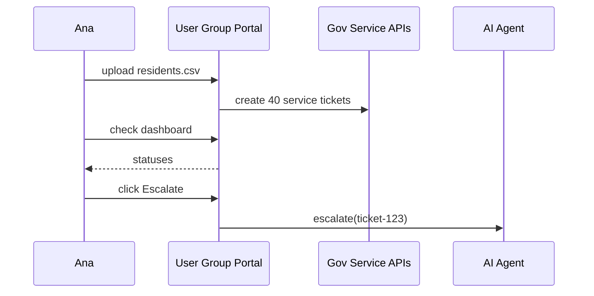

# Chapter 3: User Group Portal  
*(one dashboard to help many people at once)*  

[← Back to Chapter 2: Intent-Driven Navigation](02_intent_driven_navigation_.md)

---

## 1. Why Do We Need a “Group” Portal?

Meet Ana, activities director at *Golden Oaks Senior Center* in Ohio.  
Every January she helps 40 residents:

1. **Re-enroll in Medicare Part B**  
2. Update each person’s **voter registration** address  
3. Request **heating-bill assistance** for the building  

Today Ana mails paper forms, keeps an Excel sheet, and phones three different agencies when papers get lost.

What if she could:

* Upload a simple spreadsheet once  
* Watch every application move through the pipeline  
* Click “Escalate” when a case is stuck and let an AI agent chase it

That one-stop web page is the **User Group Portal (UGP)**.

---

## 2. Key Ideas in Plain English

| Term | What it means for Ana |
|------|-----------------------|
| **Group** | Any cohort of people (e.g., Golden Oaks, a veterans’ post, a school class). |
| **Bulk Request** | One form template applied to many members in one click. |
| **Group Dashboard** | A live table showing status for every member. |
| **Escalation** | “Nudge” button that forwards stalled cases to the [AI Representative Agent](06_ai_representative_agent_.md). |
| **Role** | Who can do what—Manager (Ana), Member, or Viewer—run by the [Access & Authorization Framework](11_access___authorization_framework_.md). |

---

## 3. Tour of the Portal (Zero-Install Demo)

Below is a **micro-frontend widget** that you can drop into any sector portal we built in Chapter 1.  
Open the Group Dashboard, upload a CSV, and hit “Send.”

```jsx
// /widgets/group-portal/index.js  (17 lines)
export default function GroupPortal() {
  const [file, setFile] = useState(null);

  const sendBulk = async () => {
    const body = new FormData();
    body.append("file", file);
    body.append("journey", "MEDICARE_ENROLL");
    await fetch("/api/group/bulk", { method:"POST", body });
    alert("40 requests submitted!");
  };

  return (
    <>
      <h2>Golden Oaks – Bulk Actions</h2>
      <input type="file" onChange={e=>setFile(e.target.files[0])}/>
      <button disabled={!file} onClick={sendBulk}>Enroll in Medicare</button>
    </>
  );
}
```

What happens?

1. Ana uploads a `residents.csv`.  
2. We POST it to `/api/group/bulk` with the chosen **journey**.  
3. A toast tells her the requests are live.

---

## 4. Seeing Progress

We reuse a tiny status table widget:

```jsx
// /widgets/group-status/index.js  (15 lines)
export default function GroupStatus() {
  const {data=[],refetch}=useFetch("/api/group/status");

  return (
    <>
      <h3>Request Tracker</h3>
      <table>
        <thead><tr><th>Name</th><th>Service</th><th>Status</th><th/></tr></thead>
        <tbody>
          {data.map(row=>
            <tr key={row.id}>
              <td>{row.name}</td><td>{row.service}</td><td>{row.stage}</td>
              <td>
                {row.stalled &&
                  <button onClick={()=>fetch(`/api/group/escalate/${row.id}`)}>
                    Escalate
                  </button>}
              </td>
            </tr>)}
        </tbody>
      </table>
      <button onClick={refetch}>Refresh</button>
    </>
  );
}
```

• Green rows = done  
• Yellow = pending  
• Red = stalled → “Escalate” calls the AI agent

---

## 5. Under the Hood (Big Picture)



1. UGP splits the CSV into 40 ticket payloads.  
2. Tickets flow through the same **Intent-Driven Journeys** from Chapter 2.  
3. Escalations hand the ticket ID to the AI agent, which pings agency APIs or suggests next steps.

---

## 6. How the Backend Handles a Bulk Upload

### 6.1 API Route

```js
// /api/group/bulk.js  (18 lines)
import {parseCsv} from "../../lib/csv";
import {plan} from "../../services/navigator/journey-planner";

export default async function handler(req, res){
  const {journey} = req.body;
  const rows = await parseCsv(req.files.file);   // ① read CSV
  const url  = plan(journey);                    // ② reuse logic from Chapter 2
  const tickets = rows.map(row => ({
      member: row.name,
      journey: url,
      stage: "PENDING"
  }));
  // ③ save tickets (pseudo code)
  await db.groupTickets.insertMany(tickets);
  res.json({count: tickets.length});
}
```

Explanation:

1. Parse Ana’s spreadsheet into rows.  
2. Use the same **Journey Planner** we built earlier.  
3. Store a row per member in a `groupTickets` collection.

### 6.2 Escalation Endpoint

```js
// /api/group/escalate/[id].js  (10 lines)
import {notifyAI} from "../../services/escalation";

export default async (req,res)=>{
  const {id}=req.query;
  await db.groupTickets.update(id,{stage:"ESCALATED"});
  await notifyAI(id);        // ping AI Representative Agent
  res.json({ok:true});
};
```

---

## 7. Integrating with Other Layers

• **Interface Layer** – widgets live in the same HMS-MFE shell.  
• **Access & Authorization Framework** – only Ana, listed as *Manager*, can bulk-submit.  
• **Governance Layer** – ensures uploaded data matches federal rules (coming up next!).  
• **AI Representative Agent** – receives escalations for smart follow-up.  

Cross-link whenever you need deeper dives.

---

## 8. Common Pitfalls & Tips

1. **CSV column mismatch**  
   – Always show a preview and mapping step (left as exercise).  

2. **Privacy controls**  
   – Mask SSNs in the dashboard; sensitive fields live server-side only.  

3. **Ticket flood**  
   – Batch network calls (throttle to e.g., 10 requests/second) to stay friendly with agency APIs.  

---

## 9. Try It Locally in 60 Seconds

```bash
npm run portal:dev        # start local server
# Visit http://localhost:3000/group
# Upload sample_residents.csv   (provided in /samples)
# Watch status table update
```

Expected: 5 demo tickets appear; click “Escalate” to see a mock AI response.

---

## 10. What You Learned

✔️ The purpose of a User Group Portal  
✔️ Creating bulk requests with a 17-line widget  
✔️ Tracking and escalating cases for an entire cohort  
✔️ How the portal reuses Intent-Driven Journeys under the hood  

Up next we’ll discover how **design rules, legal requirements, and security policies** keep every widget—from Ana’s dashboard to the AI escalation screen—looking and behaving consistently.

[→ Chapter 4: Governance Layer (HMS-GOV)](04_governance_layer__hms_gov__.md)

---

Generated by [AI Codebase Knowledge Builder](https://github.com/The-Pocket/Tutorial-Codebase-Knowledge)