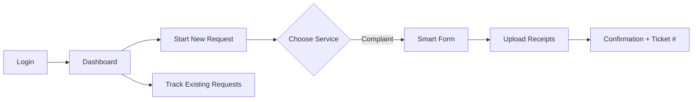
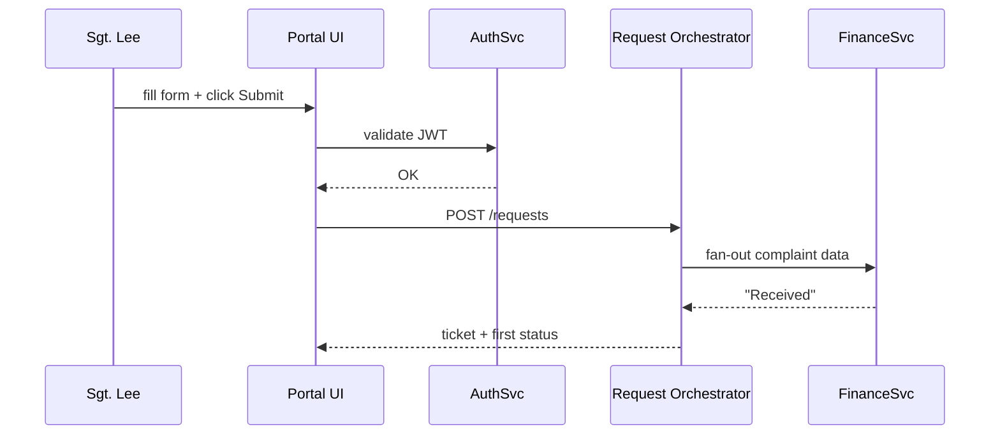

# Chapter 3: User Portal (HMS-MFE Public Interface)

*A friendly continuation from [Chapter 2: Policy Versioning & Audit Ledger](02_policy_versioning___audit_ledger_.md)*  

---

## 1  Why Do We Need a “Front Door”?

Picture Sergeant Lee, an Army Reservist who just drove 300 miles for annual training.  
She wants travel-cost reimbursement but has no idea which of the **172 federal forms** applies, which agency owns it, or whether the rule changed last month.

Without help, she will:

1. Google random PDFs  
2. Call three different hotlines  
3. Abandon reimbursement altogether 💸

**The User Portal turns that chaos into one mobile-friendly page.**  
Think of it as `USA.gov`, but scoped to *your* program: a digital counter where citizens, soldiers, or staff log in, file requests, and track every status update—while the portal quietly orchestrates dozens (or hundreds!) of backend services.

---

## 2  Key Ideas in Plain English

| Term | Everyday Analogy | Why It Matters |
|------|------------------|----------------|
| Portal Home | Entrance hall at DMV | Single place to take a ticket and pick a service |
| Micro-Frontend (MFE) | Service window #4 | Each window handles a specific task (e.g., reimbursement, scholarship) |
| Smart Form | TurboTax interview | Asks plain-English questions, hides jargon |
| Status Timeline | Package-tracking page | Shows every handoff—no more “Where is my form?” calls |
| Notification Hub | Postal SMS alerts | Pushes email/SMS when something changes |

---

## 3  Core Use Case: Filing a Travel Reimbursement Complaint

We’ll build a **tiny prototype** showing how Sgt. Lee:

1. Logs in  
2. Starts a “Complaint: Travel Reimbursement Delay” form  
3. Uploads receipts  
4. Watches the request move from *Received* → *In Review* → *Paid*

### 3.1 Quick Look at the UI (wireframe)



---

## 4  Hands-On: Building the Front Door

> NOTE: We’ll use a **React-lite** syntax for clarity, but the concepts apply to any stack.

### 4.1 Minimal Login Component (`Login.jsx`)

```javascript
import { useState } from "react";
import { apiLogin } from "./portalApi";  // thin wrapper around fetch()

export default function Login() {
  const [email, setEmail] = useState("");
  const [pw, setPw] = useState("");

  async function handleSubmit(e) {
    e.preventDefault();
    const jwt = await apiLogin(email, pw); // back-end returns JSON Web Token
    localStorage.setItem("jwt", jwt);
    window.location = "/dashboard";
  }

  return (
    <form onSubmit={handleSubmit}>
      <input placeholder="Email" onChange={e=>setEmail(e.target.value)}/>
      <input type="password" placeholder="Password" onChange={e=>setPw(e.target.value)}/>
      <button>Sign in</button>
    </form>
  );
}
```

Explanation for beginners:  
1. Capture email/password in local state.  
2. Call `apiLogin` which talks to an Auth service.  
3. Store the returned token so later API calls prove who you are.  
4. Redirect to the dashboard.

### 4.2 Starting a New Request (`NewRequest.jsx`)

```javascript
import { useState } from "react";
import { postRequest } from "./portalApi";

export default function NewRequest() {
  const [desc, setDesc] = useState("");

  async function create() {
    const ticket = await postRequest({
      type: "TRAVEL_REIMB_COMPLAINT",
      description: desc
    });
    alert(`Your ticket # is ${ticket.id}`);
  }

  return (
    <>
      <h2>Travel Reimbursement Complaint</h2>
      <textarea onChange={e=>setDesc(e.target.value)}/>
      <button onClick={create}>Submit</button>
    </>
  );
}
```

What happens?  
• We send a short JSON payload to the Portal API.  
• The API returns a `ticket.id` like `TR-2024-000123`, which the user will later track.

### 4.3 Tracking Status (`Timeline.jsx`)

```javascript
import { useEffect, useState } from "react";
import { getStatus } from "./portalApi";

export default function Timeline({ ticketId }) {
  const [events, setEvents] = useState([]);

  useEffect(()=>{
    getStatus(ticketId).then(setEvents);
  }, [ticketId]);

  return (
    <ul>
      {events.map(ev=> <li key={ev.time}>{ev.time}: {ev.label}</li>)}
    </ul>
  );
}
```

Explanation:  
Every few seconds (or via WebSockets) we pull status events like:

```json
[
  {"time":"10:02","label":"Received"},
  {"time":"10:05","label":"Assigned to Finance"},
  {"time":"11:15","label":"In Review"}
]
```

This eliminates “phone-tag” with the agency.

---

## 5  What’s Happening Behind the Curtain?

### 5.1 Bird’s-Eye Flow



Key points:  
1. The **Auth Service** issues tokens (ties into [Role-Based Access & Permissions (RBAC)](08_role_based_access___permissions__rbac__.md)).  
2. The **Request Orchestrator** is a glue microservice; it never holds policy logic (that lives in backend services and [Governance Layer](01_governance_layer__hms_gov__.md)).  
3. Every status change lands in the user’s timeline and triggers a push notification.

### 5.2 Tiny Slice of the Orchestrator (`orchestrator.py`)

```python
# File: orchestrator.py
from fastapi import FastAPI, Header
import uuid, datetime, json, httpx

app = FastAPI()

@app.post("/requests")
async def create(req: dict, authorization: str = Header()):
    ticket_id = f"TR-{uuid.uuid4().hex[:6]}"
    payload = {**req, "ticket_id": ticket_id, "ts": datetime.datetime.utcnow().isoformat()}

    # 1. Fan out to Finance Service
    async with httpx.AsyncClient() as client:
        await client.post("http://finance-svc/complaints", json=payload)

    # 2. Persist first timeline entry (skipping DB details)
    timeline = [{"time": payload["ts"], "label": "Received"}]
    fake_db[ticket_id] = timeline   # placeholder dict

    return {"id": ticket_id, "events": timeline}
```

Explanation line-by-line:  
• Generate a unique ticket number.  
• Forward the complaint to the Finance Service (one of many backends under the **Services Mesh** you will meet in [Backend Services Mesh (HMS-SVC)](09_backend_services_mesh__hms_svc__.md)).  
• Store the first timeline event.  
• Return data to the UI.

Total code: **18 lines**, keeping us honest!

---

## 6  Connecting to Other HMS-UTL Layers

1. **Policy Facts**: All text shown on the Smart Form (e.g., “You have 45 days to file”) is auto-pulled from the current policy version via [Governance Layer (HMS-GOV)](01_governance_layer__hms_gov__.md).  
2. **Audit Trail**: Each user action automatically records a ledger entry, satisfying FOIA audits you learned about in [Policy Versioning & Audit Ledger](02_policy_versioning___audit_ledger_.md).  
3. **AI Help**: In Chapter 4 you’ll see how the portal suggests next steps using intent detection and AI journeys.

---

## 7  Frequently Asked Questions

**Q: Is the Portal only for citizens?**  
A: No. Soldiers, federal employees, contractors—any “end-user” without direct backend access logs in here.

**Q: Does every service need its own frontend?**  
A: Nope. Micro-frontends load **dynamically** inside the shell. One deploy can add a whole new window without redeploying the core portal.

**Q: How does the Portal stay mobile-friendly?**  
A: We enforce a **12-column, responsive grid** and run Lighthouse CI in the build pipeline (covered in [Continuous Delivery & Compliance Pipeline](12_continuous_delivery___compliance_pipeline_.md)).

**Q: What if multiple agencies need custom branding?**  
A: Each micro-frontend ships its own CSS theme; the shell applies agency colors based on the logged-in domain (e.g., `@state.gov`).

---

## 8  What You Learned

• The User Portal is the single front door where real people start, track, and finish requests.  
• Under the hood, small components (MFEs) talk to orchestration services and backend policies—but the user only sees a clean, guided flow.  
• Simple tokens, status timelines, and push alerts slash support calls and make compliance effortless.

Ready to see how the portal *guides* users with AI instead of static menus?  
Jump to [Intent-Driven Navigation & AI-Guided Journeys](04_intent_driven_navigation___ai_guided_journeys_.md).

---

Generated by [AI Codebase Knowledge Builder](https://github.com/The-Pocket/Tutorial-Codebase-Knowledge)