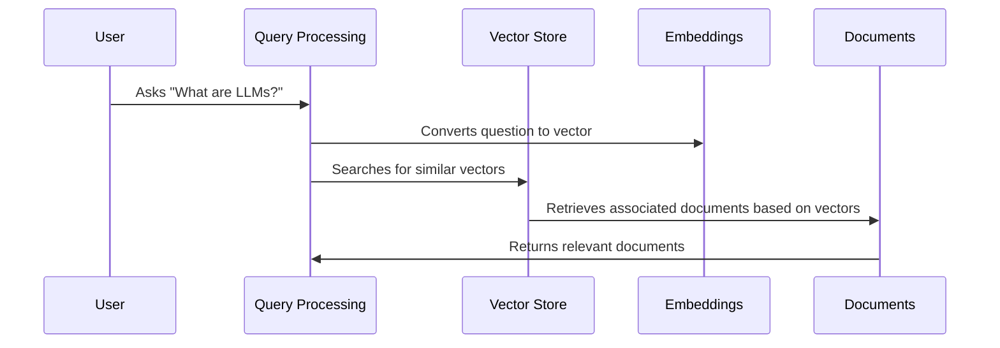

# Chapter 3: Vector Store

In the previous chapter, [Retrieval](02_retrieval_.md), we learned how our chatbot quickly finds relevant information.  But how is that information organized so it can be searched efficiently?  That's where the *Vector Store* comes in.

Imagine you're searching for information about "LLMs" in the LangChain documentation.  You don't want to read the entire documentation; you just want the relevant parts. The Vector Store helps us do this.

## What is a Vector Store?

A Vector Store is a special kind of database that stores information as vectors.  Think of it like a library where books (documents) are organized not by genre, but by their meaning.  Each book is represented by a "meaning vector" (a list of numbers that captures the essence of the book's content).  When you ask a question, the Vector Store finds the "books" with the closest meaning vectors, providing relevant context.

## How does a Vector Store work?

Let's break down how the Vector Store works with a simple example:

1. **Documents to Vectors:** Each piece of information (like a paragraph from the LangChain documentation) is converted into a meaning vector using [Embeddings](04_embeddings_.md).  This is like assigning each book in our library a unique code based on its meaning.

2. **Storing Vectors:** These meaning vectors, along with the original text, are stored in the Vector Store.  This is like putting the books on shelves based on their codes, not their genres.

3. **Searching the Vector Store:**  When you ask a question, it's also converted into a meaning vector. The Vector Store then finds the vectors that are closest to your question's vector. This is like finding books with similar codes to your query.

4. **Returning Documents:** The original text associated with the closest meaning vectors is returned. This is like retrieving the books from the shelves based on their codes.



## Vector Store in Code (Simplified)

```python
# backend/retrieval.py (simplified)
from langchain_weaviate import WeaviateVectorStore

# ... other code ...

with retrieval.make_retriever(config) as retriever:
    docs = retriever.get_relevant_documents(query)
    # docs now contains the relevant documents from the Vector Store
```

This code shows how we use a `retriever` (which uses a Vector Store like Weaviate) to get relevant documents based on a `query`.

## Looking Under the Hood: `get_relevant_documents`

When `get_relevant_documents` is called:

1. The `query` is converted into an embedding using an [Embeddings](04_embeddings_.md) model.
2. This embedding is used to search the Vector Store.
3. The Vector Store returns the most similar document embeddings and their associated documents.
4. These documents are returned by the `get_relevant_documents` function.

```python
# backend/retrieval.py (simplified)
from langchain_weaviate import WeaviateVectorStore

# ... other code to connect to Weaviate ...

store = WeaviateVectorStore(
    client=weaviate_client, # Connect to Weaviate
    index_name=WEAVIATE_DOCS_INDEX_NAME, # Name of the index/collection
    text_key="text", # Key for the text content
    embedding=embedding_model, # Embedding model to use
    attributes=["source", "title"], # Additional metadata
)
retriever = store.as_retriever(search_kwargs=search_kwargs)
docs = retriever.get_relevant_documents(query)
```

This simplified code snippet shows how a `WeaviateVectorStore` is initialized and used to retrieve documents.  The `search_kwargs` can be used to fine-tune the search process.

## Conclusion

The Vector Store is essential for efficient retrieval of relevant information. By converting text into meaning vectors and storing them in a specialized database, we can quickly find the most relevant information for a given query.  Now that we understand the Vector Store, let's explore how text is converted into meaning vectors in the next chapter: [Embeddings](04_embeddings_.md).


---

Generated by [AI Codebase Knowledge Builder](https://github.com/The-Pocket/Tutorial-Codebase-Knowledge)