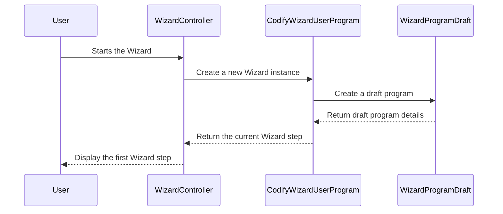

# Chapter 3: Wizard

In the previous chapters, we learned about [Protocols and Programs](01_protocols_and_programs.md) and the [Modules](02_modules.md) that make them up.  This chapter introduces the **Wizard**, a helpful tool that guides you through the process of creating your own Programs, step-by-step.

## Why a Wizard?

Imagine you're building a complex Lego castle.  You could just start putting bricks together randomly, but it's much easier to follow the instructions. The Wizard is like a set of instructions for building your Program. It helps you define your goals, choose the right Modules, and configure your Program settings.

## The Wizard's Guidance

The Wizard simplifies Program creation by breaking it down into smaller, manageable steps.  It's like filling out a form, where each section focuses on a specific aspect of your Program.

There are two main types of Wizard flows:

* **Public Program Wizard:** For creating Programs that anyone can access.
* **Personal Program Wizard:** For creating Programs just for yourself.

Both Wizards guide you through similar steps, but there are some differences based on the Program type. For example, a Public Program Wizard might ask you about pricing and distribution, while a Personal Program Wizard won't.

## Using the Wizard

Let's say you want to create a Public Program for a "7-Day Fitness Challenge."  Here's a simplified example of how the Wizard might guide you:

1. **Define your Program's goal:**  "Help users improve their fitness in 7 days."
2. **Choose a Category:** "Fitness"
3. **Select Modules:**  "Daily Challenge," "Nudge (Reminders)," "Assessment (Progress Check)."
4. **Configure Module content:**  Specify the daily challenge exercises, reminder messages, and assessment questions.
5. **Set Program access:** "Public"
6. **Review and Publish:**  Check your Program details and make it live.

## Internal Implementation

The Wizard's flow is managed by the `CodifyWizardUserProgram` model (in `Models/Core/Wizard/CodifyWizardUserProgram.php`).  It tracks your progress through the Wizard steps and stores your choices.



The `WizardProgramDraft` model (in `Models/Core/Wizard/WizardProgramDraft.php`) stores the draft version of your Program as you're building it.

Here's a simplified example of how the `CodifyWizardUserProgram` model tracks your progress:

```php
// Models/Core/Wizard/CodifyWizardUserProgram.php (simplified)
$wizardData = [
    'protocol_id' => 1, // ID of the associated Protocol
    'is_personal' => false, // Public Program
    'processing_step' => 1, // Current step in the Wizard
];

$wizard = CodifyWizardUserProgram::create($wizardData);
```

This code snippet creates a new `CodifyWizardUserProgram` record, indicating that the user is on the first step of creating a Public Program associated with a specific Protocol.

The `PublicWizardStates` enum (in `Enums/PublicWizardStates.php`) and `PersonalWizardStates` enum (in `Enums/PersonalWizardStates.php`) define the possible steps in the Wizard flow for Public and Personal Programs, respectively.

## Conclusion

In this chapter, we learned about the Wizard, a guided tool for creating Programs. We saw how it simplifies the process by breaking it down into smaller steps and how it handles different flows for Public and Personal Programs.

Next, we'll explore how to integrate [AI Integration](04_ai_integration.md) into your Programs.


---

Generated by [AI Codebase Knowledge Builder](https://github.com/The-Pocket/Tutorial-Codebase-Knowledge)