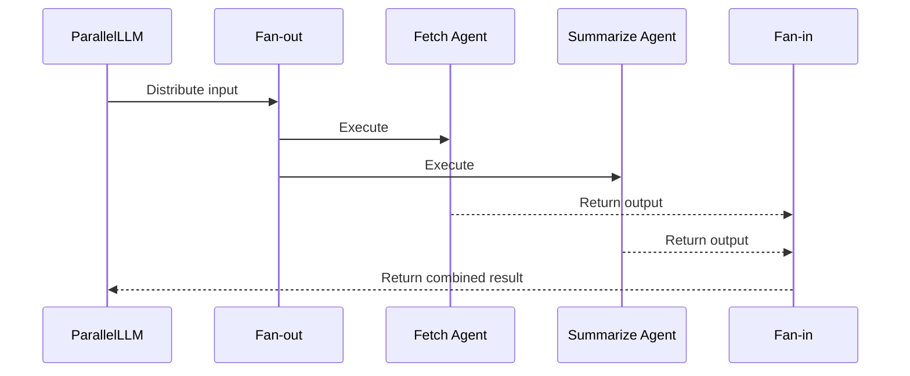

# Chapter 3: Workflow

In the previous chapter, [Agent](02_agent.md), we learned about the individual workers in our AI application.  Now, let's explore how to orchestrate these agents to perform complex tasks by using *Workflows*.

## What problem does a Workflow solve?

Imagine our news summarization assistant from before.  We now have an agent that can fetch articles and another that can summarize text. But how do we combine these actions?  A Workflow defines the sequence of steps these agents should take.  It's like a project manager creating a plan for a team to build a house.

## Key Concepts

A Workflow is essentially a sequence of steps, where each step can involve:

1. **Calling an [Agent](02_agent.md):**  This could be to fetch data, process information, or perform an action.  In our house-building analogy, this is like assigning tasks to different contractors (electrician, plumber, etc.).

2. **Passing data between steps:** The output of one step can be used as input to the next.  The carpenter needs the frame built before they can install the walls.

## Using a Workflow

While `HMS-MCP` doesn't explicitly define a base `Workflow` class, the concept is implemented through various patterns like [Parallel](src/mcp_agent/workflows/parallel/parallel_llm.py), [Router](src/mcp_agent/workflows/router/), and [Evaluator-Optimizer](src/mcp_agent/workflows/evaluator_optimizer/evaluator_optimizer.py).  These patterns provide pre-built structures for common workflow types.

Let's consider a simplified example using the `Parallel` workflow, which allows us to run multiple agents concurrently:

```python
from mcp_agent.workflows.parallel.parallel_llm import ParallelLLM
from mcp_agent.agents.agent import Agent
from mcp_agent.workflows.llm.augmented_llm_openai import OpenAIAugmentedLLM

# Create agents
fetch_agent = Agent(name="fetch_agent", instruction="Fetch a webpage.", server_names=["fetch"])
summarize_agent = Agent(name="summarize_agent", instruction="Summarize text.")

# Create a parallel workflow
parallel_workflow = ParallelLLM(
    fan_in_agent=summarize_agent, # Agent to combine results
    fan_out_agents=[fetch_agent], # Agents to run in parallel
    llm_factory=OpenAIAugmentedLLM,
)

# Execute the workflow
result = await parallel_workflow.generate_str("Summarize the page: https://www.example.com")
print(result) # Output: Summary of the webpage
```

This code defines two agents: `fetch_agent` to retrieve a webpage and `summarize_agent` to summarize its content. The `ParallelLLM` workflow runs the `fetch_agent` and then passes its output to the `summarize_agent`.

## Internal Implementation

Let's examine the internal workings of the `ParallelLLM` workflow:

1. **Fan-out:** The workflow distributes the input to each agent in `fan_out_agents`.  Like delegating tasks to different teams.

2. **Agent Execution:** Each agent performs its task independently.  Each team works on their part of the project.

3. **Fan-in:** The workflow collects the outputs from all agents and passes them to the `fan_in_agent`.  The project manager gathers updates from each team.

4. **Aggregation:** The `fan_in_agent` combines the results into a final output. The project manager compiles a final report.



Here's a simplified look at the `generate` function from `src/mcp_agent/workflows/parallel/parallel_llm.py`:

```python
async def generate(...):
    # Fan-out
    responses = await self.fan_out.generate(...)

    # Fan-in
    result = await self.fan_in.generate(...)

    return result
```

The `fan_out` and `fan_in` components handle the distribution and aggregation of tasks, respectively.

## Conclusion

Workflows are crucial for building complex AI applications by coordinating the actions of multiple [Agents](02_agent.md). The `HMS-MCP` project provides various workflow patterns like `ParallelLLM` to simplify the implementation of common scenarios.  In the next chapter, we'll explore the [MCP Server](04_mcp_server.md), which provides the tools and services that our agents use to interact with the external world.


---

Generated by [AI Codebase Knowledge Builder](https://github.com/The-Pocket/Tutorial-Codebase-Knowledge)