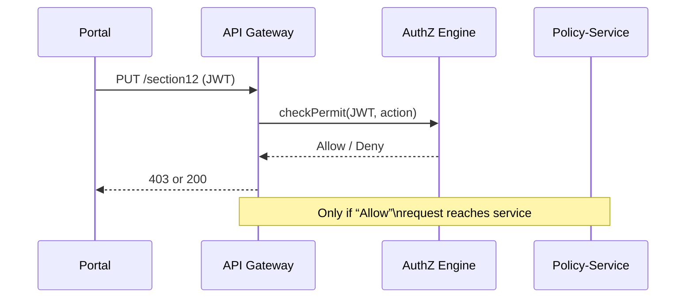

# Chapter 4: Access Control & Authorization (RBAC/ABAC)

*← You just built a secure “front door” in [Backend API Gateway (HMS-API / HMS-MKT)](03_backend_api_gateway__hms_api___hms_mkt__.md).  
Now we decide **who may walk through which hallway** once they’re inside.*

---

## 1 . Why Does This Matter? (A 60-second Story)

Alexis is a **city clerk** updating zoning permits.  
Jordan is a **DISA administrator** patching military servers.

Both log in through the same HMS portals but:

• Alexis **must not** see classified Coast Guard incident files.  
• Jordan **must** edit “Section 12” of a defense policy, but **must not** change the IRS Tax-Court docket.

Access Control is the digital key-ring that enforces those differences—and records every turn of the key for later audits.

---

## 2 . Key Ideas in Plain English

| Term                 | Beginner Meaning                                                      |
|----------------------|------------------------------------------------------------------------|
| Authentication       | “Who are you?” (login, token)                                         |
| Authorization        | “What are you allowed to do?”                                         |
| Role (RBAC)          | Job title, e.g., `city-clerk`, `disa-admin`                           |
| Attribute (ABAC)     | Facts about the user, resource, or context (e.g., *agency=HUD*, *security_level=Secret*, *day=Saturday*) |
| Permission           | Action on a resource, e.g., `edit:policy`, `view:permit`              |
| Policy               | Human-readable rule that maps roles/attributes → permissions          |
| Audit Log            | Tamper-proof record: *who accessed what, when, and why*               |

RBAC = **R**ole-Based; ABAC = **A**ttribute-Based.  
HMS lets you mix them: “Role *OR* Attribute *or both* must match.”

---

## 3 . A 3-Step Beginner Recipe

We’ll protect an endpoint that edits **Section 12** of any policy.

### 3.1 Define Roles & Attributes

```yaml
# roles.yaml
roles:
  city-clerk:
    permissions: [ "view:permit" ]
  disa-admin:
    permissions: [ "edit:policy:section12" ]
```

```yaml
# attributes.yaml (user records)
alexis:
  agency: "Phoenix-City"
  clearance: "Public"

jordan:
  agency: "DISA"
  clearance: "Secret"
```

Explanation  
• Roles carry **default** permissions (RBAC).  
• Attributes describe **situational** facts (ABAC).

---

### 3.2 Write a Tiny Policy

```yaml
# policy.yaml  (≤ 15 lines)
rules:
  - effect: allow
    when:
      any:
        - role: "disa-admin"
        - and:
            - clearance: "Secret"
            - action: "edit:policy:section12"
```

Plain English:  
1. If your **role** is `disa-admin` → allow.  
2. Otherwise, allow only if you have **Secret clearance AND** you’re doing the exact `edit:policy:section12` action.

---

### 3.3 Enforce in Code (Express middleware – 17 lines)

```js
// authz-mw.js
import policies from './policy.yaml' assert { type: 'yaml' };
export function authorize(action) {
  return (req, res, next) => {
    const user = req.user;                     // filled by Gateway
    const ctx  = { ...user, action };          // merge attributes
    const ok = policies.rules.some(r => match(r.when, ctx));
    if (!ok) return res.status(403).send('Forbidden');
    next();
  };
}
// naive matcher (5 lines omitted)
function match(when, ctx) { /* tiny recursion */ }
```

Beginner notes  
• `req.user` already exists because the Gateway validated the JWT.  
• We build `ctx` (context) and loop through policy rules.  
• On failure we instantly return HTTP 403.

Use it in a route:

```js
app.put('/policies/:id/section12', authorize('edit:policy:section12'), handler);
```

---

## 4 . What Happens Under the Hood?



1. Gateway extracts `action` from the path.  
2. AuthZ Engine evaluates **RBAC + ABAC** rule set.  
3. Decision (`Allow` / `Deny`) is logged.

---

## 5 . A Peek Inside the AuthZ Engine

### 5.1 Minimal Rule Evaluator (Rego-Lite, 18 lines)

```rego
# file: policy.rego
package hms.authz

default allow = false

allow {
  input.role == "disa-admin"
}

allow {
  input.clearance == "Secret"
  input.action == "edit:policy:section12"
}
```

Explanation  
• Rego is the language of **Open Policy Agent (OPA)**—open-source, audit-friendly.  
• `input` is the merged context (user + action).  
• First matching `allow` wins; otherwise request is denied.

### 5.2 OPA Sidecar Deployment (no code)

• Each microservice pod runs an **OPA sidecar**.  
• The Gateway queries `http://localhost:8181/v1/data/hms/authz` with JSON input.  
• Sidecar replies `{ "result": true }` or `false` within < 2 ms.

---

## 6 . Logging for Compliance

```json
{
  "ts": "2024-05-20T14:22:01Z",
  "subject": "jordan",
  "action": "edit:policy:section12",
  "resource": "policy/845",
  "decision": "allow",
  "reason": "role==disa-admin"
}
```

Each entry goes to the [Compliance & Audit Trail Engine](14_compliance___audit_trail_engine_.md) for 7-year retention.

---

## 7 . Common Pitfalls & Quick Fixes

| Pitfall                                         | Fix |
|-------------------------------------------------|-----|
| Hard-coding `if (userId===123)` in services     | Centralize all rules in OPA or middleware. |
| Letting UI hide buttons **instead of** backend enforcing | The backend **must** still check—UI is cosmetic. |
| Forgetting to log “deny” decisions              | Log **both** allow & deny for full audit. |
| Role explosion (“200 roles!”)                   | Move conditions to attributes (ABAC) to keep roles < 10. |

---

## 8 . Recap

You now have:

• A vocabulary—**roles**, **attributes**, **policies**.  
• A 3-step recipe to protect any endpoint.  
• A tiny Express middleware + optional OPA sidecar.  
• Automatic audit logs to keep IGs & GAO happy.

Next we’ll see how the **Management Layer** orchestrates these policies across dozens of microservices.  
Jump ahead to [Management Layer (HMS-SVC / HMS-OPS)](05_management_layer__hms_svc___hms_ops__.md).

---

Generated by [AI Codebase Knowledge Builder](https://github.com/The-Pocket/Tutorial-Codebase-Knowledge)