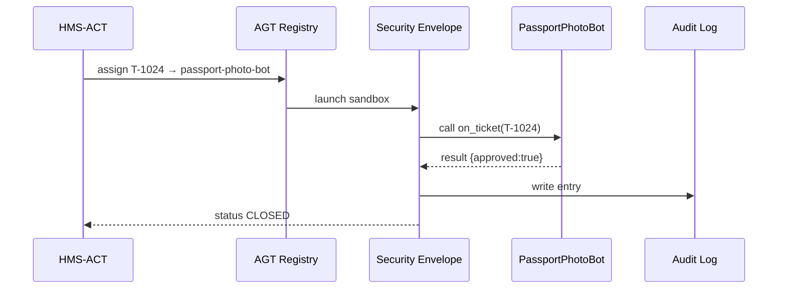

# Chapter 4: Agent Framework (HMS-AGT / HMS-AGX)

*(If you just arrived, peek at  
[Action Orchestrator (HMS-ACT)](03_action_orchestrator__hms_act__.md) to see how tickets get routed. This chapter explains **who actually does the work** once a ticket lands in an inbox.)*

---

## 1. Why Do We Need an “Agent Framework”?

### Story – “Renew My Passport, Please!”

1. Mary submits an online passport-renewal form.  
2. HMS-ACT creates Ticket **T-1024** and assigns a **“Passport Agent.”**  
3. The agent must:
   • Check Mary’s photo meets rules.  
   • Validate fee payment.  
   • Email her if anything is missing.  
   • Log every step for auditors.

Without a standard framework, each agency would code its own bots, forget security settings, and reinvent the email template wheel.  
**HMS-AGT** is that universal toolkit—think of it as a *Peace Corps for software*.  
**HMS-AGX** adds extra “training” packs (health, finance, logistics) so the same agent skeleton can work in totally different domains.

Result: citizens experience fast, consistent, trustworthy help … no matter which government portal they visit.

---

## 2. Key Concepts (Plain English)

| Word | What It Really Means | Analogy |
|------|----------------------|---------|
| Agent | A small service (human, bot, or mix) that accepts a task and returns a result. | A field officer. |
| Skill | A single capability an agent can perform (“classify image,” “send email”). | Badge on an officer’s uniform. |
| Envelope | Auto-applied wrapper that handles security, ethics, logging. | Standard-issue Peace Corps handbook. |
| Registry | Directory where agents self-register so ACT can find them. | Volunteer sign-in sheet. |
| Pack (AGX) | Optional add-on that installs specialized skills (healthcare, finance…). | Extra language training before deployment. |

Keep this table nearby; we’ll use these five terms throughout.

---

## 3. First Walk-Through  
### Use Case: Auto-Approving a Passport Photo

Goal: Build an agent that receives **T-1024**, checks the applicant’s photo, and closes the ticket if the image passes.

#### 3.1 Create the Agent (`passport_photo_bot.py`)

```python
# 18 lines total
from hms_agt import BaseAgent, skill       # core toolkit

class PassportPhotoBot(BaseAgent):
    name = "passport-photo-bot"

    @skill(needs=["image_url"])
    def check_photo(self, image_url):
        # 🪄 pretend we call a tiny ML model here
        ok = image_url.endswith(".jpg") and "face" in image_url
        return {"approved": ok}

    def on_ticket(self, ticket):
        res = self.check_photo(ticket.payload["photo_url"])
        if res["approved"]:
            ticket.close(note="Photo OK 👍")
        else:
            ticket.request_info("New photo needed ❌")
```

Explanation for beginners:

1. `BaseAgent` gives us logging, security, and a tiny DSL.  
2. We define one **skill** called `check_photo`.  
3. `on_ticket` is the entry point—AGT calls it automatically with a ticket object.  
4. Depending on ML output we either `close` or `request_info`.

*Any Python newbie can skim this and understand the flow!*

#### 3.2 Register the Agent (one-liner)

```bash
agt register passport_photo_bot.py
```

Output (abridged):

```
✓ Added passport-photo-bot → skills: check_photo
```

Behind the scenes the Agent Registry stores:
```
id=passport-photo-bot
skills=["check_photo"]
domain="general"
```

#### 3.3 Watch It Work

1. HMS-ACT detects a ticket assigned to `passport-photo-bot`.  
2. AGT spins up the agent in a sandbox.  
3. The agent runs `on_ticket`, writes an audit trail, and replies.  
4. ACT changes status to **CLOSED** or **NEEDS-INFO**.

No extra code needed—envelope + registry did the boring parts!

---

## 4. Under the Hood – 5-Step Flow



Key ideas:

1. **Registry** looks up where to run the bot.  
2. **Envelope** injects security tokens, censoring any restricted fields.  
3. **Audit Log** records every skill invocation automatically.

---

## 5. Anatomy of HMS-AGT

```
hms-agt/
├── core/
│   ├── base_agent.py
│   ├── envelope.py
│   └── registry.py
├── packs/          # AGX add-ons
│   └── finance/
│       ├── ledger_skill.py
│       └── README.md
└── cli/agt.py
```

### 5.1 `base_agent.py` (excerpt – 12 lines)

```python
class BaseAgent:
    def __init__(self, ticket):
        self.ticket = ticket
        self.logger = get_logger(ticket.id)

    def on_ticket(self, ticket):
        raise NotImplementedError()

    def close(self, note=""):
        self.ticket.status = "CLOSED"
        self.ticket.note = note
        save(self.ticket)
```

Takeaway: *BaseAgent* gives you logging and helper methods (`close`, `request_info`, …).

### 5.2 Envelope Enforcement (`envelope.py` – 10 lines)

```python
def run(agent_cls, ticket):
    with sandbox(uid=ticket.id):           # seccomp + network limits
        agent = agent_cls(ticket)
        try:
            out = agent.on_ticket(ticket)
            log(out)
        except Exception as e:
            alert_ops(e)
```

All agents inherit safety without writing security code themselves.

---

## 6. What About HMS-AGX?

AGX = “extra skills.” Installing a pack is a single command:

```bash
agx install finance
```

After installation:

```
✓ Pack finance installed: skills=[post_to_ledger, validate_funds]
```

Your agent can now simply import and call:

```python
from hms_agx.finance import post_to_ledger
```

The same security envelope still wraps every call, so sensitive ledgers remain protected.

---

## 7. Relationship to Other Layers

• Tickets come from [HMS-ACT](03_action_orchestrator__hms_act__.md).  
• Agents pull **context objects** defined by [Model Context Protocol (HMS-MCP)](05_model_context_protocol__hms_mcp__.md).  
• Compliance checks are later verified by [Compliance & Legal Reasoner (HMS-ESQ)](10_compliance___legal_reasoner__hms_esq__.md).  
• Performance data flows into [Activity & Operations Monitoring (HMS-OPS)](12_activity___operations_monitoring__hms_ops___hms_oms__.md).

---

## 8. Try It Yourself (5-Minute Lab)

```bash
git clone https://github.com/hms-example/hms-agt
cd hms-agt/examples
# 1. Register our demo bot
agt register passport_photo_bot.py
# 2. Simulate ticket arrival
python trigger_ticket.py  # creates T-1024 with sample.jpg
# 3. Tail the log
tail -f ~/.hms/agt/logs/passport-photo-bot.log
```

You should see:

```
[INFO] T-1024 photo approved → ticket closed
```

---

## 9. Recap & What’s Next

You learned:

✓ HMS-AGT gives every agency a plug-and-play way to build agents.  
✓ An **Envelope** adds security, ethics, and audit automatically.  
✓ **AGX packs** bolt on domain-specific power in one command.  
✓ Agents and HMS-ACT cooperate to turn tickets into real-world results.

Next we’ll dive into **how agents get the right slice of data (and nothing more) using context objects**. Head over to  
[Model Context Protocol (HMS-MCP)](05_model_context_protocol__hms_mcp__.md).

---

Generated by [AI Codebase Knowledge Builder](https://github.com/The-Pocket/Tutorial-Codebase-Knowledge)