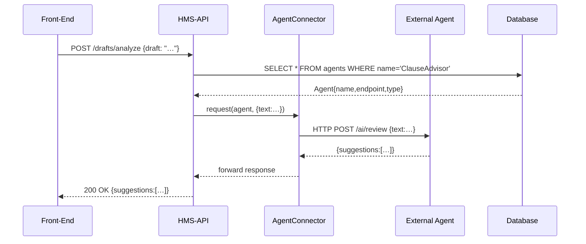

# Chapter 4: Agent Integration

In [Module Layer](03_module_layer_.md), you learned how to group related business logic into Modules. Now let’s plug in intelligent helpers—**Agents**—that can suggest, automate, or enrich your policy workflows in real time.

---

## 1. Why Agent Integration?

Imagine your policy platform has a **virtual legislative advisor**.  
- A staffer drafts a new law proposal.  
- The advisor spots missing clauses or suggests standard wording.  
- After review, the staffer publishes a cleaner, more robust draft—fast.  

Or think of a **building permit assistant** that auto-fills common form fields based on citizen data, saving hours of manual work.  
Agents solve these repetitive or expert tasks by living inside your HMS-API modules and talking to external AI or helper services.

---

## 2. Key Concepts

1. **Agent**  
   A record in HMS-API that describes a helper service: name, endpoint URL, and type (AI, human, rules engine).

2. **AgentConnector**  
   A small service class that makes HTTP or RPC calls to the Agent’s endpoint and returns structured results.

3. **Registry**  
   A Module’s service provider registers the connector so any part of your code can call `app('agent.connector')`.

4. **Invocation**  
   Your controllers or services ask the connector to run the agent on a given payload (e.g., a draft text or form data) and get back suggestions.

---

## 3. Defining & Registering an Agent

First, store agents in the database. Here’s a minimal Eloquent model:

```php
<?php
namespace App\Models\Core\Agent;

use Illuminate\Database\Eloquent\Model;

class Agent extends Model
{
  protected $fillable = ['name','endpoint','type'];
}
```

Explanation:  
- `name`: Friendly identifier (e.g. “ClauseAdvisor”).  
- `endpoint`: URL to call.  
- `type`: “AI” or “rules-engine”.

Next, register the connector in your Module’s service provider (`app/Modules/Policy/PolicyServiceProvider.php`):

```php
public function register()
{
  // Make the connector available as "agent.connector"
  $this->app->singleton('agent.connector', function($app) {
    return new \App\Services\AgentConnector();
  });
}
```

Explanation:  
- This binds `agent.connector` into Laravel’s container.  
- Anywhere you call `app('agent.connector')`, you get the same helper instance.

---

## 4. Calling an Agent in a Controller

Here’s how you might ask the ClauseAdvisor to review a draft:

```php
<?php
class LegislativeController extends Controller
{
  public function analyzeDraft(Request $req)
  {
    // 1. Fetch your agent by name
    $agent = \App\Models\Core\Agent\Agent::where('name','ClauseAdvisor')->first();

    // 2. Send the draft to the agent
    $result = app('agent.connector')->request($agent, [
      'text' => $req->input('draft')
    ]);

    // 3. Return AI suggestions
    return response()->json($result);
  }
}
```

Explanation:  
1. Load the Agent record (URL, type).  
2. Use `agent.connector` to send the payload.  
3. Return whatever the agent replies (e.g., suggested clauses, risk flags).

---

## 5. Under the Hood: Run-Time Flow

Here’s a sequence diagram for `analyzeDraft()`:



1. Your controller loads the Agent from the **Database**.  
2. It calls **AgentConnector**, which makes an HTTP call to the **External Agent**.  
3. The agent’s response flows back to the **UI**.

---

## 6. Deep Dive: AgentConnector Service

File: `app/Services/AgentConnector.php`

```php
<?php
namespace App\Services;

use GuzzleHttp\Client;

class AgentConnector
{
  protected $http;
  public function __construct()
  {
    $this->http = new Client(['timeout'=>5.0]);
  }

  public function request($agent, array $payload)
  {
    // 1. Send JSON to the agent endpoint
    $resp = $this->http->post($agent->endpoint, [
      'json' => $payload
    ]);

    // 2. Decode JSON and return
    return json_decode($resp->getBody(), true);
  }
}
```

Explanation:  
- We use Guzzle to send a POST to the agent’s URL.  
- We pass the payload as JSON.  
- We return whatever JSON the agent replies with (array or object).

---

## 7. Visualizing in the UI

A simple Vue snippet to trigger analysis:

```vue
<template>
  <v-block-icon icon="robot" text="Advisor" />
  <textarea v-model="draft" placeholder="Paste draft here"></textarea>
  <v-button-colors-light @click="analyze">Get Suggestions</v-button-colors-light>
</template>

<script>
export default {
  data:() => ({draft:''}),
  methods:{
    async analyze() {
      const res = await this.$http.post('/drafts/analyze',{draft:this.draft});
      console.log(res.data.suggestions);
    }
  }
}
</script>
```

Explanation:  
- We use `<v-block-icon>` to show a robot icon.  
- Clicking the button calls our API and logs the returned suggestions.

---

## Conclusion

In this chapter, you learned how to:
- Declare an **Agent** in your database  
- Register an **AgentConnector** in your Module  
- Invoke AI or helper services from a Controller  
- Visualize responses in your front-end  

Next up: securing these endpoints with **[Authentication & Authorization](05_authentication___authorization_.md)**.

---

Generated by [AI Codebase Knowledge Builder](https://github.com/The-Pocket/Tutorial-Codebase-Knowledge)