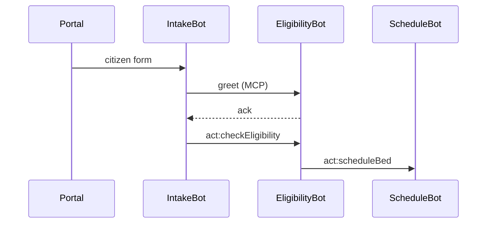

# Chapter 4: Agent Interaction Protocol (HMS-MCP)

*(a continuation of [AI Representative Agent (HMS-AGT)](03_ai_representative_agent__hms_agt__.md))*  

---

## 1. Why Do Agents Need a “Diplomatic Passport”?

### 60-Second Story – “One Form, Three Bots”

Taylor, 19, applies to **Job Corps** for free career training.  
Behind the scenes, three different AI agents must cooperate:

1. **IntakeBot** – checks that Taylor’s PDF is complete.  
2. **EligibilityBot** – validates age & income rules.  
3. **ScheduleBot** – books a dorm bed if approved.

If each bot spoke its own dialect (“boolean ok vs. string ‘YES’”) the flow would crumble.  
HMS-MCP is the **Foreign Affairs Manual** that forces every agent to:

* Use the *same* envelope.  
* Attach security badges.  
* Reserve slots for tool calls.  

Result? Agents debate without miscommunication and humans can audit every word.

---

## 2. Key Concepts (Plain English)

| Term | Friendly Explanation |
|------|----------------------|
| **Envelope** | A JSON wrapper that all messages share—like the address & stamp on a letter. |
| **Header** | Who is speaking, to whom, and why. |
| **Body** | The actual content (question, proposal, data). |
| **Tool Slot** | An optional section where the sender requests a specific action (“run getFloodMap”). |
| **Security Token** | The sender’s badge from [Role & Identity Management](02_role___identity_management__accounts___authorization__.md). |
| **Ack** | A tiny “Got it!” reply so no message disappears into the void. |
| **Schema Version** | Allows upgrades without breaking older agents. |

Analogy: Sending a message via HMS-MCP is like mailing a diplomatic pouch:

1. **Envelope** — outer bag with flags & seals.  
2. **Body** — the secret memo inside.  
3. **Tool Slot** — pre-printed forms asking the embassy to stamp, copy, or courier.  

---

## 3. The Minimal Envelope

Below is the tiniest valid MCP message—**10 lines** of JSON:

```json
{
  "v": "1.0",
  "header": {
    "from": "IntakeBot",
    "to": "EligibilityBot",
    "type": "greet",
    "token": "eyJhbGciOi..."   /* badge */
  },
  "body": {
    "text": "New Job Corps application #A-921"
  }
}
```

What happens?

* `type: "greet"` signals a light handshake.  
* If `EligibilityBot` responds with an **ack**, both sides know the channel works.

---

## 4. Hands-On: Sending Your First MCP Message

Below is a **Node/TypeScript-ish** client that wraps message creation and sending.

```javascript
// sendGreet.js  (18 lines)
import { mcpSend } from '@hms-mcp/client';
import { getToken } from '@hms-auth/client';   // Chapter 2

async function greet() {
  const token = await getToken({ actor: 'IntakeBot' });

  await mcpSend({
    v: '1.0',
    header: {
      from: 'IntakeBot',
      to: 'EligibilityBot',
      type: 'greet',
      token
    },
    body: { text: '👋 Processing app #A-921' }
  });
}

greet();
```

Explanation:

1. `getToken` gives the bot a **badge**.  
2. `mcpSend` serializes, signs, and posts the envelope to the **MCP Router**.  
3. The router guarantees delivery or retries.

---

## 5. Requesting a Tool (Action Message)

Need `EligibilityBot` to run a database check?  
Use a **tool slot** inside the body.

```json
{
  "header": { /* …same as before… */, "type": "act" },
  "body": {
    "tool": "checkEligibility",
    "args": { "dob": "2005-02-14", "income": 0 },
    "onSuccess": "proceed",
    "onFail": "reject"
  }
}
```

EligibilityBot will:

1. Execute `checkEligibility`.  
2. Send back an **act:result** message with the output.

---

## 6. A Bird’s-Eye View of the Interaction



Five participants or fewer—simple to follow!

---

## 7. Under the Hood – How MCP Validates a Message

1. **Schema Check** – Ensure all required keys exist.  
2. **Signature Verify** – Confirm the `token` is valid (JWT).  
3. **Rate-Limit** – Throttle noisy agents.  
4. **Route** – Look up the `to` agent and enqueue.  
5. **Audit** – Append envelope to an immutable log (tied to [Security & Compliance Engine](11_security___compliance_engine__hms_esq__.md)).

### 7.1 Tiny Validator (15 lines)

```javascript
// mcp/validate.js
import Ajv from 'ajv';
import jwt from 'jsonwebtoken';
import schema from './envelope.schema.json';

const ajv = new Ajv();
const validate = ajv.compile(schema);

export function assertValid(msg) {
  if (!validate(msg)) throw Error('Schema fail');
  jwt.verify(msg.header.token, process.env.PUBLIC_KEY); // Chapter 2 key
}
```

Every inbound message passes through `assertValid` before touching business logic.

---

## 8. Extending MCP – Adding a New Tool ID

Each agency can safely extend the protocol by **registering** new tools; existing agents remain compatible.

```javascript
// tools/register.js  (12 lines)
import { registry } from '@hms-mcp/registry';

registry.add({
  id: 'getZipDemographics',
  description: 'Returns census stats for a ZIP code',
  argsSchema: { zip: 'string' },
  handler: async ({ zip }) => {
    // fetch census.gov API here
    return await fetchJSON(`/census?zip=${zip}`);
  }
});
```

Now *any* agent can send an MCP message with `"tool": "getZipDemographics"` and trust the schema.

---

## 9. Debugging – View a Conversation Thread

```javascript
// dev/showThread.js  (10 lines)
import { getThread } from '@hms-mcp/client';

const msgs = await getThread('A-921');
msgs.forEach(m => console.log(m.header.type, m.body));
```

Outputs:

```
greet { text: '👋 Processing app #A-921' }
ack   { received: true }
act   { tool: 'checkEligibility', args: { ... } }
...
```

Great for both developers and auditors.

---

## 10. Where HMS-MCP Fits in the Stack

* Agents created in [HMS-AGT](03_ai_representative_agent__hms_agt__.md) **speak** MCP.  
* Human reviewers see threaded dialogues in the [Human-in-the-Loop Control Panel](05_human_in_the_loop__hitl__control_panel_.md).  
* Service endpoints reached via [Backend Service APIs](10_backend_service_apis__hms_svc___hms_api__.md) are referenced inside **tool slots**.  
* All envelopes land in the compliance log watched by [HMS-ESQ](11_security___compliance_engine__hms_esq__.md).

---

## 11. Recap

You learned:

1. What problems HMS-MCP solves (agents speaking one language).  
2. Anatomy of an MCP envelope: header, body, tool slot, token.  
3. How to send a greet or action message in fewer than 20 lines of code.  
4. Internal validation & routing flow.  
5. How to extend MCP safely with new tools.

Ready to see how humans oversee and override these automated chats?  
Jump to [Human-in-the-Loop (HITL) Control Panel](05_human_in_the_loop__hitl__control_panel_.md).

---

Generated by [AI Codebase Knowledge Builder](https://github.com/The-Pocket/Tutorial-Codebase-Knowledge)