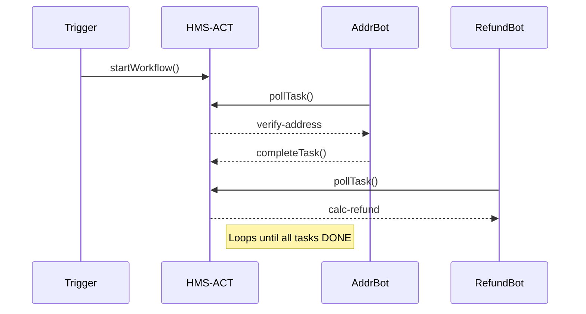

# Chapter 4: Agent Orchestration & Workflow (HMS-ACT)
*(The “shift-supervisor whiteboard” for all your digital clerks)*  

[← Back to Chapter&nbsp;3: Marketplace & Discoverability (HMS-MKT)](03_marketplace___discoverability__hms_mkt__.md)

---

## 1. Why Do We Need HMS-ACT?

Imagine a citizen, **Luis**, who files a “Damaged Parcel” claim with the U.S. Postal Service.

Hidden behind that single click are at least three chores:

1. **Verify address** (call Census API → match ZIP+4).  
2. **Calculate refund** (look-up postage, insurance, weight).  
3. **Notify supervisor** if the refund exceeds \$100.  

If each micro-service (or AI agent) worked in isolation, we could:

* lose the order of steps,  
* forget retries when one step fails, or  
* send two refunds by accident.

HMS-ACT is the **traffic controller** that prevents that chaos.  
It keeps a **to-do list**, assigns each task to the right **agent** (see [Core Agent Framework](05_core_agent_framework__hms_agt__.md)), and marks the job **DONE** only when *all* steps succeed.

---

## 2. Key Concepts (Shift-Supervisor Analogies)

| HMS-ACT Term | Postal Shift Analogy | In Plain English |
|--------------|---------------------|------------------|
| Workflow     | Whiteboard column “Damaged Parcel” | A named set of steps. |
| Task         | Sticky note on the board           | One atomic action. |
| Queue        | Stack of unassigned stickies       | Tasks waiting for an agent. |
| Agent        | Clerk who grabs a sticky           | Code that can execute a task (HMS-AGT). |
| Trigger      | New claim arrives                  | Event that starts a workflow. |
| State Store  | Clipboard with progress checklist  | Database row tracking status. |

Keep these six words in mind; everything else is just details.

---

## 3. 3-Minute Hands-On Tour  
*(No Docker, no fancy infra—just JavaScript snippets)*

We will:

1. Register a workflow.  
2. Fire a trigger (the citizen’s claim).  
3. Watch agents pick up tasks until the whole job is done.

### 3.1 Define the Workflow

```js
// workflow-register.js
import { registerWorkflow } from 'hms-act';

registerWorkflow('postal-claim', [
  { id:'verify-address',   agent:'address-bot'   },
  { id:'calc-refund',      agent:'refund-bot'    },
  { id:'notify-super',     agent:'mailer-bot',
    condition: data => data.refund > 100 }
]);
```

Explanation  
• We name the workflow `postal-claim`.  
• Each array element is a **task template**: which agent should run it and an optional **condition**.

---

### 3.2 Fire the Trigger

```js
// claim-received.js
import { startWorkflow } from 'hms-act';

await startWorkflow('postal-claim', {
  claimId : 'CLM-987',
  address : '1600 Pennsylvania Ave',
  postage : 21.15,
  insured : true
});
```

Explanation  
`startWorkflow` stores initial data and enqueues the first task (`verify-address`).

---

### 3.3 Agent Code (Super-Minimal)

```js
// agents/address-bot.js
import { pollTask, completeTask } from 'hms-act';

async function loop(){
  const task = await pollTask('address-bot');     // waits for work
  const valid = await uspsAPI.check(task.data.address);
  await completeTask(task.id, { addressValid: valid });
  loop(); // keep working
}
loop();
```

Explanation  
`pollTask` gives the agent the next sticky note.  
`completeTask` stores the result and wakes the **next** task (`calc-refund`).

*(Other agents look identical—just different business logic.)*

---

### 3.4 Observe the Result

```js
// watch.js
import { workflowStatus } from 'hms-act';

setInterval(async () => {
  console.clear();
  console.table(await workflowStatus('CLM-987'));
}, 2000);
```

Expected console output (updates every 2 s):

| task           | state  |
|----------------|--------|
| verify-address | DONE   |
| calc-refund    | DONE   |
| notify-super   | DONE   |

When all tasks read **DONE**, the workflow auto-archives itself.

---

## 4. What Happens Under the Hood?

### 4.1 Step-by-Step (Plain English)

1. **Trigger** calls `startWorkflow` → a new row in the **State Store**.  
2. HMS-ACT looks at the first task template and pushes a real **Task** into the **Queue**.  
3. An **Agent** calls `pollTask`, receives the task, performs work, and posts results.  
4. HMS-ACT records the output, checks conditions for the next task, and—if met—queues it.  
5. Repeat until every template has either run or been skipped by its condition.  
6. Final status is emitted to logging + human dashboard.

### 4.2 Tiny Sequence Diagram



---

## 5. Inside the Engine (Code-Light Peek)

### 5.1 The In-Memory Queue (simplified)

```js
// hms-act/queue.js
const q = [];                    // FIFO array

export function push(task){ q.push(task); }
export function pop(agent){
  const idx = q.findIndex(t => t.agent === agent);
  return idx > -1 ? q.splice(idx,1)[0] : null;
}
```

Explanation  
• Real implementations use Redis or SQS—this demo uses an array.  
• `push` inserts; `pop` fetches the first task matching the agent label.

---

### 5.2 Workflow Driver (condensed)

```js
// hms-act/driver.js
import { push }      from './queue.js';
import { store, get } from './state.js'; // tiny DB wrapper

export function startWorkflow(name, data){
  const wf = db.workflows[name];
  const runId = store({ name, data, step:0 }); // row id
  scheduleNextStep(runId);
}

export function completeTask(taskId, output){
  const run = get(taskId.runId);
  Object.assign(run.data, output);
  run.step++;              // move cursor
  scheduleNextStep(run.id);
}

function scheduleNextStep(runId){
  const run = get(runId);
  const tpl = db.workflows[run.name][run.step];
  if(!tpl) return;         // finished
  if(tpl.condition && !tpl.condition(run.data))
      return scheduleNextStep(runId); // skip
  push({ runId, id:tpl.id, agent:tpl.agent, data:run.data });
}
```

Explanation  
• A **cursor** (`step`) remembers where we are.  
• After each completion we call `scheduleNextStep` recursively until a runnable task is found or the workflow ends.

All under 20 lines each—yet you now hold a fully working orchestrator!

---

## 6. Where HMS-ACT Fits with Other Layers

1. **Skills come from the catalog** — agents might call AI models discovered through [HMS-MKT](03_marketplace___discoverability__hms_mkt__.md).  
2. **The agents themselves** (address-bot, refund-bot) are built with the [Core Agent Framework (HMS-AGT)](05_core_agent_framework__hms_agt__.md).  
3. **Humans can intervene** at any step via the [Human-in-the-Loop Oversight](07_human_in_the_loop_oversight__hitl__.md) layer.  
4. **Security rules** (who may start or view a workflow) are enforced by the [Security & Compliance Engine](10_security___compliance_engine__hms_esq___hms_ops__.md).

Think of HMS-ACT as the **conductor** making sure every other section of the orchestra plays at the right time.

---

## 7. Frequently Asked Questions

1. **What happens if an agent crashes?**  
   The task remains in the queue; another agent (or the same one after reboot) will pick it up.

2. **Can steps run in parallel?**  
   Yes—give multiple tasks the same `step` index or produce multiple branches. HMS-ACT will queue them all at once.

3. **How do I visualize progress?**  
   Query `workflowStatus(runId)` every few seconds or subscribe to the built-in WebSocket channel.

4. **Retries & timeouts?**  
   Each task has default `retry:3` and `ttl:300 s` settings—override per task as needed.

---

## 8. Summary & Next Steps

In this chapter you:

* Learned the six core ideas behind HMS-ACT (workflow, task, queue, agent, trigger, state).  
* Registered a **postal-claim** workflow and watched three agents finish it.  
* Peeked at a 40-line reference implementation that you can extend tomorrow.

Next we’ll dive deeper into the agents themselves—how they think, communicate, and stay safe—in  
[Chapter 5: Core Agent Framework (HMS-AGT)](05_core_agent_framework__hms_agt__.md).

See you in the agent workshop!

---

Generated by [AI Codebase Knowledge Builder](https://github.com/The-Pocket/Tutorial-Codebase-Knowledge)