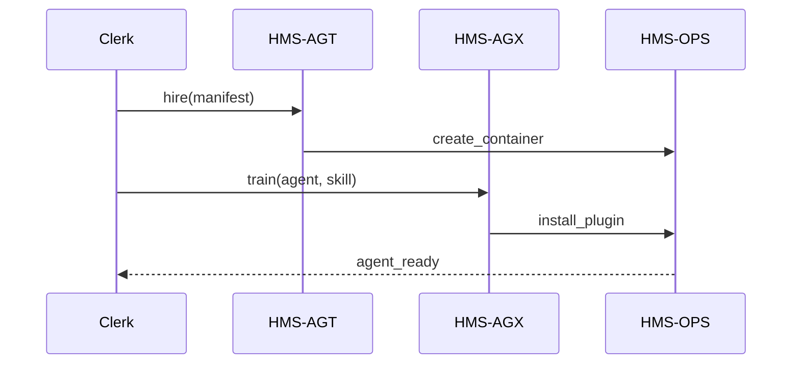

# Chapter 4: AI Agent Framework (HMS-AGT / HMS-AGX)

*[Jump back to the previous chapter: Compliance & Legal Reasoning (HMS-ESQ)](03_compliance___legal_reasoning__hms_esq__.md)*  

---

## 1. Why Do We Need Digital Civil-Servants?

Imagine the **City of Springfield** wants to launch a weekend program called  
**“Food-Truck Night.”**  

Before a single taco is served, the city must:

1. Create a new *“Mobile Food Vendor”* permit form.  
2. Check it against health, zoning, and fire codes.  
3. Sync approved vendors with Police, Tax, and Events departments.  

If one human tried to shepherd every email, spreadsheet, and compliance check, launch day would slip for months.

Instead, Springfield “**hires**” a tiny team of AI agents:

```
• PERMIT_BOT   – generates & validates the application form
• COMPLIANCE_BOT – calls HMS-ESQ to catch legal conflicts
• SYNC_BOT      – updates external databases every night
```

**HMS-AGT** is the *hiring office* that issues their badges and basic skills.  
**HMS-AGX** is the *training academy* that teaches advanced tricks (negotiation, cross-domain adapters).

The result? Food-Truck Night goes live in a week, not a season.

---

## 2. Key Concepts (Bite-Sized)

| Term | Everyday Analogy | Why It Matters |
|------|------------------|----------------|
| Agent Manifest | Résumé | Declares the agent’s name, role, and clearance. |
| HMS-AGT | HR Department | Creates, authenticates, and retires agents. |
| HMS-AGX | Training Academy | Adds specialty skills or plugins to an existing agent. |
| Badge / Clearance | Office ID card | Controls which APIs & data the agent can touch. |
| Lifecycle | Employee timeline | States: `NEW → ACTIVE → ON_LEAVE → RETIRED`. |

---

## 3. 5-Minute Tour: Hiring an Agent for “Food-Truck Night”

Below is a **toy script** (under 20 lines) using the imaginary `hms_agt` & `hms_agx` SDKs.

```python
from hms_agt import HR
from hms_agx import Academy

# 1️⃣  Log in as Springfield Clerk
hr   = HR.login("clerk@springfield.gov", "•••")
acad = Academy.attach(hr)          # Same token re-used

# 2️⃣  Draft the agent’s résumé (manifest)
manifest = {
    "name":     "PERMIT_BOT",
    "role":     "PermitFormGenerator",
    "badges":   ["read_cdf", "write_gov"],
    "version":  "1.0.0"
}

# 3️⃣  Hire the agent
agent = hr.hire(manifest)

# 4️⃣  Send to training for PDF generation skills
acad.train(agent.id, skill="pdf_template_engine")

print("✅", agent.id, "is on the job!")
```

**What happened?**

1. Clerk authenticated once (HMS-GOV handles OAuth behind the scenes).  
2. A **manifest** described the agent’s purpose & allowed data scopes.  
3. `hire()` wrote a record in the Agent Registry and minted an API key.  
4. `train()` added a plugin so the agent can export fancy PDFs.

---

## 4. Where Does HMS-AGT/AGX Sit in the Big Picture?

```
Policy Authors ─▶ [HMS-CDF] draft rule
                   │
                   ▼
   Agents produced by HMS-AGT/AGX
                   │
                   ▼
Compliance Checks via [HMS-ESQ] ─▶ Orchestrated by [HMS-ACT]
```

When the policy changes, agents can be **re-trained** automatically, ensuring yesterday’s bots don’t enforce last year’s rules.

---

## 5. Under the Hood (Plain English)

1. `hire()` writes the manifest to the **Agent Registry DB**.  
2. HMS-AGT asks **Security & Privacy Guardrails** (Chapter 15) to mint a scoped token.  
3. The token + manifest are sent to **HMS-OPS** (Chapter 14) to spin up a container.  
4. `train()` in HMS-AGX installs optional skill packs (negotiator, pdf_engine, etc.) inside that container.  
5. A **“ready”** event is broadcast on the [Inter-Agency Communication Bus (HMS-A2A)](08_inter_agency_communication_bus__hms_a2a__.md).

### Mini Sequence Diagram



Five actors, one straight-forward flow.

---

## 6. Peek Inside the Codebase

### 6.1  `hire()` Skeleton (file: `hms_agt/hr.py`)

```python
def hire(manifest: dict):
    # 1. Validate required keys
    for key in ("name", "role", "badges"):
        assert key in manifest, f"Missing {key}"
    
    # 2. Persist manifest
    agent_id = db.insert("agents", manifest)
    
    # 3. Ask Guardrails for a scoped token
    token = guardrails.issue_token(agent_id, scopes=manifest["badges"])
    
    # 4. Emit event
    bus.emit("agent.hired", {"id": agent_id})
    return Agent(id=agent_id, token=token)
```

• Under 20 lines, yet mirrors the real world steps: validation → DB write → token → event.

### 6.2  `train()` Skeleton (file: `hms_agx/academy.py`)

```python
def train(agent_id: str, skill: str):
    if skill not in SKILL_PACKS:
        raise ValueError("Unknown skill")
    # Download container layer (pretend)
    ops.install_plugin(agent_id, SKILL_PACKS[skill])
    bus.emit("agent.trained", {"id": agent_id, "skill": skill})
```

• Most logic is delegated to **HMS-OPS**; AGX stays thin and focused.

---

## 7. FAQ (Super Short)

**Q: Can a single agent hold multiple jobs?**  
A: Yes—just add more skills via `train()`. Each skill auto-bumps the agent’s semantic version.

**Q: How do we retire an agent?**  
A: `hr.retire(agent_id)` moves it to `RETIRED` state, revokes tokens, and archives logs.

**Q: What if an agent misbehaves?**  
A: The [Human-in-the-Loop Oversight](06_human_in_the_loop__hitl__oversight_.md) module can pause or sandbox any agent in real-time.

---

## 8. Try It Yourself

1. Clone `examples/agt_quickstart.ipynb`.  
2. Hire `COMPLIANCE_BOT` with only `read_esq` clearance.  
3. Train it with the `legal_summary` skill pack.  
4. Call `bot.run("Check Food-Truck application draft")` and view the summary it produces.

---

## 9. What You Learned

* HMS-AGT hires, authenticates, and retires AI agents—just like HR for humans.  
* HMS-AGX upgrades agents with specialty skills without rewriting core code.  
* A manifest + token is all an agent needs to start helping public-sector teams.

*Next up, learn how those agents keep their memories and context straight in*  
[Model Context Protocol (HMS-MCP)](05_model_context_protocol__hms_mcp__.md)

---

Generated by [AI Codebase Knowledge Builder](https://github.com/The-Pocket/Tutorial-Codebase-Knowledge)