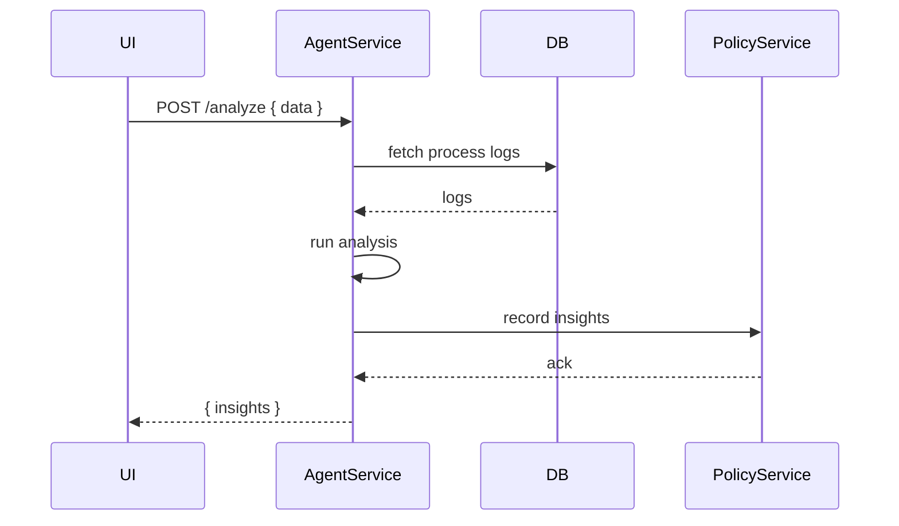

# Chapter 4: AI Agents Framework (HMS-A2A)

Welcome back! In [Chapter 3: Intent-Driven Navigation](03_intent_driven_navigation_.md), we learned how to guide users to the right forms and articles. Now we’ll introduce **AI Agents Framework (HMS-A2A)**—an environment of autonomous “expert consultants” that continuously analyze data, generate insights, and propose actions.

---

## 1. Why Do We Need an AI Agents Framework?

Imagine a federal education office that processes thousands of grant applications each year. Human reviewers notice that some stages—like eligibility checks or budget reviews—take too long. What if we could spin up an AI agent that:

- Scans application data in real time  
- Identifies bottlenecks (e.g., “Budget review delayed by 5 days”)  
- Recommends optimized steps (e.g., “Automate preliminary budget check”)  
- Interfaces with policy modules to implement changes  

That’s exactly what HMS-A2A does: think of it as a round-the-clock team of consultants working in code.

---

## 2. Key Concepts

1. **Agent**  
   An autonomous worker that runs tasks on data (like a consultant who never sleeps).

2. **Data Analysis**  
   Agents fetch and inspect datasets (e.g., grant applications) to find patterns.

3. **Insight Generation**  
   From analysis, agents create human-readable observations (e.g., “Step X is slow”).

4. **Action Proposal**  
   Agents suggest changes (automate, reorder, add checkpoints).

5. **Policy Integration**  
   Agents hand off approved proposals to policy-management modules for enactment.

---

## 3. Using HMS-A2A: A Simple Example

Let’s see how a frontend or script can call our AI agent to analyze grant bottlenecks and get action suggestions.

```js
// File: client.js
import agent from 'hms-a2a';

// 1. Fetch raw application process data
const data = await fetch('/api/applications/42').then(r => r.json());

// 2. Ask the agent to analyze bottlenecks
const { insights } = await agent.post('/analyze', { data });
console.log(insights);
// Example output:
// [ { step: 'EligibilityCheck', delayDays: 4 },
//   { step: 'BudgetReview',   delayDays: 6 } ]

// 3. Request action proposals based on insights
const { actions } = await agent.post('/actions', { insights });
console.log(actions);
// Example output:
// [ { step:'EligibilityCheck', suggestion:'Automate ID validation' },
//   { step:'BudgetReview',     suggestion:'Pre-load budget templates' } ]
```

Explanation:  
- We gather process logs for application #42.  
- We call `POST /analyze` to get slow steps.  
- We call `POST /actions` to get concrete improvement suggestions.

---

## 4. What Happens Under the Hood?

### 4.1 Sequence Diagram



1. **UI** sends raw data to **AgentService**.  
2. **AgentService** pulls needed details from the database.  
3. It runs a simple analysis algorithm.  
4. It records observations in **PolicyService** (for audit).  
5. Insights return to the UI.

---

## 5. Inside HMS-A2A: Minimal Code

### 5.1 AgentService Endpoints

```js
// File: hms-a2a/index.js
const express = require('express');
const { analyze, propose } = require('./analysis');
const app = express();
app.use(express.json());

app.post('/analyze', (req, res) => {
  const insights = analyze(req.body.data);
  res.json({ insights });
});

app.post('/actions', (req, res) => {
  const actions = propose(req.body.insights);
  res.json({ actions });
});

app.listen(5000, () => console.log('HMS-A2A on port 5000'));
```

### 5.2 Analysis Logic

```js
// File: hms-a2a/analysis.js
function analyze(data) {
  // Find steps with delay > 3 days
  return data.steps
    .filter(s => s.delay > 3)
    .map(s => ({ step: s.name, delayDays: s.delay }));
}

function propose(insights) {
  // Suggest a fix per slow step
  return insights.map(i => ({
    step: i.step,
    suggestion: `Automate checks in ${i.step}`
  }));
}

module.exports = { analyze, propose };
```

Explanation:  
- **analyze**: filters slow steps.  
- **propose**: converts each insight into an action suggestion.

---

## 6. Summary & Next Steps

In this chapter, you learned:

- What the **AI Agents Framework (HMS-A2A)** is and why it matters.  
- Key concepts: agents, analysis, insights, proposals, policy integration.  
- How to call the agent from a client and interpret its outputs.  
- A look under the hood: sequence diagram and minimal Node.js implementation.

Up next, we’ll add a human verification layer in [Chapter 5: Human-in-the-Loop Oversight](05_human_in_the_loop_oversight_.md).

---

Generated by [AI Codebase Knowledge Builder](https://github.com/The-Pocket/Tutorial-Codebase-Knowledge)