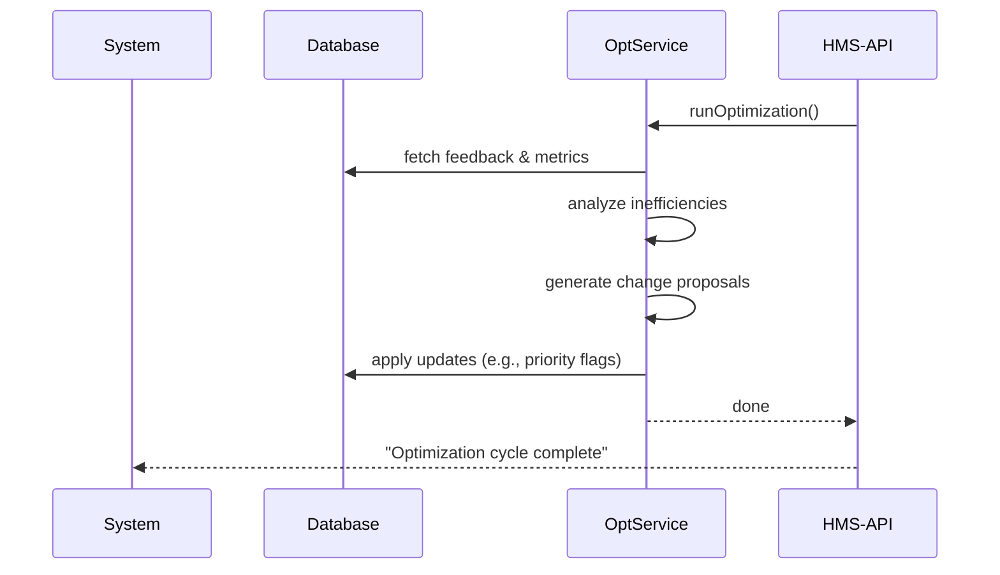

# Chapter 4: AI-Facilitated Process Optimization

Welcome back! In [Chapter 3: Intent-Driven Navigation](03_intent_driven_navigation_.md) we built an AI guide that turns free-text goals into step-by-step journeys. Now, we’ll zoom out and see how AI can continuously improve entire processes—from gathering citizen feedback to rolling out policy or workflow changes—at machine speed.

---

## 1. Why AI-Facilitated Process Optimization?

Imagine the Department of Transportation (DOT) runs a road-maintenance portal where citizens report potholes. Over time, they notice some districts take weeks longer to fix issues. A human “continuous improvement” team meets monthly to review complaints, analyze delays, propose schedule changes, and update crew assignments.

With **AI-Facilitated Process Optimization**, we automate and accelerate that loop:

1. AI ingests citizen feedback in real time.  
2. AI analyzes patterns (e.g., certain zip codes have slow responses).  
3. AI proposes policy or schedule changes (e.g., add one crew in District 7).  
4. AI implements updates automatically (e.g., bump District 7 tasks to higher priority).

You still oversee everything, but AI does the heavy lifting—so improvements happen continuously, not quarterly.

---

## 2. Key Concepts

1. **Feedback Ingestion**  
   Collect citizen comments, ticket data, performance metrics.

2. **Inefficiency Analysis**  
   Use statistics or ML to find bottlenecks (slow approvals, repeat errors).

3. **Change Proposal**  
   Generate recommended updates to policies, schedules, resource allocations.

4. **Automated Updates**  
   Push changes to the system—APIs, databases, or even notification emails.

5. **Continuous Loop**  
   Repeat steps 1–4 so the process keeps getting smarter over time.

---

## 3. A Minimal Optimization Flow

Below is how you wire up a single “optimization run” endpoint in Express. It kicks off the full loop:

```js
// src/routes/optimize.js
const express = require('express');
const { runOptimization } = require('../services/processOptService');
const router = express.Router();

router.post('/', async (req, res) => {
  // Triggers the feedback→analysis→proposal→update flow
  await runOptimization();
  res.send('Optimization cycle complete');
});

module.exports = router;
```

Explanation:  
- Client calls `POST /api/optimize`.  
- We call `runOptimization()`, which runs all four steps.  
- Respond with a simple confirmation.

---

## 4. Under the Hood: Sequence Diagram

Here’s what happens during one optimization cycle:



1. HMS-API calls the **Optimization Service**.  
2. Service reads data from the database.  
3. It runs analysis and proposals in memory.  
4. It writes updates back to the database.  
5. API returns success.

---

## 5. Internal Implementation

Let’s peek into `processOptService.js`—we’ll break it into four simple functions.

### 5.1 Service Skeleton

```js
// src/services/processOptService.js
async function runOptimization() {
  const feedback = await collectFeedback();
  const insights = analyzeInefficiencies(feedback);
  const proposals = proposeChanges(insights);
  await implementUpdates(proposals);
}

module.exports = { runOptimization };
```

Explanation:  
- `collectFeedback()`: read tickets, metrics.  
- `analyzeInefficiencies()`: find slow zones.  
- `proposeChanges()`: suggest new rules.  
- `implementUpdates()`: write back to DB or call other APIs.

### 5.2 Feedback Collector

```js
// inside processOptService.js
async function collectFeedback() {
  // Placeholder: query DB for last week's tickets
  return db.query('SELECT * FROM tickets WHERE created_at > NOW() - INTERVAL \'7 days\'');
}
```

Explanation:  
Fetch recent ticket data including status, response times, comments.

### 5.3 Inefficiency Analyzer

```js
function analyzeInefficiencies(feedback) {
  // Count average resolution time per district
  const times = {};
  feedback.forEach(t => {
    times[t.district] = times[t.district] || [];
    times[t.district].push(t.resolution_time);
  });
  const avg = Object.entries(times)
    .map(([d, arr]) => ({ district: d, avgTime: arr.reduce((a,b)=>a+b)/arr.length }));
  return avg;
}
```

Explanation:  
Compute average resolution time per district to spot delays.

### 5.4 Change Proposal

```js
function proposeChanges(insights) {
  // For any district above threshold, recommend extra crew
  return insights
    .filter(i => i.avgTime > 72) // hours
    .map(i => ({ district: i.district, action: 'addCrew' }));
}
```

Explanation:  
If a district’s average >72 hours, propose adding a maintenance crew.

### 5.5 Update Implementer

```js
async function implementUpdates(proposals) {
  for (const p of proposals) {
    // Update scheduling table or call another API
    await db.query(
      'UPDATE districts SET crews = crews + 1 WHERE id = $1',
      [p.district]
    );
  }
}
```

Explanation:  
Apply each proposal by incrementing `crews` for the flagged district.

---

## 6. Why This Matters

- **Speed:** Continuous, automated cycles mean problems get fixed faster.  
- **Data Depth:** AI can detect patterns humans might miss in raw tables.  
- **Scalability:** One service handles feedback from hundreds of offices seamlessly.  
- **Governance:** You still review proposals; AI does heavy computation.

---

## Conclusion

You’ve seen how **AI-Facilitated Process Optimization** closes the loop: from citizen feedback to implemented updates in minutes instead of months. With this pattern, your HMS-AGX system learns and adapts, just like a well-oiled public works department—only faster.

Next up, we’ll build **Specialized AI Agents** that handle niche tasks inside this framework:

[Chapter 5: Specialized AI Agents (HMS-A2A)](05_specialized_ai_agents__hms_a2a__.md)

---

Generated by [AI Codebase Knowledge Builder](https://github.com/The-Pocket/Tutorial-Codebase-Knowledge)